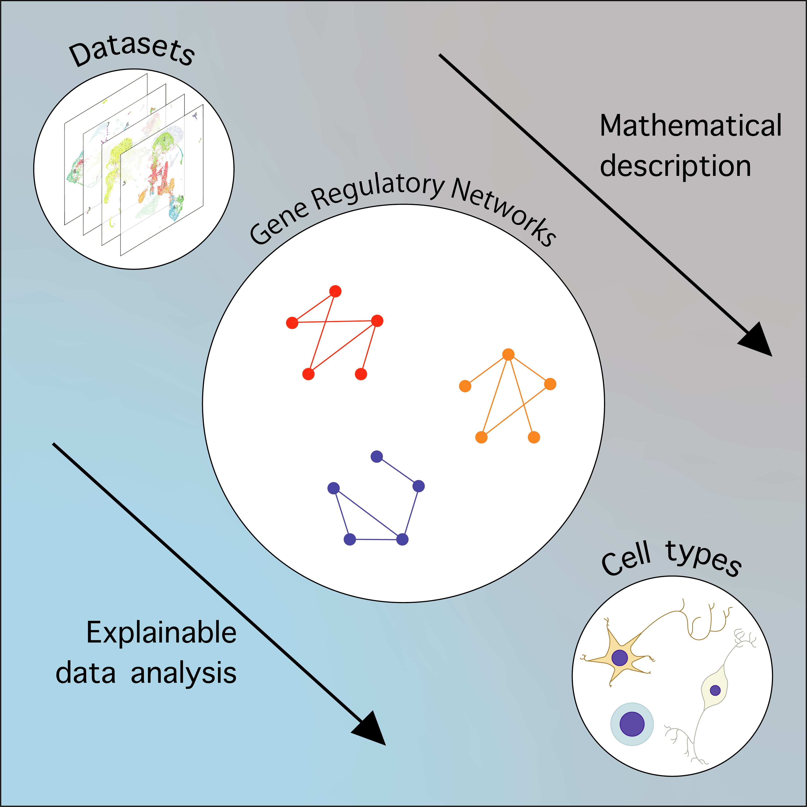

# algebra_ver822

## How to start
### Initial settings
1. clone this repository with `git clone git@github.com:yo-aka-gene/algebra_ver822.git`
2. install Docker to your local env
3. swich your working dir to `/algebra_ver822`
4. run `make init`

### Run Python codes
You can run python codes in jupyterlab virtual environment. Run `make start-py` to start the docker container for jupyterlab; otherwise follow the instructions below. Note that `*.ipynb` files are indexed with numbers. Please follow the numbering. 
***Notes***: some codes require that R scripts already done. Please check the description.
1. run `docker start algebra_ver822-jupyterlab-1`
2. access `localhost:8080` via your local browser (edit `docker-compose.yml` to use different port)
3. run codes in jupyter notebook environment
4. run `make lib-py` or `make lib` to install packages in dependencies (preinstalled with `make init` command)
5. you can stop the virtual computer by running `make stop-py` code in your local env (run `make stop` to stop all docker containers regarding this project).

### Run R codes
You can run r codes in rstudio virtual environment. Run `make start-r` to start the docker container for rstudio; otherwise follow the instructions below. Note that `*.Rmd` files are indexed with numbers. Please follow the numbering. 
***Notes***: some packages are only installed rstuio environment. Please use `algebra_ver822-rstudio-1` container.
1. run `docker start algebra_ver822-rstudio-1`
2. access `localhost:8787` via your local browser (edit `docker-compose.yml` to use different port)
3. run codes in rstudio environment
4. run `make lib-r` or `make lib` to install packages in dependencies (preinstalled with `make init` command)
5. you can stop the virtual computer by running `make stop-r` code in your local env (run `make stop` to stop all docker containers regarding this project).

### Troubleshooting
- when you want to remove the docker containers, run `make terminate` in your local environment.
- when you renew (remove and rebuild) the docker containers, run `make reboot` in your local environment.
---
## Preference of Docker in local environment
- Resource
    - CPUs: 8
    - Memory: 24.00 GB
    - Swap: 2 GB
- **Note**: the author used MacBook Pro(15inch, 2019)
---
## Copyright of the dataset
1. Allen Institute for Brain Science
    - human primary mortor cortex: [https://portal.brain-map.org/atlases-and-data/rnaseq/human-m1-10x](https://portal.brain-map.org/atlases-and-data/rnaseq/human-m1-10x)
    - run `make m1_10x` or `make all-data` or `make init` to install this data.
    - For the sake of the data size, we seplit the original files (make command includes this process as well)
2. HuaQiao University (GSE165388)
    - Interneuron origin and molecular diversity in the human fetal brain: [https://www.ncbi.nlm.nih.gov/geo/query/acc.cgi?acc=GSE165388](https://www.ncbi.nlm.nih.gov/geo/query/acc.cgi?acc=GSE165388)
    - Contributors: [Yu Y](https://www.ncbi.nlm.nih.gov/pubmed/?term=Yu%20Y[Author]), [Sun T](https://www.ncbi.nlm.nih.gov/pubmed/?term=Sun%20T[Author])
    - Citation: Yu Y, Zeng Z, Xie D, Chen R et al. Interneuron origin and molecular diversity in the human fetal brain. Nat Neurosci 2021 Dec;24(12):1745-1756. PMID: [34737447](https://www.ncbi.nlm.nih.gov/pubmed/34737447)
    - Contact name: Yuan Yu
    - E-mail: [yuyuan@stu.hqu.edu.cn](yuyuan@stu.hqu.edu.cn)
    - run `make gse` or `make all-data` or `make init` to install this data.
    - data contain four subgroups `GW9`, `GW10`, `GW11`, and `GW12`.
    - the cmd will make dirs for each subgroups and rename files to adjust `CreateSeuratObject` function of `Seurat`.
---
## For developers
- please use `pip` instead of `conda` for installing Python packages
