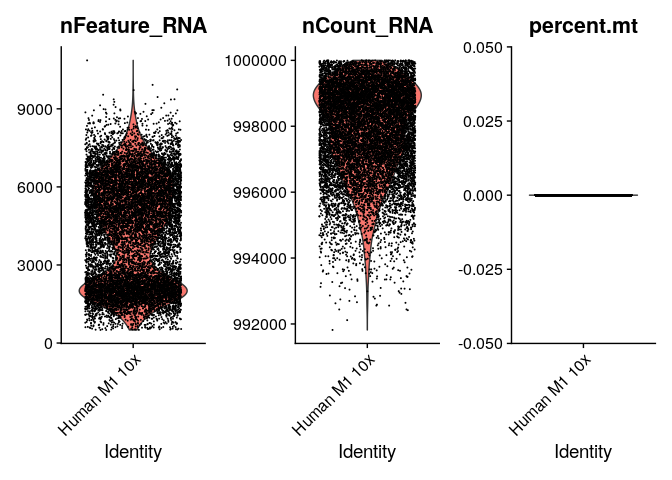

# 01_preprocess

## Do before

1.  run `code/01-2_preprocess_for_r.ipynb`

## Objectives

1.  preprocessing Allen data

### load data and make seurat object

``` r
library(dplyr)
```

    ## 
    ## Attaching package: 'dplyr'

    ## The following objects are masked from 'package:stats':
    ## 
    ##     filter, lag

    ## The following objects are masked from 'package:base':
    ## 
    ##     intersect, setdiff, setequal, union

``` r
library(jsonlite)
library(Matrix)
library(patchwork)
library(Seurat)
```

    ## Attaching SeuratObject

    ## Attaching sp

``` r
source("../tools/spongy_panda/export_gdcmatrix.R")

data_id <- "m1_10x"

raw.data <- Read10X(data.dir = "../../data/m1_10x_resampled/resampled", gene.column = 1)
data <- CreateSeuratObject(counts = raw.data, project = "Human M1 10x", min.cells = 3, min.features = 200)
data
```

    ## An object of class Seurat 
    ## 30424 features across 12015 samples within 1 assay 
    ## Active assay: RNA (30424 features, 0 variable features)

### make difrectory to save outputs

``` r
dir.name <- "../../data/m1_10x_processed"

if (! dir.exists(dir.name)) {
  dir.create(dir.name)
}
```

### check matrix dimensionality

## QC

``` r
data[["percent.mt"]] <- PercentageFeatureSet(data, pattern = "^MT-")
```

``` r
VlnPlot(data, features = c("nFeature_RNA", "nCount_RNA", "percent.mt"), ncol = 3)
```

    ## Warning in SingleExIPlot(type = type, data = data[, x, drop = FALSE], idents =
    ## idents, : All cells have the same value of percent.mt.



-   omitted (no genes matched `^MT-`)
-   memo: to use ribosomal genes, use `^RP[SL]`

### Normalization

``` r
data <- NormalizeData(data, normalization.method = "LogNormalize", scale.factor = 10000)
```

### Export Normalized (filtered) matrix

``` r
saveRDS(data, paste0(dir.name, "/", data_id, "_log.rds"))
```

### Export SeuratObject

``` r
saveRDS(data, file = paste0(dir.name, "/", data_id, "_seuratobject.rds"))
```
