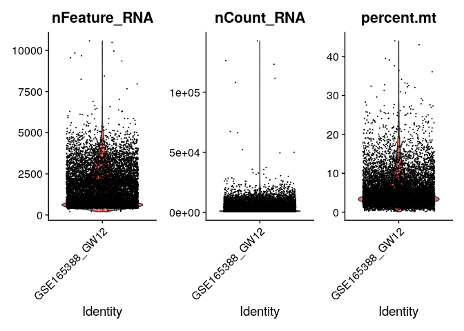
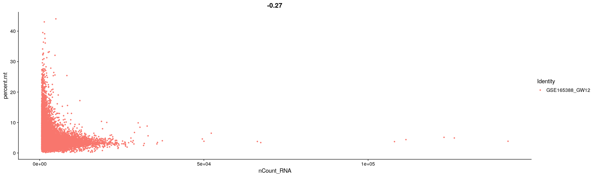
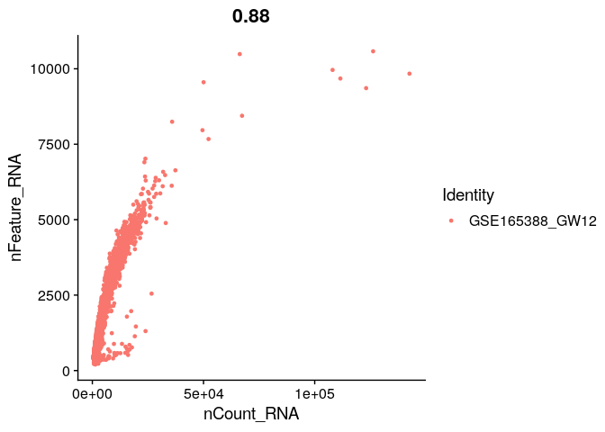

# 01_preprocess

## Objectives

1.  preprocessing GSE165388 data

### load data and make seurat object

``` r
library(dplyr)
```

    ## 
    ## Attaching package: 'dplyr'

    ## The following objects are masked from 'package:stats':
    ## 
    ##     filter, lag

    ## The following objects are masked from 'package:base':
    ## 
    ##     intersect, setdiff, setequal, union

``` r
library(jsonlite)
library(Matrix)
library(patchwork)
library(Seurat)
```

    ## Attaching SeuratObject

    ## Attaching sp

``` r
source("../tools/spongy_panda/export_gdcmatrix.R")

data_id <- "gw12"

raw.data <- Read10X(data.dir = "../../data/gse165388/GSM5032683_GW12/")
data <- CreateSeuratObject(counts = raw.data, project = "GSE165388_GW12", min.cells = 3, min.features = 200)
data
```

    ## An object of class Seurat 
    ## 21301 features across 10630 samples within 1 assay 
    ## Active assay: RNA (21301 features, 0 variable features)

### make difrectory to save outputs

``` r
dir.name <- "../../data/gse165388_processed"

if (! dir.exists(dir.name)) {
  dir.create(dir.name)
}
```

### check matrix dimensionality

``` r
dim(GetAssayData(data))
```

    ## [1] 21301 10630

### Export raw matrix

``` r
saveRDS(data, paste0(dir.name, "/", data_id, "_raw.rds"))
save_gdcmatrix(GetAssayData(data), paste0(dir.name, "/", data_id, "_raw"))
```

## QC

``` r
data[["percent.mt"]] <- PercentageFeatureSet(data, pattern = "^MT-")
```

### visualization

``` r
VlnPlot(data, features = c("nFeature_RNA", "nCount_RNA", "percent.mt"), ncol = 3)
```



``` r
plot1 <- FeatureScatter(data, feature1 = "nCount_RNA", feature2 = "percent.mt")
plot2 <- FeatureScatter(data, feature1 = "nCount_RNA", feature2 = "nFeature_RNA")
plot1
```



``` r
plot2
```



### filter submatrix

``` r
data <- subset(data, subset = nFeature_RNA > 200 & nFeature_RNA < 5000 & percent.mt < 15)
```

### check if the matrix is filtered

``` r
dim(GetAssayData(data))
```

    ## [1] 21301 10112

### Normalization

``` r
data <- NormalizeData(data, normalization.method = "LogNormalize", scale.factor = 1e6)
```

### Export Normalized (filtered) matrix

``` r
saveRDS(data, paste0(dir.name, "/", data_id, "_log.rds"))
save_gdcmatrix(GetAssayData(data), paste0(dir.name, "/", data_id,"_log"))
```

### Export SeuratObject

``` r
saveRDS(data, file = paste0(dir.name, "/", data_id, "_seuratobject.rds"))
```
