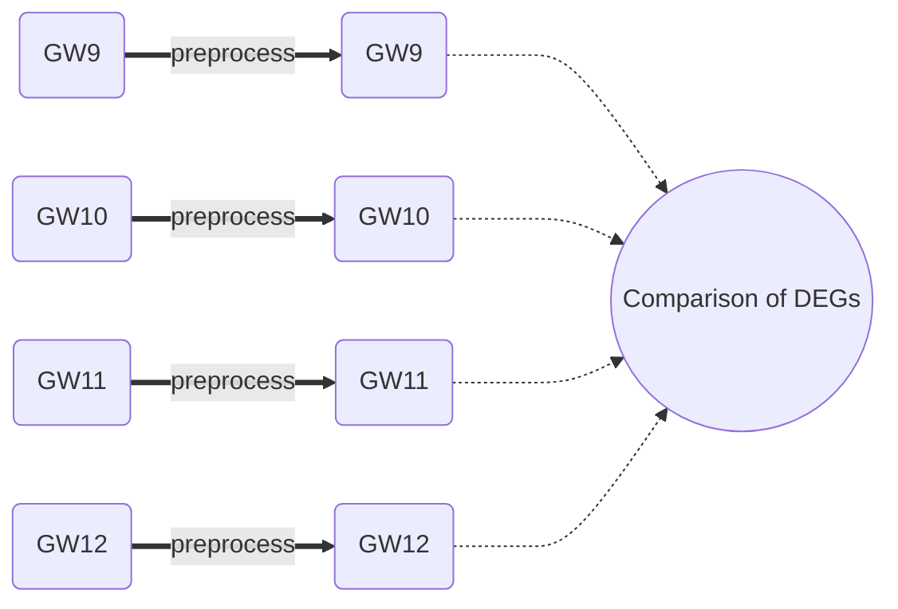

# Schematic of this directory
---

## Overview of scripts
- GW9: [01_preprocess_GSE165388_gw9.md](./01_preprocess_GSE165388_gw9.md)
- GW10: [01_preprocess_GSE165388_gw10.md](./01_preprocess_GSE165388_gw10.md)
- GW11: [01_preprocess_GSE165388_gw11.md](./01_preprocess_GSE165388_gw11.md)
- GW12: [01_preprocess_GSE165388_gw12.md](./01_preprocess_GSE165388_gw12.md)

## Raw scripts
- GW9: [01_preprocess_GSE165388_gw9.Rmd](./01_preprocess_GSE165388_gw9.Rmd)
- GW10: [01_preprocess_GSE165388_gw10.Rmd](./01_preprocess_GSE165388_gw10.Rmd)
- GW11: [01_preprocess_GSE165388_gw11.Rmd](./01_preprocess_GSE165388_gw11.Rmd)
- GW12: [01_preprocess_GSE165388_gw12.Rmd](./01_preprocess_GSE165388_gw12.Rmd)
