# 01_preprocess

## Objectives

1.  preprocessing GSE165388 data

### load data and make seurat object

``` r
library(dplyr)
```

    ## 
    ## Attaching package: 'dplyr'

    ## The following objects are masked from 'package:stats':
    ## 
    ##     filter, lag

    ## The following objects are masked from 'package:base':
    ## 
    ##     intersect, setdiff, setequal, union

``` r
library(Seurat)
```

    ## Attaching SeuratObject

    ## Attaching sp

``` r
library(patchwork)

raw.data <- Read10X(data.dir = "../../data/gse165388/GSM5032680_GW9/")
data <- CreateSeuratObject(counts = raw.data, project = "GSE165388_GW9", min.cells = 3, min.features = 200)
data
```

    ## An object of class Seurat 
    ## 22240 features across 12676 samples within 1 assay 
    ## Active assay: RNA (22240 features, 0 variable features)

### check matrix

    ## 5 x 30 sparse Matrix of class "dgCMatrix"

    ##    [[ suppressing 30 column names 'AAACCCAAGCTGAGCA-1', 'AAACCCAAGGAACTCG-1', 'AAACCCAAGTCCCAAT-1' ... ]]

    ##                                                                          
    ## GAPDH 5 4 9 . 16 1 10 12 . 1 1 30 13  8 . 5 4 5 2 4 1 8 1 18 6 11 2 8 6 6
    ## NES   1 . 1 2  3 .  .  . . 1 .  2  3  1 . 1 . . . . . . .  7 .  . . . . .
    ## DCX   6 6 8 1  3 .  5  6 5 7 1  4  1 12 1 7 . 1 6 1 . 1 2  . 4  2 . 4 4 .
    ## TUBB3 . . . .  . .  .  . . . .  1  .  . . . . . . . . . .  . .  . . . . .
    ## GFAP  . . . .  . .  .  . . . .  .  .  . . . . . . . . . .  . .  . . . . .

### check difference between dense matrix and sparse matix

-   dense matrix

<!-- -->

    ## 3413527648 bytes

## Export raw matrix

``` r
if (! dir.exists("../../data/gse165388_count")) {
  dir.create("../../data/gse165388_count")
}

saveRDS(GetAssayData(data), file = "../../data/gse165388_count/gw9_raw.rds")
```

------------------------------------------------------------------------

## QC

``` r
data[["percent.mt"]] <- PercentageFeatureSet(data, pattern = "^MT-")
```

### visualization

``` r
VlnPlot(data, features = c("nFeature_RNA", "nCount_RNA", "percent.mt"), ncol = 3)
```


``` r
plot1 <- FeatureScatter(data, feature1 = "nCount_RNA", feature2 = "percent.mt")
plot2 <- FeatureScatter(data, feature1 = "nCount_RNA", feature2 = "nFeature_RNA")
plot1
```

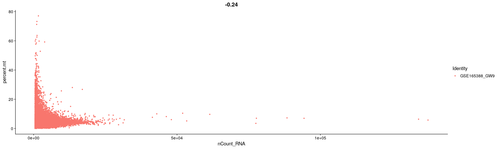

``` r
plot2
```


``` r
data <- subset(data, subset = nFeature_RNA > 200 & nFeature_RNA < 5000 & percent.mt < 20)
```

## Normalization

``` r
data <- NormalizeData(data, normalization.method = "LogNormalize", scale.factor = 10000)
```

``` r
dim(GetAssayData(data))
```

    ## [1] 22240 12176

``` r
saveRDS(GetAssayData(data), file = "../../data/gse165388_count/gw9_log.rds")
```

### visualization

``` r
data <- FindVariableFeatures(data, selection.method = "vst", nfeatures = 2000)
# Identify the 10 most highly variable genes
top10 <- head(VariableFeatures(data), 10)
# plot variable features with and without labels
plot1 <- VariableFeaturePlot(data)
plot2 <- LabelPoints(plot = plot1, points = top10, repel = TRUE)
```

    ## When using repel, set xnudge and ynudge to 0 for optimal results

``` r
plot2
```

    ## Warning: Transformation introduced infinite values in continuous x-axis

    ## Warning: Removed 10 rows containing missing values (geom_point).

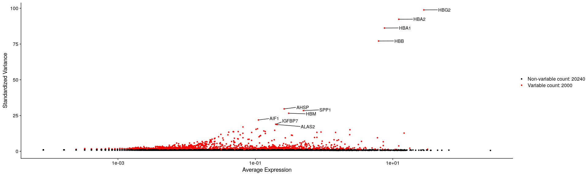

## Data scaling (for PCA)

``` r
all.genes <- rownames(data)
data <- ScaleData(data, features = all.genes)
```

    ## Centering and scaling data matrix

## PCA

    ## PC_ 1 
    ## Positive:  STMN2, RTN1, NSG2, SYT1, CNTNAP2, PCSK1N, SH3BP5, GPM6A, RUNX1T1, NEUROD2 
    ##     GRIA2, EEF1A2, BCL11B, NEUROD6, SLA, SCG5, TBR1, CPE, RBFOX1, GRIA1 
    ##     AC004158.1, ANK3, NRXN1, LY6H, EPHA5, PRDM8, LINGO1, JPH4, SYT4, XPR1 
    ## Negative:  HMGB2, TOP2A, NUSAP1, MKI67, CENPF, MAD2L1, SMC4, H2AFX, PBK, NUF2 
    ##     TPX2, CDK1, BIRC5, PTTG1, GTSE1, UBE2C, CKS1B, KIFC1, ASPM, AURKB 
    ##     KIF11, SGO1, NDC80, KNL1, MIS18BP1, SMC2, CKAP2L, PIMREG, CKS2, HMGN2 
    ## PC_ 2 
    ## Positive:  STMN2, NNAT, CKB, BCL11A, DLX6-AS1, GPM6A, HMGB1, HMGB3, PFN2, DLX5 
    ##     BCL11B, GAP43, GAD2, CALM2, SYNE2, UBE2S, MEIS2, RTN1, CCDC88A, AC004158.1 
    ##     RND3, SFPQ, NSG2, ASCL1, RUNX1T1, UBE2C, DLX2, SYT1, TOP2A, HNRNPA2B1 
    ## Negative:  S100A11, FCGRT, A2M, HTRA1, ARHGDIB, HLA-E, RGS10, LAPTM5, AIF1, SPP1 
    ##     C1QB, C1QC, C1QA, TYROBP, GIMAP4, VSIR, GMFG, PYCARD, CYBA, CX3CR1 
    ##     ADAP2, SLCO2B1, GPR34, ALOX5AP, B2M, VSIG4, RAB32, TGFB1, CD53, APBB1IP 
    ## PC_ 3 
    ## Positive:  DLX6-AS1, DLX5, GAD2, DLX2, ARX, SP9, SOX2, DLX1, TMEM123, GAD1 
    ##     ERBB4, PLS3, C11orf96, ZFHX3, DLX6, SOX6, PBX3, SIX3, CHL1, PDE4DIP 
    ##     PDZRN3, SNTG1, ZNF503, PFN2, GAS2L3, CXCR4, ASCL1, SOX1, MPPED2, SP8 
    ## Negative:  NEUROD6, NFIA, NEUROD2, TBR1, SOX5, CPE, PRDM8, NFIB, SLA, ZBTB18 
    ##     PTPRZ1, PRDX1, CNTNAP2, EPB41L3, FRMD4B, NEUROD1, SEZ6, GRIA1, CSRP2, NPTX1 
    ##     SLC17A7, SYT4, SORBS2, FSTL5, CALM1, SPIRE1, GNAI1, FEZF2, EMX1, NRN1 
    ## PC_ 4 
    ## Positive:  SPP1, STMN2, AIF1, C1QC, C1QA, C1QB, TYROBP, CX3CR1, GPR34, APBB1IP 
    ##     VSIG4, CD53, TREM2, BHLHE41, ALOX5AP, LY86, CSF1R, CD68, FCGR1A, PIF1 
    ##     PLD4, SAMSN1, P2RY12, C3, P2RY13, FCGR3A, FCER1G, CYBB, ITGB2, PLK1 
    ## Negative:  IGFBP7, CLDN5, ITM2A, SPARC, IFITM3, SLC38A5, GNG11, CAVIN3, FN1, PON2 
    ##     ESAM, HES1, APCDD1, RAMP2, RGCC, SLC9A3R2, ECSCR, EGFL7, EPAS1, ENG 
    ##     C1orf54, PECAM1, SLC2A1, S100A16, VIM, SLC7A5, ID3, COL4A1, MFSD2A, ROBO4 
    ## PC_ 5 
    ## Positive:  PLK1, CCNB1, CDC20, PIF1, NEK2, CENPA, AURKA, CENPE, DLGAP5, BUB1 
    ##     ASPM, ECT2, SGO2, CDCA8, TUBA1C, KNSTRN, PSRC1, UBE2C, CCNA1, KIF2C 
    ##     KIF18A, SAPCD2, IGFBP7, KIF14, TTK, TROAP, DEPDC1, CCNB2, CLDN5, CDCA3 
    ## Negative:  GINS2, HELLS, MCM5, PCNA, MCM7, MCM3, DUT, PCLAF, E2F1, FAM111B 
    ##     CLSPN, MCM4, MCM6, DHFR, CHEK1, DTL, FEN1, CCNE2, CDT1, NASP 
    ##     CTNNAL1, CDCA7, CCND2, CKB, TYMS, MYBL2, CDC45, CDC6, BRCA1, GMNN

### visualizaition

-   loadings

``` r
VizDimLoadings(data, dims = 1:2, reduction = "pca")
```

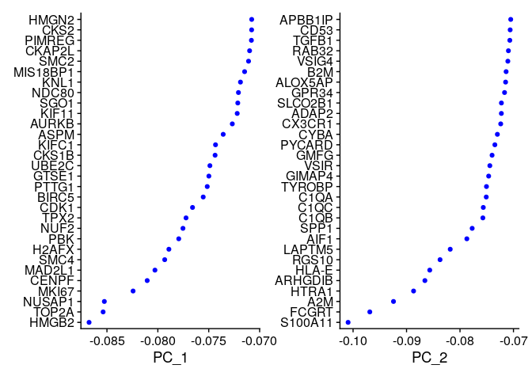

-   scatter plot

``` r
DimPlot(data, reduction = "pca")
```

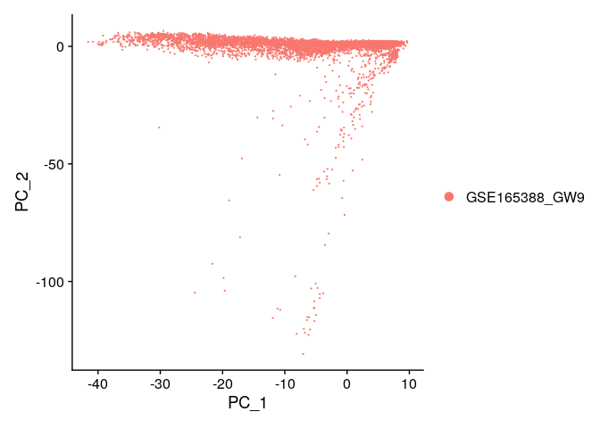

-   heat map

``` r
DimHeatmap(data, dims = 1, cells = 500, balanced = TRUE)
```

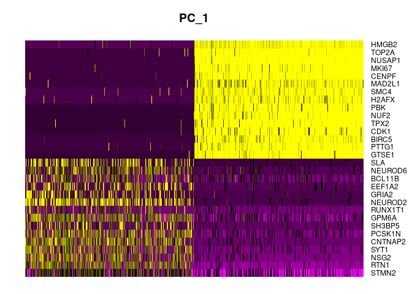

``` r
DimHeatmap(data, dims = 1:15, cells = 500, balanced = TRUE)
```

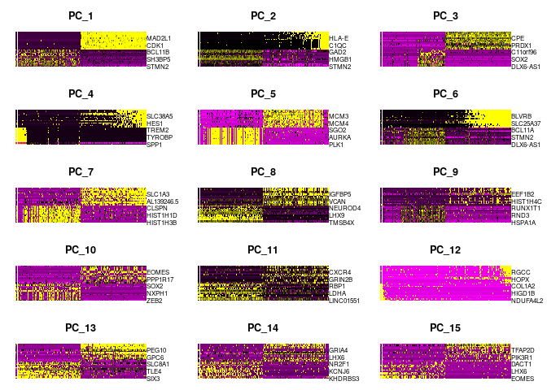

### determine n_dim

-   Jack Straw plot

``` r
data <- JackStraw(data, num.replicate = 100)
data <- ScoreJackStraw(data, dims = 1:20)
```

``` r
JackStrawPlot(data, dims = 1:20)
```

    ## Warning: Removed 28000 rows containing missing values (geom_point).

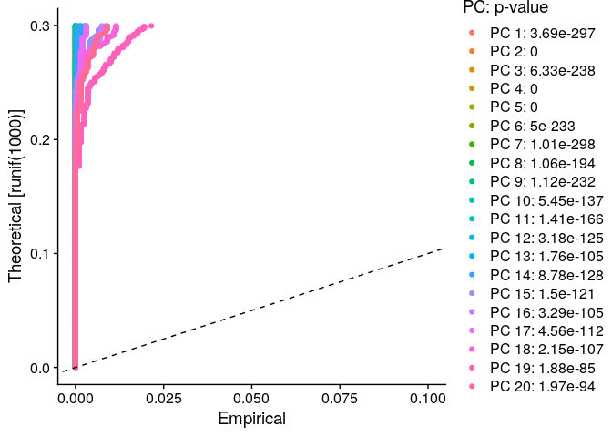

-   Elbow plot

``` r
ElbowPlot(data)
```

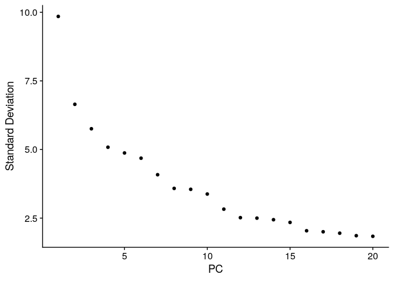

-   **Note**: when the data is small enough, `fa.parallel` from `psych`
    is useful

``` r
dim(data)
```

    ## [1] 22240 12176

## Clustering

``` r
data <- FindNeighbors(data, dims = 1:50)
```

    ## Computing nearest neighbor graph

    ## Computing SNN

``` r
data <- FindClusters(data, resolution = 0.5)
```

    ## Modularity Optimizer version 1.3.0 by Ludo Waltman and Nees Jan van Eck
    ## 
    ## Number of nodes: 12176
    ## Number of edges: 532449
    ## 
    ## Running Louvain algorithm...
    ## Maximum modularity in 10 random starts: 0.9166
    ## Number of communities: 17
    ## Elapsed time: 2 seconds

## Embedding into Manifolds

### UMAP

``` r
data <- RunUMAP(data, dims = 1:50)
```

    ## Warning: The default method for RunUMAP has changed from calling Python UMAP via reticulate to the R-native UWOT using the cosine metric
    ## To use Python UMAP via reticulate, set umap.method to 'umap-learn' and metric to 'correlation'
    ## This message will be shown once per session

    ## 13:50:28 UMAP embedding parameters a = 0.9922 b = 1.112

    ## 13:50:28 Read 12176 rows and found 50 numeric columns

    ## 13:50:28 Using Annoy for neighbor search, n_neighbors = 30

    ## 13:50:28 Building Annoy index with metric = cosine, n_trees = 50

    ## 0%   10   20   30   40   50   60   70   80   90   100%

    ## [----|----|----|----|----|----|----|----|----|----|

    ## **************************************************|
    ## 13:50:30 Writing NN index file to temp file /tmp/RtmpIJKvaq/filef5b3b7d2fae
    ## 13:50:30 Searching Annoy index using 1 thread, search_k = 3000
    ## 13:50:35 Annoy recall = 100%
    ## 13:50:35 Commencing smooth kNN distance calibration using 1 thread with target n_neighbors = 30
    ## 13:50:36 Initializing from normalized Laplacian + noise (using irlba)
    ## 13:50:37 Commencing optimization for 200 epochs, with 526412 positive edges
    ## 13:50:45 Optimization finished

``` r
DimPlot(data, reduction = "umap")
```

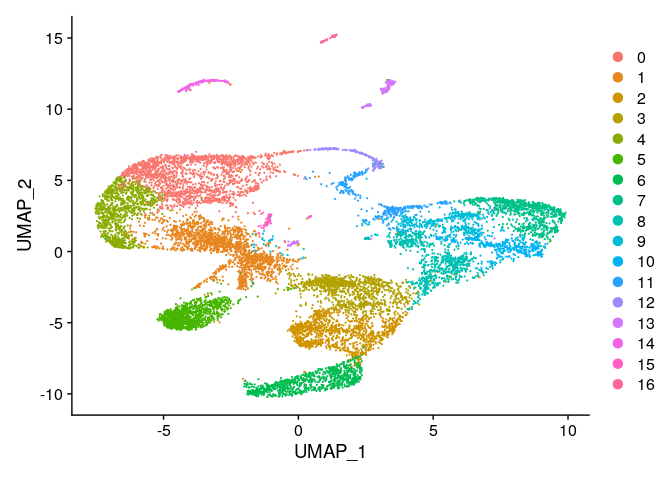

### tSNE

``` r
data <- RunTSNE(data, dims = 1:100)
```

    ## Warning in `[[.DimReduc`(args$object, cells, args$dims): The following
    ## embeddings are not present: NA, NA, NA, NA, NA, NA, NA, NA, NA, NA, NA, NA, NA,
    ## NA, NA, NA, NA, NA, NA, NA, NA, NA, NA, NA, NA, NA, NA, NA, NA, NA, NA, NA, NA,
    ## NA, NA, NA, NA, NA, NA, NA, NA, NA, NA, NA, NA, NA, NA, NA, NA, NA

``` r
DimPlot(data, reduction = "tsne")
```

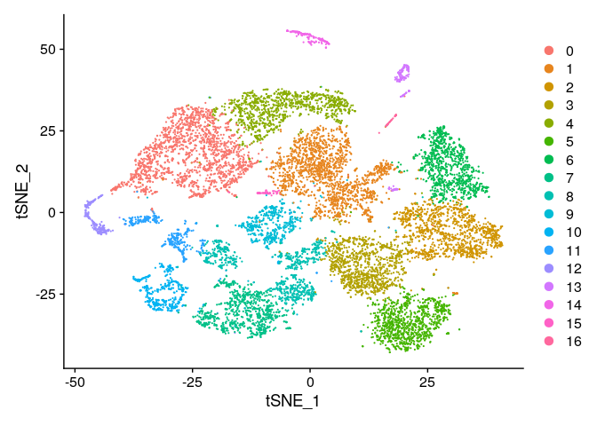

## Find DEG

-   compare all clusters

``` r
data.markers <- FindAllMarkers(data, only.pos = TRUE, min.pct = 0.25, logfc.threshold = 0.25)
```

    ## Calculating cluster 0

    ## For a more efficient implementation of the Wilcoxon Rank Sum Test,
    ## (default method for FindMarkers) please install the limma package
    ## --------------------------------------------
    ## install.packages('BiocManager')
    ## BiocManager::install('limma')
    ## --------------------------------------------
    ## After installation of limma, Seurat will automatically use the more 
    ## efficient implementation (no further action necessary).
    ## This message will be shown once per session

    ## Calculating cluster 1

    ## Calculating cluster 2

    ## Calculating cluster 3

    ## Calculating cluster 4

    ## Calculating cluster 5

    ## Calculating cluster 6

    ## Calculating cluster 7

    ## Calculating cluster 8

    ## Calculating cluster 9

    ## Calculating cluster 10

    ## Calculating cluster 11

    ## Calculating cluster 12

    ## Calculating cluster 13

    ## Calculating cluster 14

    ## Calculating cluster 15

    ## Calculating cluster 16

``` r
data.markers %>%
    group_by(cluster) %>%
    slice_max(n = 2, order_by = avg_log2FC)
```

    ## # A tibble: 34 × 7
    ## # Groups:   cluster [17]
    ##        p_val avg_log2FC pct.1 pct.2 p_val_adj cluster gene    
    ##        <dbl>      <dbl> <dbl> <dbl>     <dbl> <fct>   <chr>   
    ##  1 0              1.80  0.944 0.248 0         0       NEUROD6 
    ##  2 0              1.75  0.983 0.703 0         0       PRDX1   
    ##  3 9.98e-184      0.974 0.935 0.984 2.22e-179 1       MT-ND1  
    ##  4 4.84e- 26      0.960 0.413 0.339 1.08e- 21 1       NEUROD6 
    ##  5 0              2.82  0.821 0.163 0         2       SIX3    
    ##  6 0              2.27  0.991 0.604 0         2       MEIS2   
    ##  7 0              2.06  0.999 0.497 0         3       DLX6-AS1
    ##  8 0              1.96  0.831 0.297 0         3       NR2F2   
    ##  9 0              2.22  0.971 0.292 0         4       SOX5    
    ## 10 0              1.95  0.825 0.32  0         4       LMO3    
    ## # … with 24 more rows
    ## # ℹ Use `print(n = ...)` to see more rows

``` r
if (! dir.exists("../../data/gse165388_deg")) {
  dir.create("../../data/gse165388_deg")
}

write.csv(data.markers, "../../data/gse165388_deg/gw9_deg.csv")
```

-   heatmap

``` r
data.markers %>%
    group_by(cluster) %>%
    top_n(n = 10, wt = avg_log2FC) -> top10
DoHeatmap(data, features = top10$gene) + NoLegend()
```

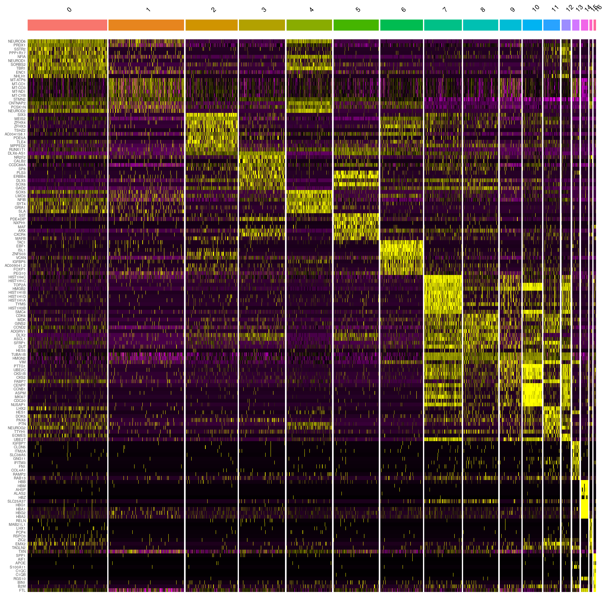

## Visualization

``` r
VlnPlot(data, features = c(
  "NEUROD6", "SIX3", "DLX6-AS1",
  "SOX5", "SST", "TAC1"
  ))
```

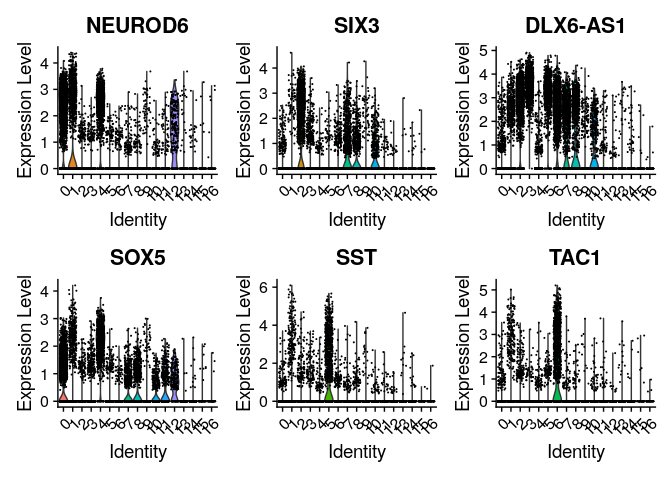

``` r
VlnPlot(data, features = c(
  "HIST1H4C", "CCND2", "VIM",
  "CENPF", "PTN", "EOMES"
  ))
```

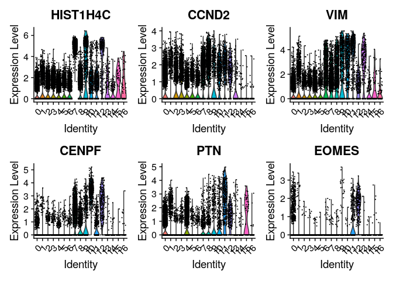

``` r
VlnPlot(data, features = c(
  "IGFBP7", "HBG2", "   PCP4", "SPP1"
  ))
```

    ## Warning in FetchData.Seurat(object = object, vars = features, slot = slot): The
    ## following requested variables were not found: PCP4

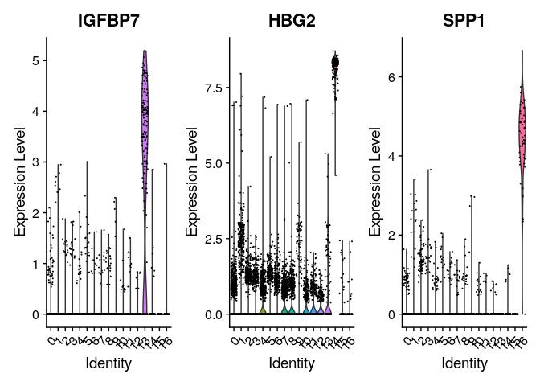

-   scatter plot

``` r
FeaturePlot(data, features = c(
  "NEUROD6", "SIX3", "DLX6-AS1",
  "SOX5", "SST", "TAC1"
  ))
```

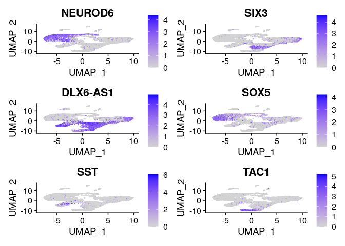

``` r
FeaturePlot(data, features = c(
  "HIST1H4C", "CCND2", "VIM",
  "CENPF", "PTN", "EOMES"
  ))
```

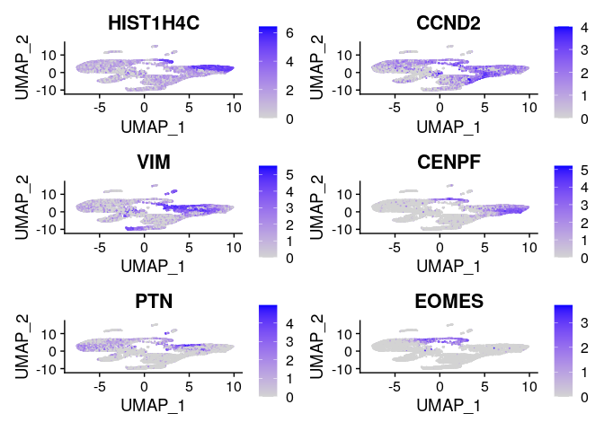

``` r
FeaturePlot(data, features = c(
  "IGFBP7", "HBG2", "   PCP4", "SPP1"
  ))
```

    ## Warning in FetchData.Seurat(object = object, vars = c(dims, "ident",
    ## features), : The following requested variables were not found: PCP4

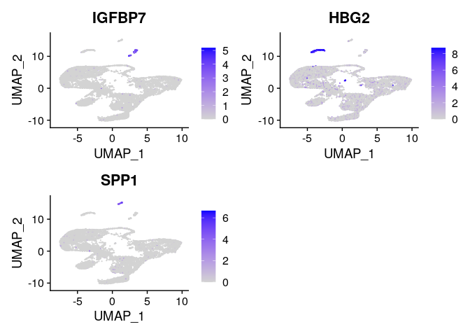

``` r
if (! dir.exists("../../data/gse165388_cluster")) {
  dir.create("../../data/gse165388_cluster")
}

saveRDS(Idents(data), file = "../../data/gse165388_cluster/gw9.rds")
```

-   After these procedure, clusters are **manually** annotated

new.cluster.ids \<- c(“Naive CD4 T”, “CD14+ Mono”, “Memory CD4 T”, “B”,
“CD8 T”, “FCGR3A+ Mono”, “NK”, “DC”, “Platelet”) names(new.cluster.ids)
\<- levels(pbmc) pbmc \<- RenameIdents(pbmc, new.cluster.ids)
DimPlot(pbmc, reduction = “umap”, label = TRUE, pt.size = 0.5) +
NoLegend()

### Expot all results

saveRDS(pbmc, file = “../../data/tutorial/pbmc_tutorial_all.rds”)
