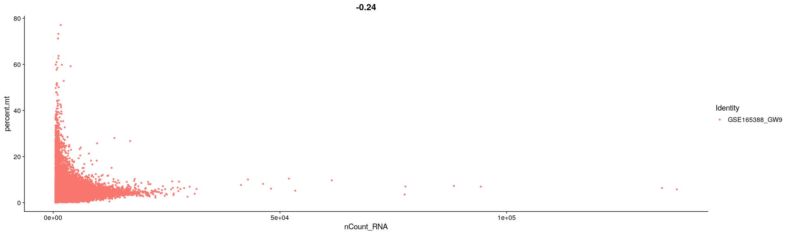

# 01_preprocess

## Objectives

1.  preprocessing GSE165388 data

### load data and make seurat object

``` r
library(dplyr)
```

    ## 
    ## Attaching package: 'dplyr'

    ## The following objects are masked from 'package:stats':
    ## 
    ##     filter, lag

    ## The following objects are masked from 'package:base':
    ## 
    ##     intersect, setdiff, setequal, union

``` r
library(Matrix)
library(patchwork)
library(Seurat)
```

    ## Attaching SeuratObject

    ## Attaching sp

``` r
raw.data <- Read10X(data.dir = "../../data/gse165388/GSM5032680_GW9/")
data <- CreateSeuratObject(counts = raw.data, project = "GSE165388_GW9", min.cells = 3, min.features = 200)
data
```

    ## An object of class Seurat 
    ## 22240 features across 12676 samples within 1 assay 
    ## Active assay: RNA (22240 features, 0 variable features)

### check matrix

    ## 5 x 30 sparse Matrix of class "dgCMatrix"

    ##    [[ suppressing 30 column names 'AAACCCAAGCTGAGCA-1', 'AAACCCAAGGAACTCG-1', 'AAACCCAAGTCCCAAT-1' ... ]]

    ##                                                                          
    ## GAPDH 5 4 9 . 16 1 10 12 . 1 1 30 13  8 . 5 4 5 2 4 1 8 1 18 6 11 2 8 6 6
    ## NES   1 . 1 2  3 .  .  . . 1 .  2  3  1 . 1 . . . . . . .  7 .  . . . . .
    ## DCX   6 6 8 1  3 .  5  6 5 7 1  4  1 12 1 7 . 1 6 1 . 1 2  . 4  2 . 4 4 .
    ## TUBB3 . . . .  . .  .  . . . .  1  .  . . . . . . . . . .  . .  . . . . .
    ## GFAP  . . . .  . .  .  . . . .  .  .  . . . . . . . . . .  . .  . . . . .

### check difference between dense matrix and sparse matix

-   dense matrix

<!-- -->

    ## 3413527648 bytes

## Export raw matrix

``` r
dir.name <- "../../data/gse165388_processed"

if (! dir.exists(dir.name)) {
  dir.create(dir.name)
}

writeMM(GetAssayData(data), file = paste0(dir.name, "/gw9_raw.mtx"))
```

    ## NULL

``` r
capture.output(colnames(GetAssayData(data)),file = paste0(dir.name, "/gw9_raw_samples.txt"))
capture.output(rownames(GetAssayData(data)), file = paste0(dir.name, "/gw9_raw_genes.txt"))
```

------------------------------------------------------------------------

## QC

``` r
data[["percent.mt"]] <- PercentageFeatureSet(data, pattern = "^MT-")
```

### visualization

``` r
VlnPlot(data, features = c("nFeature_RNA", "nCount_RNA", "percent.mt"), ncol = 3)
```


``` r
plot1 <- FeatureScatter(data, feature1 = "nCount_RNA", feature2 = "percent.mt")
plot2 <- FeatureScatter(data, feature1 = "nCount_RNA", feature2 = "nFeature_RNA")
plot1
```



``` r
plot2
```


## filter submatrix

``` r
data <- subset(data, subset = nFeature_RNA > 200 & nFeature_RNA < 5000 & percent.mt < 20)
```

## Normalization

``` r
data <- NormalizeData(data, normalization.method = "LogNormalize", scale.factor = 10000)
```

``` r
dim(GetAssayData(data))
```

    ## [1] 22240 12176

## Export Normalized (filtered) matrix

``` r
dir.name <- "../../data/gse165388_processed"

if (! dir.exists(dir.name)) {
  dir.create(dir.name)
}

writeMM(GetAssayData(data), file = paste0(dir.name, "/gw9_log.mtx"))
```

    ## NULL

``` r
capture.output(colnames(GetAssayData(data)),file = paste0(dir.name, "/gw9_log_samples.txt"))
capture.output(rownames(GetAssayData(data)), file = paste0(dir.name, "/gw9_log_genes.txt"))
```

## Export SeuratObject

``` r
saveRDS(data, file = paste0(dir.name, "/gw9_seuratobject.rds"))
```
