# 01_preprocess

## Objectives

1.  learn to utilize Rstudio and R Notebook
2.  learn API of Seurat
3.  Consider what kind of comparison I can do with Seurat

### load data and make seurat object

``` r
library(dplyr)
```

    ## 
    ## Attaching package: 'dplyr'

    ## The following objects are masked from 'package:stats':
    ## 
    ##     filter, lag

    ## The following objects are masked from 'package:base':
    ## 
    ##     intersect, setdiff, setequal, union

``` r
library(Seurat)
```

    ## Attaching SeuratObject

    ## Attaching sp

``` r
library(patchwork)

# Load the PBMC dataset
pbmc.data <- Read10X(data.dir = "../../data/filtered_gene_bc_matrices/hg19/")
# Initialize the Seurat object with the raw (non-normalized data).
pbmc <- CreateSeuratObject(counts = pbmc.data, project = "pbmc3k", min.cells = 3, min.features = 200)
```

    ## Warning: Feature names cannot have underscores ('_'), replacing with dashes
    ## ('-')

``` r
pbmc
```

    ## An object of class Seurat 
    ## 13714 features across 2700 samples within 1 assay 
    ## Active assay: RNA (13714 features, 0 variable features)

### check matrix

``` r
# Lets examine a few genes in the first thirty cells
pbmc.data[c("CD3D", "TCL1A", "MS4A1", "GAPDH"), 1:30]
```

    ## 4 x 30 sparse Matrix of class "dgCMatrix"

    ##    [[ suppressing 30 column names 'AAACATACAACCAC-1', 'AAACATTGAGCTAC-1', 'AAACATTGATCAGC-1' ... ]]

    ##                                                                     
    ## CD3D  4 . 10 . . 1 2 3 1 . . 2 7 1 . . 1 3 . 2  3 . . . . . 3 4  1 5
    ## TCL1A . .  . . . . . . 1 . . . . . . . . . . .  . 1 . . . . . .  . .
    ## MS4A1 . 6  . . . . . . 1 1 1 . . . . . . . . . 36 1 2 . . 2 . .  . .
    ## GAPDH 3 2  5 4 1 1 2 3 1 . 3 1 8 5 2 1 8 1 6 5 11 . . 1 6 1 . 2 13 2

### check difference between dense matrix and sparse matix

-   dense matrix

``` r
dense.size <- object.size(as.matrix(pbmc.data))
dense.size
```

    ## 709591472 bytes

-sparse matrix

``` r
sparse.size <- object.size(pbmc.data)
sparse.size
```

    ## 29905192 bytes

-   comparison

``` r
dense.size/sparse.size
```

    ## 23.7 bytes

## QC

-   high expression of mitocondrial genes -\> the cell is dead

``` r
# The [[ operator can add columns to object metadata. This is a great place to stash QC stats
pbmc[["percent.mt"]] <- PercentageFeatureSet(pbmc, pattern = "^MT-")
```

-   **Note**: making new row with \[\[“”\]\]

### visualization

``` r
# Visualize QC metrics as a violin plot
VlnPlot(pbmc, features = c("nFeature_RNA", "nCount_RNA", "percent.mt"), ncol = 3)
```

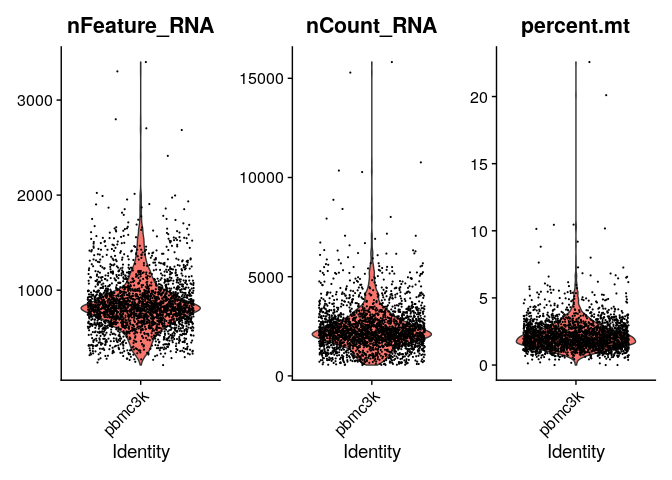

``` r
# FeatureScatter is typically used to visualize feature-feature relationships, but can be used
# for anything calculated by the object, i.e. columns in object metadata, PC scores etc.

plot1 <- FeatureScatter(pbmc, feature1 = "nCount_RNA", feature2 = "percent.mt")
plot2 <- FeatureScatter(pbmc, feature1 = "nCount_RNA", feature2 = "nFeature_RNA")
plot1 + plot2
```

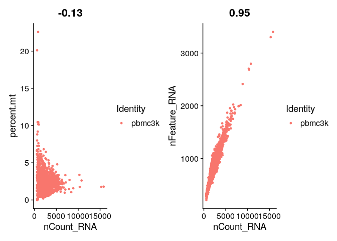

``` r
pbmc <- subset(pbmc, subset = nFeature_RNA > 200 & nFeature_RNA < 2500 & percent.mt < 5)
```

## Normalization

``` r
pbmc <- NormalizeData(pbmc, normalization.method = "LogNormalize", scale.factor = 10000)
```

-   the same result will be obtained with the following code as well

``` r
pbmc <- NormalizeData(pbmc)
```

### visualization

``` r
pbmc <- FindVariableFeatures(pbmc, selection.method = "vst", nfeatures = 2000)

# Identify the 10 most highly variable genes
top10 <- head(VariableFeatures(pbmc), 10)

# plot variable features with and without labels
plot1 <- VariableFeaturePlot(pbmc)
plot2 <- LabelPoints(plot = plot1, points = top10, repel = TRUE)
```

    ## When using repel, set xnudge and ynudge to 0 for optimal results

``` r
plot1 + plot2
```

    ## Warning: Transformation introduced infinite values in continuous x-axis

    ## Warning: Removed 1 rows containing missing values (geom_point).

    ## Warning: Transformation introduced infinite values in continuous x-axis

    ## Warning: Removed 1 rows containing missing values (geom_point).

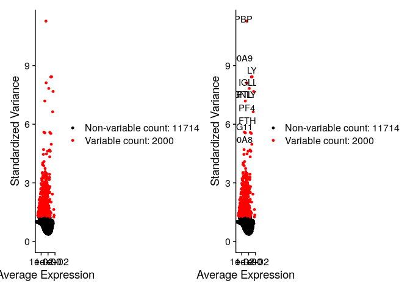

``` r
plot2
```

    ## Warning: Transformation introduced infinite values in continuous x-axis

    ## Warning: Removed 1 rows containing missing values (geom_point).

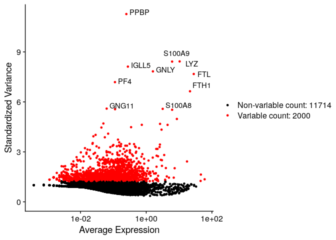

## Data scaling (for PCA)

``` r
all.genes <- rownames(pbmc)
pbmc <- ScaleData(pbmc, features = all.genes)
```

    ## Centering and scaling data matrix

## PCA

``` r
pbmc <- RunPCA(pbmc, features = VariableFeatures(object = pbmc))
```

    ## PC_ 1 
    ## Positive:  CST3, TYROBP, LST1, AIF1, FTL, FTH1, LYZ, FCN1, S100A9, TYMP 
    ##     FCER1G, CFD, LGALS1, S100A8, CTSS, LGALS2, SERPINA1, IFITM3, SPI1, CFP 
    ##     PSAP, IFI30, SAT1, COTL1, S100A11, NPC2, GRN, LGALS3, GSTP1, PYCARD 
    ## Negative:  MALAT1, LTB, IL32, IL7R, CD2, B2M, ACAP1, CD27, STK17A, CTSW 
    ##     CD247, GIMAP5, AQP3, CCL5, SELL, TRAF3IP3, GZMA, MAL, CST7, ITM2A 
    ##     MYC, GIMAP7, HOPX, BEX2, LDLRAP1, GZMK, ETS1, ZAP70, TNFAIP8, RIC3 
    ## PC_ 2 
    ## Positive:  CD79A, MS4A1, TCL1A, HLA-DQA1, HLA-DQB1, HLA-DRA, LINC00926, CD79B, HLA-DRB1, CD74 
    ##     HLA-DMA, HLA-DPB1, HLA-DQA2, CD37, HLA-DRB5, HLA-DMB, HLA-DPA1, FCRLA, HVCN1, LTB 
    ##     BLNK, P2RX5, IGLL5, IRF8, SWAP70, ARHGAP24, FCGR2B, SMIM14, PPP1R14A, C16orf74 
    ## Negative:  NKG7, PRF1, CST7, GZMB, GZMA, FGFBP2, CTSW, GNLY, B2M, SPON2 
    ##     CCL4, GZMH, FCGR3A, CCL5, CD247, XCL2, CLIC3, AKR1C3, SRGN, HOPX 
    ##     TTC38, APMAP, CTSC, S100A4, IGFBP7, ANXA1, ID2, IL32, XCL1, RHOC 
    ## PC_ 3 
    ## Positive:  HLA-DQA1, CD79A, CD79B, HLA-DQB1, HLA-DPB1, HLA-DPA1, CD74, MS4A1, HLA-DRB1, HLA-DRA 
    ##     HLA-DRB5, HLA-DQA2, TCL1A, LINC00926, HLA-DMB, HLA-DMA, CD37, HVCN1, FCRLA, IRF8 
    ##     PLAC8, BLNK, MALAT1, SMIM14, PLD4, P2RX5, IGLL5, LAT2, SWAP70, FCGR2B 
    ## Negative:  PPBP, PF4, SDPR, SPARC, GNG11, NRGN, GP9, RGS18, TUBB1, CLU 
    ##     HIST1H2AC, AP001189.4, ITGA2B, CD9, TMEM40, PTCRA, CA2, ACRBP, MMD, TREML1 
    ##     NGFRAP1, F13A1, SEPT5, RUFY1, TSC22D1, MPP1, CMTM5, RP11-367G6.3, MYL9, GP1BA 
    ## PC_ 4 
    ## Positive:  HLA-DQA1, CD79B, CD79A, MS4A1, HLA-DQB1, CD74, HIST1H2AC, HLA-DPB1, PF4, SDPR 
    ##     TCL1A, HLA-DRB1, HLA-DPA1, HLA-DQA2, PPBP, HLA-DRA, LINC00926, GNG11, SPARC, HLA-DRB5 
    ##     GP9, AP001189.4, CA2, PTCRA, CD9, NRGN, RGS18, CLU, TUBB1, GZMB 
    ## Negative:  VIM, IL7R, S100A6, IL32, S100A8, S100A4, GIMAP7, S100A10, S100A9, MAL 
    ##     AQP3, CD2, CD14, FYB, LGALS2, GIMAP4, ANXA1, CD27, FCN1, RBP7 
    ##     LYZ, S100A11, GIMAP5, MS4A6A, S100A12, FOLR3, TRABD2A, AIF1, IL8, IFI6 
    ## PC_ 5 
    ## Positive:  GZMB, NKG7, S100A8, FGFBP2, GNLY, CCL4, CST7, PRF1, GZMA, SPON2 
    ##     GZMH, S100A9, LGALS2, CCL3, CTSW, XCL2, CD14, CLIC3, S100A12, RBP7 
    ##     CCL5, MS4A6A, GSTP1, FOLR3, IGFBP7, TYROBP, TTC38, AKR1C3, XCL1, HOPX 
    ## Negative:  LTB, IL7R, CKB, VIM, MS4A7, AQP3, CYTIP, RP11-290F20.3, SIGLEC10, HMOX1 
    ##     LILRB2, PTGES3, MAL, CD27, HN1, CD2, GDI2, CORO1B, ANXA5, TUBA1B 
    ##     FAM110A, ATP1A1, TRADD, PPA1, CCDC109B, ABRACL, CTD-2006K23.1, WARS, VMO1, FYB

``` r
# Examine and visualize PCA results a few different ways
print(pbmc[["pca"]], dims = 1:5, nfeatures = 5)
```

    ## PC_ 1 
    ## Positive:  CST3, TYROBP, LST1, AIF1, FTL 
    ## Negative:  MALAT1, LTB, IL32, IL7R, CD2 
    ## PC_ 2 
    ## Positive:  CD79A, MS4A1, TCL1A, HLA-DQA1, HLA-DQB1 
    ## Negative:  NKG7, PRF1, CST7, GZMB, GZMA 
    ## PC_ 3 
    ## Positive:  HLA-DQA1, CD79A, CD79B, HLA-DQB1, HLA-DPB1 
    ## Negative:  PPBP, PF4, SDPR, SPARC, GNG11 
    ## PC_ 4 
    ## Positive:  HLA-DQA1, CD79B, CD79A, MS4A1, HLA-DQB1 
    ## Negative:  VIM, IL7R, S100A6, IL32, S100A8 
    ## PC_ 5 
    ## Positive:  GZMB, NKG7, S100A8, FGFBP2, GNLY 
    ## Negative:  LTB, IL7R, CKB, VIM, MS4A7

### visualizaition

-   loadings

``` r
VizDimLoadings(pbmc, dims = 1:2, reduction = "pca")
```

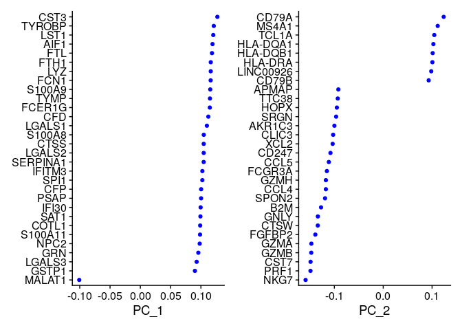

-   scatter plot

``` r
DimPlot(pbmc, reduction = "pca")
```

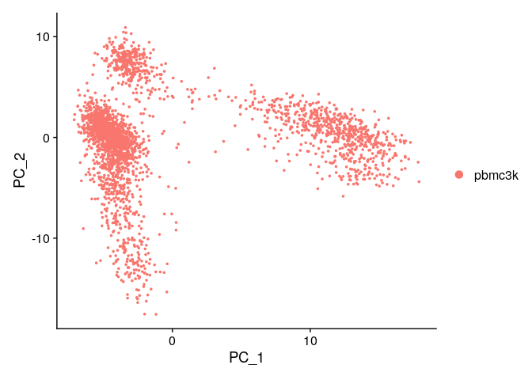

-   heat map

``` r
DimHeatmap(pbmc, dims = 1, cells = 500, balanced = TRUE)
```

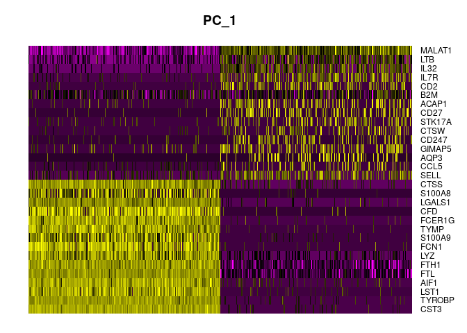

``` r
DimHeatmap(pbmc, dims = 1:15, cells = 500, balanced = TRUE)
```

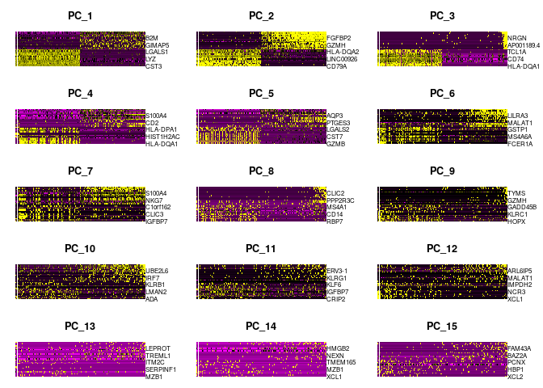

### determine n_dim

-   Jack Straw plot

``` r
# NOTE: This process can take a long time for big datasets, comment out for expediency. More
# approximate techniques such as those implemented in ElbowPlot() can be used to reduce
# computation time
pbmc <- JackStraw(pbmc, num.replicate = 100)
pbmc <- ScoreJackStraw(pbmc, dims = 1:20)
JackStrawPlot(pbmc, dims = 1:15)
```

    ## Warning: Removed 23501 rows containing missing values (geom_point).

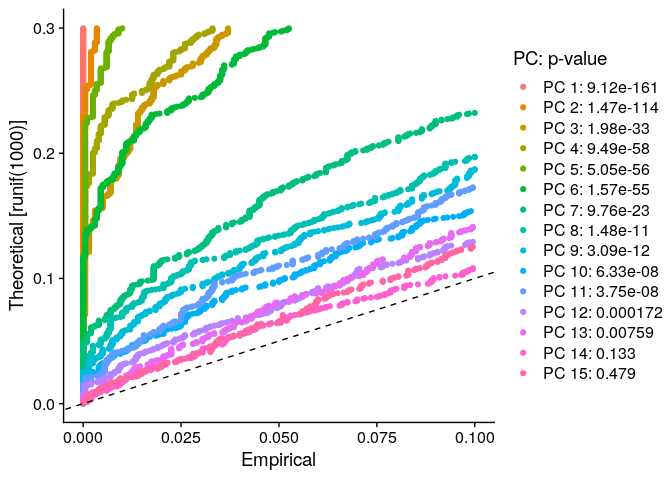

-   Elbow plot

``` r
ElbowPlot(pbmc)
```

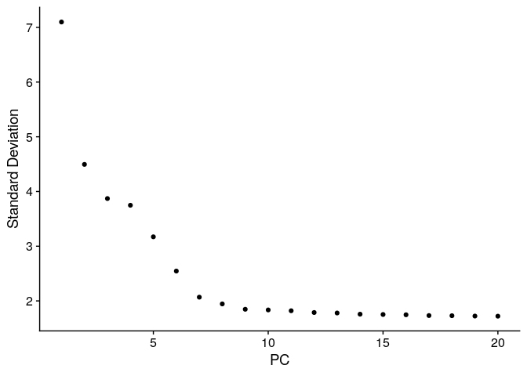

-   **Note**: when the data is small enough, `fa.parallel` from `psych`
    is useful

## Clustering

``` r
pbmc <- FindNeighbors(pbmc, dims = 1:10)
```

    ## Computing nearest neighbor graph

    ## Computing SNN

``` r
pbmc <- FindClusters(pbmc, resolution = 0.5)
```

    ## Modularity Optimizer version 1.3.0 by Ludo Waltman and Nees Jan van Eck
    ## 
    ## Number of nodes: 2638
    ## Number of edges: 95927
    ## 
    ## Running Louvain algorithm...
    ## Maximum modularity in 10 random starts: 0.8728
    ## Number of communities: 9
    ## Elapsed time: 0 seconds

-   checking ids

``` r
# Look at cluster IDs of the first 5 cells
head(Idents(pbmc), 5)
```

    ## AAACATACAACCAC-1 AAACATTGAGCTAC-1 AAACATTGATCAGC-1 AAACCGTGCTTCCG-1 
    ##                2                3                2                1 
    ## AAACCGTGTATGCG-1 
    ##                6 
    ## Levels: 0 1 2 3 4 5 6 7 8

## Embedding into Manifolds

### UMAP

``` r
# If you haven't installed UMAP, you can do so via reticulate::py_install(packages =
# 'umap-learn')
pbmc <- RunUMAP(pbmc, dims = 1:10)
```

    ## Warning: The default method for RunUMAP has changed from calling Python UMAP via reticulate to the R-native UWOT using the cosine metric
    ## To use Python UMAP via reticulate, set umap.method to 'umap-learn' and metric to 'correlation'
    ## This message will be shown once per session

    ## 20:50:55 UMAP embedding parameters a = 0.9922 b = 1.112

    ## 20:50:55 Read 2638 rows and found 10 numeric columns

    ## 20:50:55 Using Annoy for neighbor search, n_neighbors = 30

    ## 20:50:55 Building Annoy index with metric = cosine, n_trees = 50

    ## 0%   10   20   30   40   50   60   70   80   90   100%

    ## [----|----|----|----|----|----|----|----|----|----|

    ## **************************************************|
    ## 20:50:55 Writing NN index file to temp file /tmp/RtmpCFB6Ek/filed211c7dd196
    ## 20:50:55 Searching Annoy index using 1 thread, search_k = 3000
    ## 20:50:56 Annoy recall = 100%
    ## 20:50:57 Commencing smooth kNN distance calibration using 1 thread with target n_neighbors = 30
    ## 20:50:57 Initializing from normalized Laplacian + noise (using irlba)
    ## 20:50:57 Commencing optimization for 500 epochs, with 105140 positive edges
    ## 20:51:01 Optimization finished

``` r
# note that you can set `label = TRUE` or use the LabelClusters function to help label
# individual clusters
DimPlot(pbmc, reduction = "umap")
```

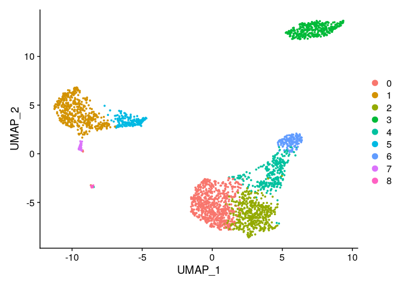

### sSNE

``` r
# If you haven't installed UMAP, you can do so via reticulate::py_install(packages =
# 'umap-learn')
pbmc <- RunTSNE(pbmc, dims = 1:10)

# note that you can set `label = TRUE` or use the LabelClusters function to help label
# individual clusters
DimPlot(pbmc, reduction = "tsne")
```

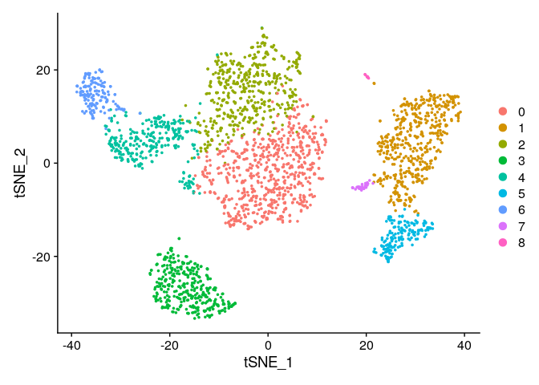

## Export results so far

``` r
saveRDS(pbmc, file = "../../data/tutorial/pbmc_tutorial.rds")
```

-   **Note**: .rds format can be used in python as well. use `pyreadr`

## Find DEG

-   markers of cluster2

``` r
# find all markers of cluster 2
cluster2.markers <- FindMarkers(pbmc, ident.1 = 2, min.pct = 0.25)
```

    ## For a more efficient implementation of the Wilcoxon Rank Sum Test,
    ## (default method for FindMarkers) please install the limma package
    ## --------------------------------------------
    ## install.packages('BiocManager')
    ## BiocManager::install('limma')
    ## --------------------------------------------
    ## After installation of limma, Seurat will automatically use the more 
    ## efficient implementation (no further action necessary).
    ## This message will be shown once per session

``` r
head(cluster2.markers, n = 5)
```

    ##             p_val avg_log2FC pct.1 pct.2    p_val_adj
    ## IL32 2.892340e-90  1.2013522 0.947 0.465 3.966555e-86
    ## LTB  1.060121e-86  1.2695776 0.981 0.643 1.453850e-82
    ## CD3D 8.794641e-71  0.9389621 0.922 0.432 1.206097e-66
    ## IL7R 3.516098e-68  1.1873213 0.750 0.326 4.821977e-64
    ## LDHB 1.642480e-67  0.8969774 0.954 0.614 2.252497e-63

-   markers of cluster5 compared to cluster 0-3

``` r
# find all markers distinguishing cluster 5 from clusters 0 and 3
cluster5.markers <- FindMarkers(pbmc, ident.1 = 5, ident.2 = c(0, 3), min.pct = 0.25)
head(cluster5.markers, n = 5)
```

    ##                       p_val avg_log2FC pct.1 pct.2     p_val_adj
    ## FCGR3A        8.246578e-205   4.261495 0.975 0.040 1.130936e-200
    ## IFITM3        1.677613e-195   3.879339 0.975 0.049 2.300678e-191
    ## CFD           2.401156e-193   3.405492 0.938 0.038 3.292945e-189
    ## CD68          2.900384e-191   3.020484 0.926 0.035 3.977587e-187
    ## RP11-290F20.3 2.513244e-186   2.720057 0.840 0.017 3.446663e-182

-   iteratively compare all clusters

``` r
# find markers for every cluster compared to all remaining cells, report only the positive
# ones
pbmc.markers <- FindAllMarkers(pbmc, only.pos = TRUE, min.pct = 0.25, logfc.threshold = 0.25)
```

    ## Calculating cluster 0

    ## Calculating cluster 1

    ## Calculating cluster 2

    ## Calculating cluster 3

    ## Calculating cluster 4

    ## Calculating cluster 5

    ## Calculating cluster 6

    ## Calculating cluster 7

    ## Calculating cluster 8

``` r
pbmc.markers %>%
    group_by(cluster) %>%
    slice_max(n = 2, order_by = avg_log2FC)
```

    ## # A tibble: 18 × 7
    ## # Groups:   cluster [9]
    ##        p_val avg_log2FC pct.1 pct.2 p_val_adj cluster gene    
    ##        <dbl>      <dbl> <dbl> <dbl>     <dbl> <fct>   <chr>   
    ##  1 9.57e- 88       1.36 0.447 0.108 1.31e- 83 0       CCR7    
    ##  2 3.75e-112       1.09 0.912 0.592 5.14e-108 0       LDHB    
    ##  3 0               5.57 0.996 0.215 0         1       S100A9  
    ##  4 0               5.48 0.975 0.121 0         1       S100A8  
    ##  5 1.06e- 86       1.27 0.981 0.643 1.45e- 82 2       LTB     
    ##  6 2.97e- 58       1.23 0.42  0.111 4.07e- 54 2       AQP3    
    ##  7 0               4.31 0.936 0.041 0         3       CD79A   
    ##  8 9.48e-271       3.59 0.622 0.022 1.30e-266 3       TCL1A   
    ##  9 5.61e-202       3.10 0.983 0.234 7.70e-198 4       CCL5    
    ## 10 7.25e-165       3.00 0.577 0.055 9.95e-161 4       GZMK    
    ## 11 3.51e-184       3.31 0.975 0.134 4.82e-180 5       FCGR3A  
    ## 12 2.03e-125       3.09 1     0.315 2.78e-121 5       LST1    
    ## 13 3.13e-191       5.32 0.961 0.131 4.30e-187 6       GNLY    
    ## 14 7.95e-269       4.83 0.961 0.068 1.09e-264 6       GZMB    
    ## 15 1.48e-220       3.87 0.812 0.011 2.03e-216 7       FCER1A  
    ## 16 1.67e- 21       2.87 1     0.513 2.28e- 17 7       HLA-DPB1
    ## 17 1.92e-102       8.59 1     0.024 2.63e- 98 8       PPBP    
    ## 18 9.25e-186       7.29 1     0.011 1.27e-181 8       PF4

-   ROC can be a measure of differential expressions as explanatory
    variables

``` r
cluster0.markers <- FindMarkers(pbmc, ident.1 = 0, logfc.threshold = 0.25, test.use = "roc", only.pos = TRUE)
cluster0.markers
```

    ##                    myAUC  avg_diff power avg_log2FC pct.1 pct.2
    ## RPS12              0.827 0.5059247 0.654  0.7298951 1.000 0.991
    ## RPS6               0.826 0.4762402 0.652  0.6870694 1.000 0.995
    ## RPS27              0.824 0.5047203 0.648  0.7281575 0.999 0.992
    ## RPL32              0.821 0.4294911 0.642  0.6196246 0.999 0.995
    ## RPS14              0.811 0.4334133 0.622  0.6252832 1.000 0.994
    ## RPS25              0.803 0.5196163 0.606  0.7496479 0.997 0.975
    ## RPL31              0.798 0.5227603 0.596  0.7541837 0.997 0.964
    ## RPL9               0.797 0.5230934 0.594  0.7546643 0.997 0.971
    ## RPL13              0.792 0.3893890 0.584  0.5617696 1.000 0.996
    ## RPL3               0.788 0.4200060 0.576  0.6059406 0.997 0.995
    ## RPS3               0.788 0.4104851 0.576  0.5922049 1.000 0.994
    ## RPS3A              0.787 0.5461948 0.574  0.7879925 0.997 0.975
    ## RPL30              0.785 0.4606356 0.570  0.6645567 1.000 0.980
    ## LDHB               0.784 0.7521034 0.568  1.0850559 0.912 0.592
    ## RPL21              0.783 0.4576652 0.566  0.6602714 0.997 0.991
    ## RPS15A             0.782 0.4417193 0.564  0.6372663 0.997 0.983
    ## RPLP2              0.776 0.4113912 0.552  0.5935120 1.000 0.990
    ## RPS27A             0.770 0.5076242 0.540  0.7323469 0.994 0.967
    ## RPS13              0.769 0.4814302 0.538  0.6945569 0.985 0.962
    ## EEF1A1             0.769 0.3662114 0.538  0.5283314 0.994 0.991
    ## RPL13A             0.762 0.3317493 0.524  0.4786130 1.000 0.999
    ## RPS18              0.762 0.3595409 0.524  0.5187079 1.000 0.996
    ## RPL11              0.761 0.3200854 0.522  0.4617856 1.000 0.995
    ## RPS28              0.760 0.4420190 0.520  0.6376986 0.993 0.968
    ## MALAT1             0.760 0.4488969 0.520  0.6476213 1.000 0.999
    ## RPL35A             0.758 0.3963877 0.516  0.5718665 0.999 0.981
    ## RPL27A             0.757 0.3664888 0.514  0.5287316 0.999 0.988
    ## RPS29              0.754 0.5145039 0.508  0.7422722 0.993 0.904
    ## TPT1               0.751 0.4146670 0.502  0.5982381 0.997 0.982
    ## RPL23A             0.750 0.3853302 0.500  0.5559139 1.000 0.988
    ## RPS23              0.749 0.3946851 0.498  0.5694103 0.997 0.977
    ## RPS4X              0.744 0.3558244 0.488  0.5133462 0.997 0.992
    ## RPS20              0.743 0.4626117 0.486  0.6674076 0.988 0.943
    ## RPL5               0.738 0.4134588 0.476  0.5964950 0.988 0.969
    ## RPS16              0.735 0.3706385 0.470  0.5347184 0.996 0.982
    ## RPL19              0.730 0.2757781 0.460  0.3978638 0.999 0.993
    ## RPL10              0.730 0.2473295 0.460  0.3568211 1.000 0.997
    ## RPL10A             0.726 0.3603932 0.452  0.5199375 0.991 0.985
    ## CD3D               0.724 0.6483208 0.448  0.9353293 0.845 0.406
    ## RPSA               0.722 0.3930175 0.444  0.5670044 0.990 0.948
    ## RPL14              0.715 0.3014249 0.430  0.4348642 0.996 0.985
    ## RPS5               0.712 0.3477614 0.424  0.5017136 0.990 0.975
    ## RPS10              0.712 0.3594207 0.424  0.5185344 0.991 0.968
    ## RPS15              0.708 0.2824010 0.416  0.4074185 1.000 0.989
    ## NPM1               0.708 0.5220308 0.416  0.7531313 0.921 0.798
    ## RPL36              0.705 0.3712174 0.410  0.5355535 0.990 0.948
    ## RPLP0              0.705 0.3669961 0.410  0.5294635 0.988 0.938
    ## RPL18              0.704 0.3547413 0.408  0.5117835 0.999 0.979
    ## RPL4               0.695 0.3627145 0.390  0.5232864 0.994 0.956
    ## RPL7               0.690 0.3888172 0.380  0.5609447 0.980 0.967
    ## RPL36A             0.690 0.3906693 0.380  0.5636166 0.965 0.887
    ## RPL22              0.690 0.4611898 0.380  0.6653563 0.911 0.777
    ## EEF1B2             0.688 0.3804629 0.376  0.5488919 0.947 0.867
    ## CD3E               0.686 0.6038799 0.372  0.8712146 0.731 0.400
    ## RPL18A             0.685 0.2209691 0.370  0.3187911 0.999 0.992
    ## RPS2               0.684 0.2266646 0.368  0.3270080 1.000 0.995
    ## RPS8               0.684 0.2951766 0.368  0.4258498 0.997 0.984
    ## RPS19              0.683 0.2502690 0.366  0.3610619 0.999 0.992
    ## RPL17              0.682 0.3119403 0.364  0.4500347 0.978 0.957
    ## JUNB               0.678 0.4879514 0.356  0.7039651 0.915 0.903
    ## CCR7               0.677 0.9419709 0.354  1.3589768 0.447 0.108
    ## BTG1               0.674 0.4081742 0.348  0.5888710 0.944 0.859
    ## TMEM66             0.674 0.5103223 0.348  0.7362395 0.846 0.700
    ## GLTSCR2            0.672 0.3960273 0.344  0.5713466 0.920 0.803
    ## RPS26              0.672 0.3381196 0.344  0.4878035 0.965 0.898
    ## NOSIP              0.667 0.6563893 0.334  0.9469695 0.629 0.359
    ## RPL38              0.666 0.3551379 0.332  0.5123557 0.947 0.874
    ## RPS21              0.663 0.3437448 0.326  0.4959189 0.940 0.839
    ## RPLP1              0.663 0.2142150 0.326  0.3090469 1.000 0.996
    ## RPL35              0.663 0.2773413 0.326  0.4001189 0.991 0.965
    ## RPL12              0.660 0.2034458 0.320  0.2935103 1.000 0.989
    ## RPL24              0.660 0.2855340 0.320  0.4119385 0.984 0.942
    ## RPL37A             0.653 0.2632507 0.306  0.3797905 0.987 0.945
    ## RPL37              0.651 0.2847198 0.302  0.4107639 0.987 0.943
    ## CD7                0.648 0.4724034 0.296  0.6815341 0.582 0.293
    ## RPS4Y1             0.644 0.3188482 0.288  0.4600007 0.940 0.869
    ## RPSAP58            0.643 0.3617078 0.286  0.5218341 0.845 0.698
    ## RPL27              0.643 0.2461533 0.286  0.3551241 0.975 0.952
    ## IL7R               0.643 0.5068846 0.286  0.7312799 0.604 0.332
    ## C6orf48            0.642 0.5331473 0.284  0.7691690 0.699 0.492
    ## RPL34              0.640 0.3998030 0.280  0.5767939 0.927 0.904
    ## PIK3IP1            0.636 0.6593274 0.272  0.9512084 0.443 0.185
    ## RPL6               0.636 0.1947417 0.272  0.2809529 0.999 0.992
    ## RPL7A              0.636 0.2197727 0.272  0.3170650 0.985 0.975
    ## RPL15              0.635 0.1928839 0.270  0.2782726 0.996 0.996
    ## LTB                0.634 0.2573593 0.268  0.3712909 0.898 0.636
    ## LEF1               0.625 0.7480613 0.250  1.0792243 0.342 0.103
    ## RPS7               0.619 0.1850066 0.238  0.2669081 0.997 0.987
    ## TCF7               0.616 0.5501196 0.232  0.7936548 0.393 0.177
    ## PRKCQ-AS1          0.615 0.7074393 0.230  1.0206192 0.330 0.112
    ## AES                0.614 0.3719773 0.228  0.5366499 0.640 0.442
    ## HNRNPA1            0.613 0.2110714 0.226  0.3045116 0.961 0.919
    ## TOMM7              0.611 0.2912888 0.222  0.4202409 0.838 0.758
    ## SELL               0.611 0.2961077 0.222  0.4271931 0.608 0.425
    ## CD27               0.607 0.3989126 0.214  0.5755092 0.399 0.184
    ## TMEM123            0.606 0.3999831 0.212  0.5770536 0.550 0.385
    ## LEPROTL1           0.604 0.4788099 0.208  0.6907766 0.404 0.209
    ## LCK                0.603 0.4067943 0.206  0.5868802 0.504 0.311
    ## HINT1              0.601 0.3063360 0.202  0.4419495 0.734 0.610
    ## RPL23              0.598 0.2008449 0.196  0.2897579 0.905 0.841
    ## EIF4A2             0.598 0.3196442 0.196  0.4611491 0.740 0.606
    ## NDFIP1             0.596 0.4983859 0.192  0.7190188 0.444 0.283
    ## EEF1D              0.595 0.1920675 0.190  0.2770948 0.963 0.967
    ## C12orf57           0.594 0.5179687 0.188  0.7472708 0.425 0.258
    ## RGS10              0.594 0.3606675 0.188  0.5203332 0.531 0.377
    ## GIMAP5             0.594 0.3983035 0.188  0.5746305 0.415 0.241
    ## MAL                0.593 0.6580819 0.186  0.9494114 0.268 0.087
    ## COMMD6             0.591 0.2892424 0.182  0.4172886 0.680 0.575
    ## RGCC               0.590 0.4479080 0.180  0.6461946 0.360 0.185
    ## HSPA8              0.590 0.2517444 0.180  0.3631904 0.769 0.642
    ## PABPC1             0.590 0.2380974 0.180  0.3435019 0.893 0.849
    ## RHOH               0.586 0.4535408 0.172  0.6543211 0.370 0.208
    ## EVL                0.584 0.2890311 0.168  0.4169837 0.633 0.497
    ## ZFP36L2            0.584 0.2772749 0.168  0.4000231 0.732 0.624
    ## LDLRAP1            0.584 0.7641186 0.168  1.1023901 0.247 0.085
    ## SOD1               0.583 0.3193485 0.166  0.4607225 0.598 0.483
    ## GYPC               0.583 0.4020680 0.166  0.5800616 0.401 0.255
    ## TRAF3IP3           0.583 0.3990531 0.166  0.5757120 0.564 0.454
    ## DNAJB1             0.582 0.4552958 0.164  0.6568530 0.395 0.256
    ## SRSF5              0.582 0.1867927 0.164  0.2694849 0.788 0.715
    ## CD3G               0.581 0.3591670 0.162  0.5181684 0.338 0.178
    ## FHIT               0.581 0.6132861 0.162  0.8847848 0.200 0.040
    ## COX7C              0.579 0.2424727 0.158  0.3498141 0.757 0.677
    ## CXCR4              0.579 0.1992422 0.158  0.2874457 0.697 0.567
    ## FYB                0.577 0.2735849 0.154  0.3946996 0.462 0.338
    ## FLT3LG             0.575 0.4854142 0.150  0.7003046 0.276 0.137
    ## GIMAP7             0.575 0.1875331 0.150  0.2705531 0.621 0.512
    ## DDX5               0.574 0.1891250 0.148  0.2728497 0.870 0.794
    ## SNRPD2             0.572 0.2508625 0.144  0.3619181 0.636 0.546
    ## PEBP1              0.572 0.2662877 0.144  0.3841720 0.471 0.350
    ## JUN                0.572 0.2110909 0.144  0.3045399 0.776 0.731
    ## OXNAD1             0.571 0.4747864 0.142  0.6849720 0.219 0.081
    ## TRABD2A            0.571 0.4151546 0.142  0.5989416 0.199 0.060
    ## ST13               0.570 0.3629920 0.140  0.5236868 0.480 0.376
    ## PRDX2              0.570 0.3366735 0.140  0.4857171 0.380 0.259
    ## TRAT1              0.569 0.3879959 0.138  0.5597597 0.270 0.139
    ## OCIAD2             0.568 0.3058906 0.136  0.4413068 0.325 0.192
    ## MYC                0.567 0.3988071 0.134  0.5753571 0.241 0.115
    ## ACAP1              0.566 0.4128591 0.132  0.5956298 0.392 0.272
    ## SLC2A3             0.565 0.3209171 0.130  0.4629856 0.339 0.222
    ## NBEAL1             0.565 0.1808590 0.130  0.2609244 0.741 0.666
    ## LINC00176          0.564 0.4854872 0.128  0.7004099 0.155 0.029
    ## BTG2               0.564 0.3160465 0.128  0.4559588 0.437 0.336
    ## NELL2              0.563 0.4371100 0.126  0.6306164 0.158 0.033
    ## CD69               0.563 0.2030891 0.126  0.2929957 0.455 0.328
    ## CYTIP              0.563 0.1938575 0.126  0.2796772 0.424 0.314
    ## AAK1               0.563 0.3934966 0.126  0.5676955 0.234 0.114
    ## PPA1               0.561 0.2685795 0.122  0.3874783 0.387 0.291
    ## CD8B               0.561 0.5698152 0.122  0.8220695 0.213 0.097
    ## SH3YL1             0.561 0.4130262 0.122  0.5958709 0.189 0.069
    ## RSL1D1             0.560 0.2978047 0.120  0.4296414 0.405 0.301
    ## NUCB2              0.559 0.3931645 0.118  0.5672164 0.202 0.086
    ## LAT                0.558 0.2831836 0.116  0.4085476 0.303 0.191
    ## NGFRAP1            0.557 0.2822841 0.114  0.4072498 0.174 0.062
    ## UXT                0.557 0.2321926 0.114  0.3349832 0.471 0.387
    ## AQP3               0.555 0.3120202 0.110  0.4501499 0.246 0.140
    ## EIF3E              0.555 0.2667403 0.110  0.3848250 0.433 0.356
    ## BEX2               0.555 0.2953212 0.110  0.4260584 0.189 0.080
    ## PSIP1              0.553 0.3308302 0.106  0.4772871 0.260 0.164
    ## CCDC109B           0.551 0.3209596 0.102  0.4630468 0.387 0.306
    ## EEF1G              0.550 0.2890438 0.100  0.4170020 0.308 0.223
    ## CD6                0.550 0.3211933 0.100  0.4633840 0.183 0.085
    ## SUSD3              0.550 0.2924719 0.100  0.4219477 0.213 0.119
    ## STK17A             0.549 0.1750796 0.098  0.2525864 0.389 0.294
    ## CUTA               0.549 0.2519909 0.098  0.3635460 0.485 0.418
    ## ACTN1              0.548 0.2648072 0.096  0.3820360 0.145 0.049
    ## TMA7               0.548 0.1983422 0.096  0.2861474 0.727 0.654
    ## RCAN3              0.548 0.3438492 0.096  0.4960695 0.177 0.085
    ## SOCS3              0.547 0.3911026 0.094  0.5642418 0.238 0.154
    ## EPHX2              0.547 0.3425190 0.094  0.4941505 0.123 0.030
    ## MZT2B              0.547 0.2412808 0.094  0.3480946 0.427 0.359
    ## RP11-664D1.1       0.546 0.3482671 0.092  0.5024433 0.124 0.034
    ## CAMK4              0.546 0.3282054 0.092  0.4735003 0.164 0.075
    ## CCNI               0.546 0.1755368 0.092  0.2532460 0.675 0.615
    ## C14orf64           0.545 0.3526691 0.090  0.5087939 0.120 0.031
    ## SCGB3A1            0.545 0.4201944 0.090  0.6062124 0.118 0.029
    ## MGAT4A             0.544 0.2904410 0.088  0.4190177 0.190 0.106
    ## SELM               0.543 0.2642273 0.086  0.3811993 0.167 0.082
    ## LINC00861          0.543 0.3158721 0.086  0.4557071 0.152 0.068
    ## CD40LG             0.543 0.2639993 0.086  0.3808705 0.167 0.083
    ## ADTRP              0.543 0.3780411 0.086  0.5453980 0.102 0.016
    ## APBA2              0.542 0.3600892 0.084  0.5194988 0.114 0.031
    ## RP11-51J9.5        0.542 0.2981670 0.084  0.4301641 0.175 0.094
    ## ITM2A              0.542 0.4103506 0.084  0.5920108 0.189 0.105
    ## SPOCK2             0.541 0.2331428 0.082  0.3363539 0.270 0.188
    ## STMN3              0.539 0.2611726 0.078  0.3767924 0.164 0.086
    ## RPL39              0.539 0.2461848 0.078  0.3551696 0.325 0.257
    ## SNHG8              0.539 0.3204551 0.078  0.4623189 0.301 0.233
    ## FOXP1              0.539 0.3202180 0.078  0.4619769 0.219 0.147
    ## RIC3               0.538 0.2253501 0.076  0.3251115 0.154 0.077
    ## ATP6V0E2           0.538 0.3770759 0.076  0.5440055 0.143 0.068
    ## CITED2             0.538 0.2598442 0.076  0.3748760 0.278 0.212
    ## SON                0.537 0.2232026 0.074  0.3220132 0.354 0.301
    ## TNRC6C             0.537 0.2821427 0.074  0.4070458 0.102 0.030
    ## CD5                0.537 0.2827483 0.074  0.4079196 0.127 0.055
    ## SATB1              0.537 0.2573273 0.074  0.3712448 0.139 0.068
    ## MZT2A              0.537 0.1948953 0.074  0.2811745 0.308 0.245
    ## RGL4               0.536 0.2627026 0.072  0.3789997 0.162 0.093
    ## TMEM204            0.536 0.2831957 0.072  0.4085651 0.130 0.060
    ## BCL11B             0.536 0.2452189 0.072  0.3537761 0.135 0.063
    ## SF1                0.536 0.2019513 0.072  0.2913541 0.348 0.292
    ## ANXA2R             0.536 0.1813842 0.072  0.2616822 0.228 0.161
    ## PASK               0.536 0.1766117 0.072  0.2547969 0.117 0.046
    ## TOMM20             0.536 0.1926276 0.072  0.2779029 0.313 0.256
    ## BCL2               0.535 0.2508899 0.070  0.3619577 0.129 0.059
    ## TXK                0.535 0.2304497 0.070  0.3324686 0.129 0.059
    ## ATM                0.534 0.2206403 0.068  0.3183167 0.193 0.129
    ## NDUFS5             0.534 0.1845707 0.068  0.2662792 0.431 0.386
    ## TMIGD2             0.533 0.2369758 0.066  0.3418839 0.107 0.040
    ## NDNL2              0.533 0.3289189 0.066  0.4745297 0.213 0.151
    ## SVIP               0.533 0.1775600 0.066  0.2561650 0.181 0.118
    ## PCED1B             0.532 0.2340552 0.064  0.3376703 0.107 0.043
    ## PIM2               0.532 0.2354951 0.064  0.3397475 0.197 0.136
    ## DDX18              0.531 0.2073406 0.062  0.2991293 0.216 0.160
    ## BEX4               0.530 0.3265411 0.060  0.4710992 0.158 0.100
    ## EPB41L4A-AS1       0.530 0.2296792 0.060  0.3313570 0.216 0.161
    ## PCNP               0.530 0.2472990 0.060  0.3567770 0.291 0.245
    ## GCC2               0.530 0.2195909 0.060  0.3168026 0.156 0.101
    ## MRPS21             0.530 0.2963925 0.060  0.4276040 0.265 0.212
    ## ZNF331             0.529 0.1872776 0.058  0.2701845 0.177 0.122
    ## PHF1               0.529 0.1805646 0.058  0.2604997 0.135 0.075
    ## CISH               0.529 0.1765347 0.058  0.2546857 0.120 0.063
    ## DENND2D            0.529 0.2688225 0.058  0.3878289 0.202 0.145
    ## LGALS3BP           0.528 0.2170046 0.056  0.3130715 0.105 0.051
    ## SEPT1              0.528 0.2518207 0.056  0.3633005 0.269 0.221
    ## ITK                0.528 0.2042961 0.056  0.2947369 0.120 0.064
    ## AIMP1              0.528 0.2275567 0.056  0.3282949 0.140 0.088
    ## TMC8               0.527 0.1775846 0.054  0.2562004 0.174 0.122
    ## STAT3              0.527 0.1977045 0.054  0.2852274 0.212 0.165
    ## LETMD1             0.527 0.1975426 0.054  0.2849937 0.129 0.077
    ## XXbac-BPG299F13.17 0.527 0.3180573 0.054  0.4588597 0.167 0.115
    ## PRMT10             0.527 0.2248536 0.054  0.3243952 0.129 0.075
    ## TESPA1             0.526 0.2254236 0.052  0.3252175 0.108 0.057
    ## SLC38A1            0.526 0.1791735 0.052  0.2584926 0.159 0.111
    ## ADD3               0.526 0.1836641 0.052  0.2649713 0.227 0.182
    ## SCML4              0.526 0.1987619 0.052  0.2867529 0.111 0.060
    ## TAF1D              0.524 0.3090178 0.048  0.4458184 0.184 0.140
    ## PSMD5-AS1          0.524 0.1957787 0.048  0.2824489 0.148 0.100
    ## FBL                0.523 0.2435938 0.046  0.3514315 0.304 0.268
    ## CDC25B             0.523 0.2106102 0.046  0.3038463 0.121 0.077
    ## UBAC2              0.523 0.2668017 0.046  0.3849135 0.165 0.123
    ## GIMAP2             0.523 0.2641953 0.046  0.3811533 0.225 0.186
    ## LYRM4              0.523 0.1737790 0.046  0.2507101 0.159 0.118
    ## PARP1              0.477 0.1969073 0.046  0.2840772 0.080 0.128
    ## SMDT1              0.522 0.2847538 0.044  0.4108129 0.402 0.380
    ## FGFR1OP2           0.522 0.2369059 0.044  0.3417830 0.192 0.149
    ## SIT1               0.522 0.1765698 0.044  0.2547364 0.174 0.134
    ## TTC39C             0.521 0.2084822 0.042  0.3007763 0.161 0.124
    ## FAM102A            0.521 0.1848425 0.042  0.2666713 0.105 0.064
    ## TBCC               0.521 0.1966676 0.042  0.2837314 0.187 0.150
    ## CHD2               0.520 0.2239202 0.040  0.3230486 0.164 0.125
    ## TC2N               0.520 0.1838928 0.040  0.2653012 0.133 0.095
    ## LYRM5              0.520 0.2057031 0.040  0.2967669 0.105 0.067
    ## GATA3              0.520 0.2190487 0.040  0.3160204 0.108 0.069
    ## UXS1               0.520 0.2067654 0.040  0.2982994 0.107 0.068
    ## NEMF               0.518 0.2116824 0.036  0.3053932 0.142 0.110
    ## IMPDH2             0.518 0.2413131 0.036  0.3481412 0.184 0.156
    ## SRP9               0.518 0.3256868 0.036  0.4698667 0.345 0.327
    ## RBMX               0.517 0.2342635 0.034  0.3379707 0.329 0.307
    ## ARID4A             0.483 0.1778206 0.034  0.2565409 0.082 0.118
    ## TTC1               0.485 0.2578420 0.030  0.3719873 0.098 0.133
    ## ZNF428             0.514 0.2021996 0.028  0.2917124 0.175 0.149
    ## PCSK7              0.486 0.2538772 0.028  0.3662673 0.123 0.151
    ## EIF3D              0.513 0.2845471 0.026  0.4105147 0.406 0.402
    ## PRPF6              0.513 0.1972073 0.026  0.2845100 0.121 0.099
    ## DDX24              0.513 0.1855692 0.026  0.2677198 0.250 0.230
    ## EXOSC8             0.512 0.2379387 0.024  0.3432730 0.113 0.090
    ## GOLGA7             0.512 0.2021068 0.024  0.2915785 0.170 0.152
    ## CDC123             0.488 0.1996754 0.024  0.2880707 0.114 0.140
    ## IL27RA             0.507 0.1966598 0.014  0.2837200 0.114 0.102
    ## RAD23A             0.504 0.1888466 0.008  0.2724481 0.197 0.195
    ## SURF1              0.504 0.2710486 0.008  0.3910404 0.175 0.172
    ## C21orf33           0.496 0.3065089 0.008  0.4421988 0.099 0.110
    ## DDX46              0.503 0.2878830 0.006  0.4153274 0.164 0.162
    ## LUC7L3             0.499 0.3867148 0.002  0.5579116 0.170 0.176
    ## HDAC1              0.499 0.2511833 0.002  0.3623809 0.154 0.158

## Visualization

``` r
VlnPlot(pbmc, features = c("MS4A1", "CD79A", "GAPDH", "TAPBPL", "GADD45G", "POLR1A"))
```

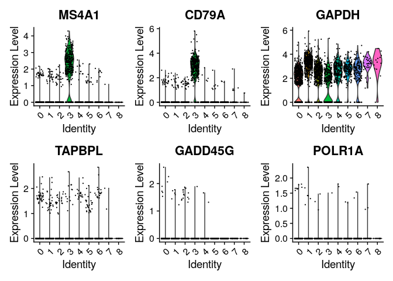

-   violing plot of rawcounts

``` r
# you can plot raw counts as well
VlnPlot(pbmc, features = c("NKG7", "PF4", "POLR2A"), slot = "counts", log = TRUE)
```

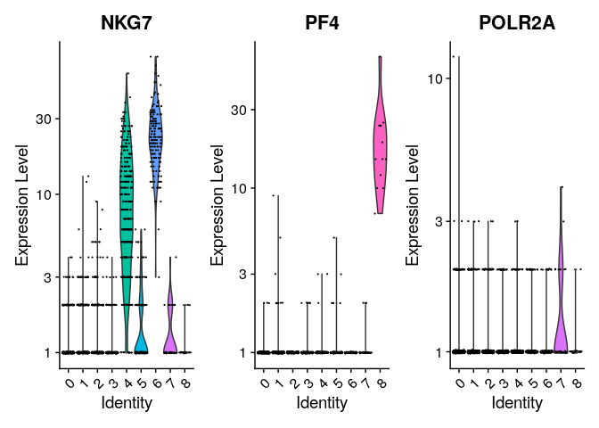

-   scatter plot

``` r
FeaturePlot(pbmc, features = c("MS4A1", "GNLY", "CD3E", "CD14", "FCER1A", "PPBP",
    "CD8A", "UGT8", "CD44"))
```

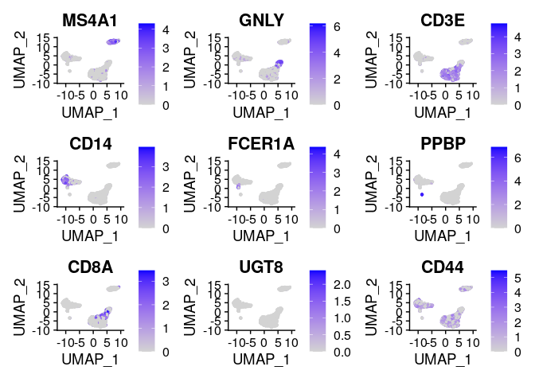

-   heatmap

``` r
pbmc.markers %>%
    group_by(cluster) %>%
    top_n(n = 10, wt = avg_log2FC) -> top10
DoHeatmap(pbmc, features = top10$gene) + NoLegend()
```

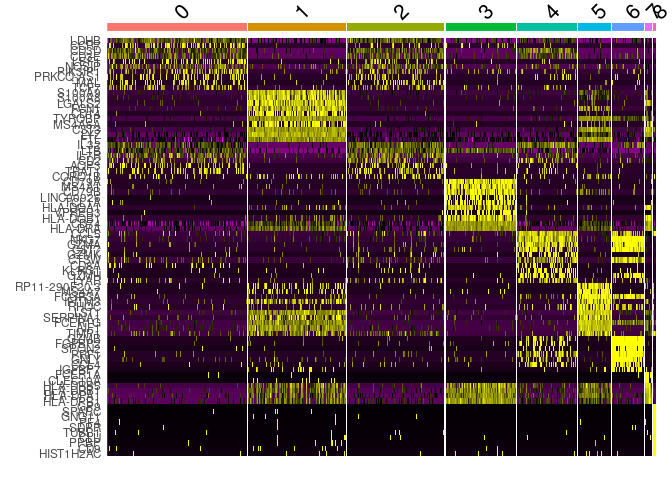

-   After these procedure, clusters are **manually** annotated

``` r
new.cluster.ids <- c("Naive CD4 T", "CD14+ Mono", "Memory CD4 T", "B", "CD8 T", "FCGR3A+ Mono",
    "NK", "DC", "Platelet")
names(new.cluster.ids) <- levels(pbmc)
pbmc <- RenameIdents(pbmc, new.cluster.ids)
DimPlot(pbmc, reduction = "umap", label = TRUE, pt.size = 0.5) + NoLegend()
```

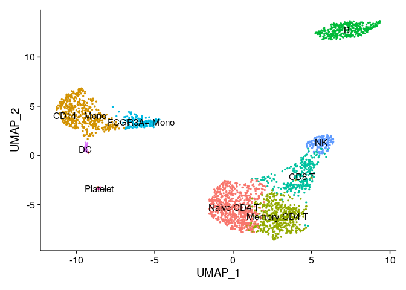

### Expot all results

``` r
saveRDS(pbmc, file = "../../data/tutorial/pbmc_tutorial_all.rds")
```

## Cmds of RNotebook

-   *Insert Chunk*: `Opt+Cmd+I`
-   *Run*: `Shift+Cmd+Return`
-   *Preview*: `Shit+Cmd+K`
-   *Save*: `Cmd+S`
