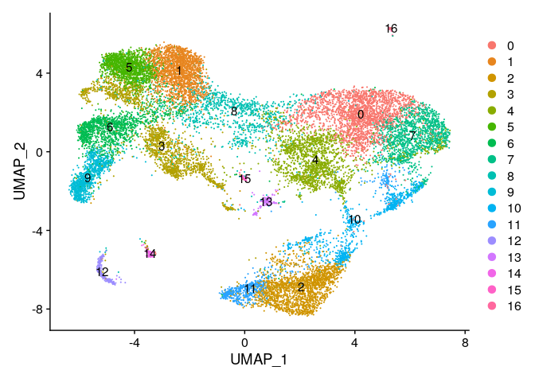
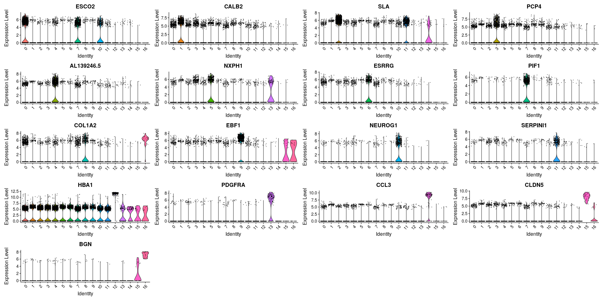
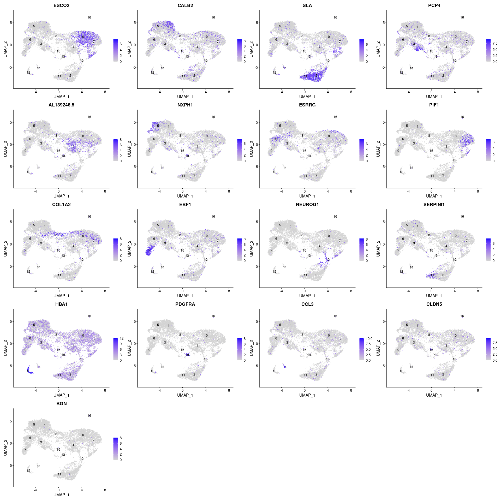
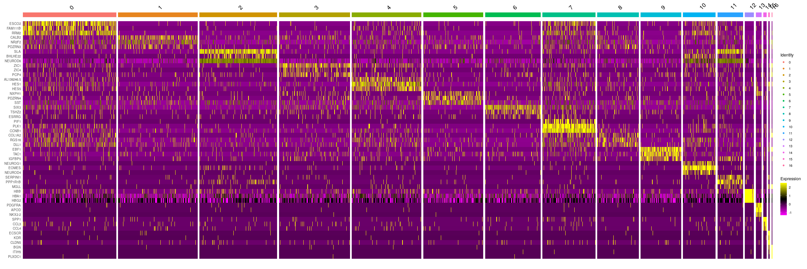
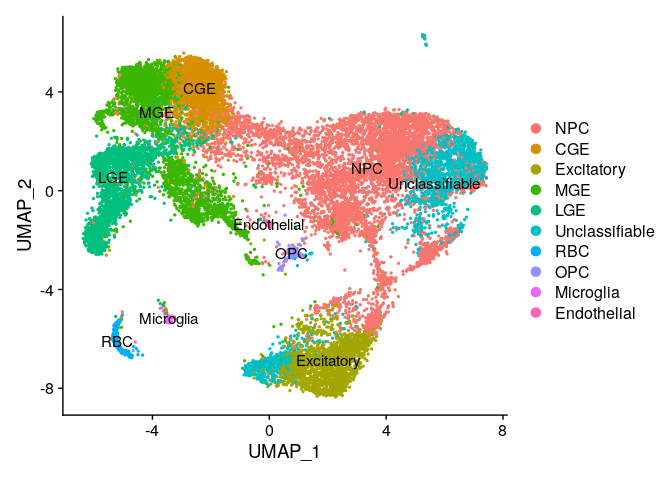

# 05-3_manual_annot

## Objectives

1.  Manual Annotation via Seurat

### load data and make seurat object

``` r
library(dplyr)
```

    ## 
    ## Attaching package: 'dplyr'

    ## The following objects are masked from 'package:stats':
    ## 
    ##     filter, lag

    ## The following objects are masked from 'package:base':
    ## 
    ##     intersect, setdiff, setequal, union

``` r
library(jsonlite)
library(Seurat)
```

    ## Attaching SeuratObject

    ## Attaching sp

``` r
library(patchwork)


source("../tools/spongy_panda/export_gdcmatrix.R")

data.id = "gw10"
data <- readRDS(paste0("../../data/gse165388_variablefeat/", data.id, "feat_seurat_pbj.rds"))

dim <- as.integer(read_json("../../out/gse165388/05_seurat_annot/dimensionality.json", simplifyVector = TRUE)[data.id])
```

### make difrectory to save outputs

``` r
dir.name <- "../../data/gse165388_annot"

if (! dir.exists(dir.name)) {
  dir.create(dir.name)
}
```

## PCA

``` r
all.genes <- rownames(data)
feat <- VariableFeatures(object = data)

data <- RunPCA(
  data,
  features = feat,
  verbose = FALSE,
  seed.use = 0,
  npcs=length(feat),
  approx=FALSE
)
```

## Clustering

``` r
data <- FindNeighbors(data, dims = 1:dim)
```

    ## Computing nearest neighbor graph

    ## Computing SNN

``` r
data <- FindClusters(data, resolution = 0.8)
```

    ## Modularity Optimizer version 1.3.0 by Ludo Waltman and Nees Jan van Eck
    ## 
    ## Number of nodes: 18183
    ## Number of edges: 2088447
    ## 
    ## Running Louvain algorithm...
    ## Maximum modularity in 10 random starts: 0.8375
    ## Number of communities: 17
    ## Elapsed time: 8 seconds

### Get cluster id

``` r
clusters_id <- data.frame(Idents(data))
```

## Embedding into Manifolds

### UMAP

``` r
data <- RunUMAP(data, dims = 1:dim)
```

    ## Warning: The default method for RunUMAP has changed from calling Python UMAP via reticulate to the R-native UWOT using the cosine metric
    ## To use Python UMAP via reticulate, set umap.method to 'umap-learn' and metric to 'correlation'
    ## This message will be shown once per session

    ## 10:38:01 UMAP embedding parameters a = 0.9922 b = 1.112

    ## 10:38:01 Read 18183 rows and found 211 numeric columns

    ## 10:38:01 Using Annoy for neighbor search, n_neighbors = 30

    ## 10:38:01 Building Annoy index with metric = cosine, n_trees = 50

    ## 0%   10   20   30   40   50   60   70   80   90   100%

    ## [----|----|----|----|----|----|----|----|----|----|

    ## **************************************************|
    ## 10:38:08 Writing NN index file to temp file /tmp/RtmpUl3qIS/file1027335d7542
    ## 10:38:08 Searching Annoy index using 1 thread, search_k = 3000
    ## 10:38:26 Annoy recall = 100%
    ## 10:38:28 Commencing smooth kNN distance calibration using 1 thread with target n_neighbors = 30
    ## 10:38:29 Initializing from normalized Laplacian + noise (using irlba)
    ## 10:38:30 Commencing optimization for 200 epochs, with 889658 positive edges
    ## 10:38:42 Optimization finished

``` r
DimPlot(data, reduction = "umap", label = T)
```



## Find DEG

``` r
markers <- FindAllMarkers(data, only.pos = TRUE, min.pct = 0.25, logfc.threshold = 0.25)
```

    ## Calculating cluster 0

    ## For a more efficient implementation of the Wilcoxon Rank Sum Test,
    ## (default method for FindMarkers) please install the limma package
    ## --------------------------------------------
    ## install.packages('BiocManager')
    ## BiocManager::install('limma')
    ## --------------------------------------------
    ## After installation of limma, Seurat will automatically use the more 
    ## efficient implementation (no further action necessary).
    ## This message will be shown once per session

    ## Calculating cluster 1

    ## Calculating cluster 2

    ## Calculating cluster 3

    ## Calculating cluster 4

    ## Calculating cluster 5

    ## Calculating cluster 6

    ## Calculating cluster 7

    ## Calculating cluster 8

    ## Calculating cluster 9

    ## Calculating cluster 10

    ## Calculating cluster 11

    ## Calculating cluster 12

    ## Calculating cluster 13

    ## Calculating cluster 14

    ## Calculating cluster 15

    ## Calculating cluster 16

``` r
n <- 10

degs <- markers %>%
  group_by(cluster) %>%
  slice_max(n = n, order_by = avg_log2FC) %>%
  data.frame()

write.csv(
  degs, 
  paste0(dir.name, "/", data.id, "_degs_top", n, ".csv"),
  quote = F
  )
```

### choose one key gene per cluster

``` r
deg.list <- sapply(unique(degs$cluster), function(idx) degs[degs$cluster==idx, ]$gene[1])
```

## Visualization

``` r
VlnPlot(data, features = deg.list)
```



-   scatter plot

``` r
FeaturePlot(data, features = deg.list, label=T)
```



-   heatmap

``` r
markers %>%
    group_by(cluster) %>%
    top_n(n = 3, wt = avg_log2FC) -> top
DoHeatmap(data, features = top$gene)
```



-   After these procedure, clusters are **manually** annotated

``` r
degs
```

    ##             p_val avg_log2FC pct.1 pct.2     p_val_adj cluster       gene
    ## 1    0.000000e+00  3.0641253 0.588 0.085  0.000000e+00       0      ESCO2
    ## 2    0.000000e+00  2.8987622 0.412 0.058  0.000000e+00       0    FAM111B
    ## 3    0.000000e+00  2.8706933 0.614 0.105  0.000000e+00       0       RRM2
    ## 4    0.000000e+00  2.8635786 0.254 0.034  0.000000e+00       0      MYBL2
    ## 5    0.000000e+00  2.8367198 0.302 0.043  0.000000e+00       0      CDC45
    ## 6    0.000000e+00  2.8033344 0.481 0.081  0.000000e+00       0   HIST1H1B
    ## 7    0.000000e+00  2.7787747 0.387 0.062  0.000000e+00       0  HIST1H2AJ
    ## 8    0.000000e+00  2.7490382 0.331 0.051  0.000000e+00       0      MCM10
    ## 9    0.000000e+00  2.6973508 0.837 0.208  0.000000e+00       0       TYMS
    ## 10   0.000000e+00  2.6810122 0.577 0.105  0.000000e+00       0   RAD51AP1
    ## 11   0.000000e+00  2.7870394 0.417 0.122  0.000000e+00       1      CALB2
    ## 12   0.000000e+00  2.0120806 0.574 0.245  0.000000e+00       1      NR2F2
    ## 13   1.069372e-96  1.9298601 0.269 0.120  2.221621e-92       1     PDZRN3
    ## 14  1.429752e-297  1.7358900 0.645 0.308 2.970310e-293       1       PLS3
    ## 15  9.737952e-117  1.6059576 0.468 0.282 2.023060e-112       1      CXCR4
    ## 16   1.424620e-61  1.5715068 0.252 0.134  2.959647e-57       1    DYNC1I1
    ## 17   1.186147e-66  1.4067442 0.277 0.144  2.464220e-62       1      ERBB4
    ## 18   1.319811e-92  1.3871172 0.421 0.260  2.741908e-88       1      PCDH9
    ## 19   3.419209e-66  1.3773730 0.304 0.170  7.103407e-62       1     RIPOR2
    ## 20   0.000000e+00  1.3420834 0.980 0.767  0.000000e+00       1   DLX6-AS1
    ## 21   0.000000e+00  3.7352812 0.760 0.097  0.000000e+00       2        SLA
    ## 22   0.000000e+00  3.4196210 0.313 0.039  0.000000e+00       2    BHLHE22
    ## 23   0.000000e+00  3.3294384 0.984 0.290  0.000000e+00       2    NEUROD6
    ## 24   0.000000e+00  3.2573700 0.933 0.193  0.000000e+00       2    NEUROD2
    ## 25   0.000000e+00  3.0729702 0.567 0.095  0.000000e+00       2    NEUROD1
    ## 26   0.000000e+00  2.9816462 0.332 0.054  0.000000e+00       2      EPHB6
    ## 27   0.000000e+00  2.9201245 0.487 0.104  0.000000e+00       2       SYT4
    ## 28   0.000000e+00  2.9032659 0.404 0.063  0.000000e+00       2      PRDM8
    ## 29   0.000000e+00  2.8940659 0.699 0.131  0.000000e+00       2       TBR1
    ## 30   0.000000e+00  2.8734124 0.262 0.039  0.000000e+00       2     RBFOX3
    ## 31  2.417681e-178  3.3153582 0.319 0.101 5.022732e-174       3       PCP4
    ## 32  5.223902e-274  3.0579568 0.258 0.045 1.085266e-269       3       ZIC4
    ## 33   0.000000e+00  2.7686796 0.431 0.115  0.000000e+00       3       ZIC1
    ## 34  2.872567e-283  2.2769789 0.465 0.147 5.967758e-279       3     NKX2-1
    ## 35   0.000000e+00  2.1189005 0.680 0.298  0.000000e+00       3       MEST
    ## 36   0.000000e+00  1.7690763 0.924 0.651  0.000000e+00       3       MEG3
    ## 37   2.411338e-72  1.5571959 0.257 0.115  5.009555e-68       3      NRCAM
    ## 38   3.039955e-70  1.5507362 0.265 0.124  6.315506e-66       3     PCDH17
    ## 39  1.102438e-114  1.4902042 0.383 0.172 2.290314e-110       3   KCNQ1OT1
    ## 40   3.241862e-62  1.4465906 0.251 0.119  6.734969e-58       3     SPINT2
    ## 41   0.000000e+00  3.6092250 0.415 0.061  0.000000e+00       4 AL139246.5
    ## 42   0.000000e+00  3.3908539 0.674 0.145  0.000000e+00       4       HES1
    ## 43   0.000000e+00  3.1965089 0.460 0.075  0.000000e+00       4       HES5
    ## 44   0.000000e+00  3.0876827 0.373 0.057  0.000000e+00       4      PLPP3
    ## 45  5.389706e-283  3.0384199 0.274 0.048 1.119711e-278       4      MGST1
    ## 46   0.000000e+00  3.0076390 0.538 0.130  0.000000e+00       4        CLU
    ## 47   0.000000e+00  2.8838486 0.363 0.077  0.000000e+00       4     SLC1A3
    ## 48  2.370801e-253  2.8502206 0.251 0.045 4.925340e-249       4       LIX1
    ## 49   0.000000e+00  2.7757820 0.728 0.215  0.000000e+00       4      TTYH1
    ## 50  2.875486e-268  2.7363465 0.263 0.046 5.973822e-264       4      VEPH1
    ## 51   0.000000e+00  3.1828160 0.319 0.055  0.000000e+00       5      NXPH1
    ## 52   0.000000e+00  3.1185018 0.435 0.087  0.000000e+00       5     PDZRN4
    ## 53  1.291306e-204  2.9814357 0.502 0.220 2.682688e-200       5        SST
    ## 54  7.534347e-247  2.9640213 0.306 0.067 1.565261e-242       5        MAF
    ## 55  2.601036e-193  2.7276640 0.286 0.071 5.403652e-189       5      GRIA4
    ## 56   0.000000e+00  2.5324092 0.487 0.128  0.000000e+00       5      ERBB4
    ## 57   0.000000e+00  2.2287641 0.791 0.304  0.000000e+00       5       PLS3
    ## 58  1.679275e-277  2.0296765 0.627 0.273 3.488695e-273       5      CXCR4
    ## 59  1.889409e-146  1.7284131 0.491 0.254 3.925247e-142       5    PDE4DIP
    ## 60  6.295199e-104  1.6125661 0.420 0.214  1.307827e-99       5      MEF2C
    ## 61  1.367266e-209  3.0780015 0.270 0.056 2.840495e-205       6      ESRRG
    ## 62  1.012818e-238  3.0362087 0.324 0.072 2.104129e-234       6      TSHZ2
    ## 63   0.000000e+00  2.9089894 0.641 0.186  0.000000e+00       6       SIX3
    ## 64  5.332915e-167  2.7985033 0.263 0.065 1.107913e-162       6       NRG1
    ## 65  4.459001e-143  2.5736016 0.275 0.079 9.263575e-139       6       RPRM
    ## 66  5.418018e-266  2.5218353 0.508 0.174 1.125593e-261       6      ZFHX4
    ## 67  3.248856e-160  2.4679204 0.263 0.066 6.749498e-156       6      SYNPR
    ## 68  2.071855e-154  2.2059423 0.347 0.113 4.304279e-150       6     ZNF503
    ## 69  4.389802e-218  2.0965055 0.543 0.222 9.119814e-214       6      ZFHX3
    ## 70   0.000000e+00  2.0543612 0.972 0.626  0.000000e+00       6      MEIS2
    ## 71   0.000000e+00  4.5218975 0.457 0.014  0.000000e+00       7       PIF1
    ## 72   0.000000e+00  4.4446773 0.846 0.067  0.000000e+00       7       PLK1
    ## 73   0.000000e+00  4.2870729 0.899 0.123  0.000000e+00       7      CCNB1
    ## 74   0.000000e+00  4.2551329 0.700 0.048  0.000000e+00       7       NEK2
    ## 75   0.000000e+00  4.2227656 0.924 0.113  0.000000e+00       7      CDC20
    ## 76   0.000000e+00  4.1146111 0.754 0.056  0.000000e+00       7      CENPA
    ## 77   0.000000e+00  4.0575873 0.967 0.153  0.000000e+00       7       ASPM
    ## 78   0.000000e+00  3.9798659 0.930 0.113  0.000000e+00       7      CENPE
    ## 79   0.000000e+00  3.9244926 0.809 0.077  0.000000e+00       7      AURKA
    ## 80   0.000000e+00  3.9208228 0.922 0.111  0.000000e+00       7     DLGAP5
    ## 81  1.631424e-105  2.5818472 0.276 0.083 3.389284e-101       8     COL1A2
    ## 82   1.505217e-95  2.3270407 0.404 0.179  3.127088e-91       8      RGS16
    ## 83   9.160842e-51  1.6759327 0.327 0.170  1.903165e-46       8       DLL1
    ## 84   1.810263e-43  1.2987667 0.466 0.322  3.760821e-39       8       DLL3
    ## 85   1.171220e-52  1.2491348 0.661 0.536  2.433209e-48       8    GADD45G
    ## 86   1.919229e-19  1.1424065 0.298 0.207  3.987199e-15       8       CDK6
    ## 87   5.763383e-91  0.9908383 0.814 0.654  1.197343e-86       8       DLX2
    ## 88   5.154760e-78  0.9570077 0.790 0.634  1.070901e-73       8       GAD2
    ## 89   6.328616e-19  0.9515728 0.324 0.230  1.314770e-14       8      FBXW7
    ## 90   5.274755e-45  0.9100434 0.671 0.517  1.095830e-40       8      ASCL1
    ## 91   0.000000e+00  5.4371556 0.800 0.054  0.000000e+00       9       EBF1
    ## 92   0.000000e+00  4.8743031 0.686 0.131  0.000000e+00       9       TAC1
    ## 93   0.000000e+00  4.4287240 0.460 0.083  0.000000e+00       9     IGFBP5
    ## 94   0.000000e+00  3.8857734 0.771 0.112  0.000000e+00       9       ISL1
    ## 95   0.000000e+00  3.5030782 0.649 0.100  0.000000e+00       9     ZNF503
    ## 96  4.218810e-265  3.1663288 0.587 0.205 8.764578e-261       9      FOXP1
    ## 97  1.398557e-150  2.8563233 0.303 0.077 2.905501e-146       9     ZNF521
    ## 98  3.419713e-140  2.8373179 0.307 0.085 7.104455e-136       9 AC009041.2
    ## 99  5.884177e-153  2.6305359 0.277 0.062 1.222438e-148       9 AC140912.1
    ## 100  0.000000e+00  2.3576270 0.875 0.483  0.000000e+00       9       VCAN
    ## 101  0.000000e+00  5.2961765 0.419 0.015  0.000000e+00      10    NEUROG1
    ## 102  0.000000e+00  5.1083048 0.835 0.043  0.000000e+00      10      EOMES
    ## 103  0.000000e+00  5.1025757 0.393 0.008  0.000000e+00      10    NEUROD4
    ## 104  0.000000e+00  4.0993136 0.430 0.043  0.000000e+00      10       PENK
    ## 105  0.000000e+00  4.0467313 0.681 0.056  0.000000e+00      10      NHLH1
    ## 106  0.000000e+00  3.8343263 0.250 0.016  0.000000e+00      10     TFAP2C
    ## 107  0.000000e+00  3.6933434 0.695 0.079  0.000000e+00      10    NEUROG2
    ## 108  0.000000e+00  3.4982781 0.430 0.034  0.000000e+00      10     DMRTA2
    ## 109  0.000000e+00  3.2493300 0.645 0.071  0.000000e+00      10      SSTR2
    ## 110  0.000000e+00  3.2382941 0.646 0.104  0.000000e+00      10    PPP1R17
    ## 111  0.000000e+00  3.9323800 0.421 0.028  0.000000e+00      11   SERPINI1
    ## 112  0.000000e+00  3.8689112 0.564 0.040  0.000000e+00      11    PPP1R1B
    ## 113  0.000000e+00  3.5157511 0.315 0.022  0.000000e+00      11       MGLL
    ## 114  0.000000e+00  3.4780715 0.455 0.033  0.000000e+00      11       DAB1
    ## 115  0.000000e+00  3.4635025 0.258 0.017  0.000000e+00      11      CDH13
    ## 116 2.308054e-273  3.4023275 0.258 0.020 4.794982e-269      11       CDH7
    ## 117  0.000000e+00  3.2345742 0.469 0.046  0.000000e+00      11      FEZF2
    ## 118  0.000000e+00  3.1844627 0.575 0.072  0.000000e+00      11      MASP1
    ## 119 1.427920e-281  3.1720297 0.264 0.021 2.966505e-277      11     GAREM1
    ## 120  0.000000e+00  2.9216490 0.618 0.081  0.000000e+00      11      PRDM8
    ## 121 7.147877e-175  8.9110499 0.991 0.445 1.484972e-170      12       HBA1
    ## 122  0.000000e+00  8.8283865 0.970 0.111  0.000000e+00      12        HBB
    ## 123 4.483476e-156  8.8269091 1.000 0.649 9.314421e-152      12       HBG2
    ## 124 4.817841e-151  8.7786081 1.000 0.694 1.000907e-146      12       HBA2
    ## 125  0.000000e+00  8.3043849 0.896 0.006  0.000000e+00      12       HBG1
    ## 126  0.000000e+00  7.9898478 0.774 0.007  0.000000e+00      12       AHSP
    ## 127  0.000000e+00  7.9872385 0.709 0.008  0.000000e+00      12        HBM
    ## 128  0.000000e+00  7.7840485 0.657 0.002  0.000000e+00      12       GYPB
    ## 129  0.000000e+00  7.6866347 0.748 0.004  0.000000e+00      12      ALAS2
    ## 130  0.000000e+00  7.2950788 0.526 0.002  0.000000e+00      12      HEMGN
    ## 131  0.000000e+00  8.0441893 0.755 0.009  0.000000e+00      13     PDGFRA
    ## 132  0.000000e+00  7.9884550 0.930 0.008  0.000000e+00      13       APOD
    ## 133  0.000000e+00  7.4867415 0.678 0.003  0.000000e+00      13     NKX2-2
    ## 134  0.000000e+00  7.1828359 0.280 0.003  0.000000e+00      13     CLDN11
    ## 135  0.000000e+00  6.9737745 0.902 0.025  0.000000e+00      13      S100B
    ## 136  0.000000e+00  6.6843048 0.573 0.003  0.000000e+00      13      SOX10
    ## 137  0.000000e+00  6.6544162 0.336 0.001  0.000000e+00      13      GPR17
    ## 138  0.000000e+00  6.4391573 0.916 0.034  0.000000e+00      13       PMP2
    ## 139  0.000000e+00  6.3610034 0.552 0.007  0.000000e+00      13      EVI2A
    ## 140  0.000000e+00  5.7581349 0.294 0.001  0.000000e+00      13    COL20A1
    ## 141 7.708479e-290  9.6845734 0.826 0.041 1.601437e-285      14       CCL3
    ## 142  0.000000e+00  9.6598253 0.977 0.040  0.000000e+00      14       SPP1
    ## 143 1.410638e-272  9.5213540 0.756 0.036 2.930601e-268      14       CCL4
    ## 144  0.000000e+00  9.2325701 0.674 0.017  0.000000e+00      14     CCL4L2
    ## 145  0.000000e+00  9.2130891 0.698 0.011  0.000000e+00      14     CCL3L1
    ## 146  0.000000e+00  9.2064900 0.849 0.011  0.000000e+00      14       RGS1
    ## 147  0.000000e+00  9.1148088 0.674 0.004  0.000000e+00      14       IL1B
    ## 148  0.000000e+00  9.0782359 0.907 0.004  0.000000e+00      14       C1QC
    ## 149  0.000000e+00  9.0415411 0.930 0.009  0.000000e+00      14       AIF1
    ## 150  0.000000e+00  9.0129084 0.942 0.006  0.000000e+00      14     TYROBP
    ## 151 8.700141e-146  8.4661585 1.000 0.049 1.807454e-141      15      CLDN5
    ## 152  0.000000e+00  8.0449488 0.844 0.006  0.000000e+00      15      ECSCR
    ## 153  0.000000e+00  8.0296759 0.750 0.003  0.000000e+00      15        KDR
    ## 154  0.000000e+00  8.0148707 0.469 0.002  0.000000e+00      15       GJA4
    ## 155 1.881512e-141  7.9933495 0.969 0.047 3.908841e-137      15     IGFBP7
    ## 156  0.000000e+00  7.9149083 0.781 0.005  0.000000e+00      15       FLT1
    ## 157  0.000000e+00  7.8523390 0.781 0.007  0.000000e+00      15       ESAM
    ## 158 3.526285e-119  7.6967649 0.938 0.053 7.325856e-115      15      ITM2A
    ## 159 2.489922e-199  7.6392982 0.406 0.005 5.172812e-195      15     TM4SF1
    ## 160  0.000000e+00  7.6129966 0.656 0.005  0.000000e+00      15    S100A16
    ## 161  0.000000e+00  9.5351609 1.000 0.005  0.000000e+00      16        BGN
    ## 162  0.000000e+00  9.0806691 1.000 0.003  0.000000e+00      16      ITIH5
    ## 163  0.000000e+00  9.0184189 1.000 0.003  0.000000e+00      16     PLXDC1
    ## 164  0.000000e+00  9.0091252 0.950 0.001  0.000000e+00      16     HIGD1B
    ## 165  0.000000e+00  8.4701906 0.950 0.002  0.000000e+00      16      EDNRA
    ## 166 4.408237e-279  8.4107439 1.000 0.015 9.158111e-275      16     COL4A1
    ## 167  0.000000e+00  8.3524946 0.900 0.001  0.000000e+00      16      ABCC9
    ## 168  0.000000e+00  8.2363355 0.800 0.002  0.000000e+00      16      PRELP
    ## 169 2.495785e-197  8.1921752 0.950 0.019 5.184993e-193      16   NDUFA4L2
    ## 170  0.000000e+00  8.1826929 0.750 0.003  0.000000e+00      16        DCN

### Assign Names

``` r
new.label <- c(
  "NPC", "CGE", "Excitatory", "MGE", "NPC", "MGE",
  "LGE", "Unclassifiable", "NPC", "LGE", "NPC", "Unclassifiable",
  "RBC", "OPC", "Microglia", "Endothelial", "Unclassifiable"
)
```

### Visualization

``` r
names(new.label) <- levels(data)
data <- RenameIdents(data, new.label)
DimPlot(data, reduction = "umap", label = TRUE, pt.size = 0.5)
```



### Export Clusters

## Export Data

``` r
saveRDS(Embeddings(data, reduction = "pca")[, 1:dim], file = paste0(dir.name, "/", data.id, "pca.rds"))
saveRDS(Embeddings(data, reduction = "umap"), file = paste0(dir.name, "/", data.id, "umap.rds"))
```
