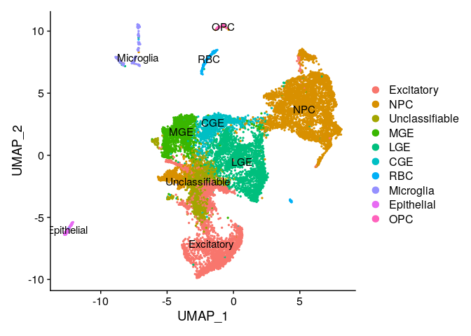

# 05-3_manual_annot

## Objectives

1.  Manual Annotation via Seurat

### load data and make seurat object

``` r
library(dplyr)
```

    ## 
    ## Attaching package: 'dplyr'

    ## The following objects are masked from 'package:stats':
    ## 
    ##     filter, lag

    ## The following objects are masked from 'package:base':
    ## 
    ##     intersect, setdiff, setequal, union

``` r
library(jsonlite)
library(Seurat)
```

    ## Attaching SeuratObject

    ## Attaching sp

``` r
library(patchwork)


source("../tools/spongy_panda/export_gdcmatrix.R")

data.id = "gw11"
data <- readRDS(paste0("../../data/gse165388_variablefeat/", data.id, "feat_seurat_pbj.rds"))

dim <- as.integer(read_json("../../out/gse165388/05_seurat_annot/dimensionality.json", simplifyVector = TRUE)[data.id])
```

### make difrectory to save outputs

``` r
dir.name <- "../../data/gse165388_annot"

if (! dir.exists(dir.name)) {
  dir.create(dir.name)
}
```

## PCA

``` r
all.genes <- rownames(data)
feat <- VariableFeatures(object = data)

data <- RunPCA(
  data,
  features = feat,
  verbose = FALSE,
  seed.use = 0,
  npcs=length(feat),
  approx=FALSE
)
```

## Clustering

``` r
data <- FindNeighbors(data, dims = 1:dim)
```

    ## Computing nearest neighbor graph

    ## Computing SNN

``` r
data <- FindClusters(data, resolution = 0.8)
```

    ## Modularity Optimizer version 1.3.0 by Ludo Waltman and Nees Jan van Eck
    ## 
    ## Number of nodes: 15994
    ## Number of edges: 1560645
    ## 
    ## Running Louvain algorithm...
    ## Maximum modularity in 10 random starts: 0.8517
    ## Number of communities: 18
    ## Elapsed time: 5 seconds

### Get cluster id

``` r
clusters_id <- data.frame(Idents(data))
```

## Embedding into Manifolds

### UMAP

``` r
data <- RunUMAP(data, dims = 1:dim)
```

    ## Warning: The default method for RunUMAP has changed from calling Python UMAP via reticulate to the R-native UWOT using the cosine metric
    ## To use Python UMAP via reticulate, set umap.method to 'umap-learn' and metric to 'correlation'
    ## This message will be shown once per session

    ## 03:49:53 UMAP embedding parameters a = 0.9922 b = 1.112

    ## 03:49:53 Read 15994 rows and found 204 numeric columns

    ## 03:49:53 Using Annoy for neighbor search, n_neighbors = 30

    ## 03:49:53 Building Annoy index with metric = cosine, n_trees = 50

    ## 0%   10   20   30   40   50   60   70   80   90   100%

    ## [----|----|----|----|----|----|----|----|----|----|

    ## **************************************************|
    ## 03:50:00 Writing NN index file to temp file /tmp/RtmpBOJURY/filedf03b2a81b4
    ## 03:50:00 Searching Annoy index using 1 thread, search_k = 3000
    ## 03:50:13 Annoy recall = 100%
    ## 03:50:14 Commencing smooth kNN distance calibration using 1 thread with target n_neighbors = 30
    ## 03:50:15 Initializing from normalized Laplacian + noise (using irlba)
    ## 03:50:16 Commencing optimization for 200 epochs, with 779896 positive edges
    ## 03:50:27 Optimization finished

``` r
DimPlot(data, reduction = "umap", label = T)
```


## Find DEG

``` r
markers <- FindAllMarkers(data, only.pos = TRUE, min.pct = 0.25, logfc.threshold = 0.25)
```

    ## Calculating cluster 0

    ## For a more efficient implementation of the Wilcoxon Rank Sum Test,
    ## (default method for FindMarkers) please install the limma package
    ## --------------------------------------------
    ## install.packages('BiocManager')
    ## BiocManager::install('limma')
    ## --------------------------------------------
    ## After installation of limma, Seurat will automatically use the more 
    ## efficient implementation (no further action necessary).
    ## This message will be shown once per session

    ## Calculating cluster 1

    ## Calculating cluster 2

    ## Calculating cluster 3

    ## Calculating cluster 4

    ## Calculating cluster 5

    ## Calculating cluster 6

    ## Calculating cluster 7

    ## Calculating cluster 8

    ## Calculating cluster 9

    ## Calculating cluster 10

    ## Calculating cluster 11

    ## Calculating cluster 12

    ## Calculating cluster 13

    ## Calculating cluster 14

    ## Calculating cluster 15

    ## Calculating cluster 16

    ## Calculating cluster 17

``` r
n <- 10

degs <- markers %>%
  group_by(cluster) %>%
  slice_max(n = n, order_by = avg_log2FC) %>%
  data.frame()

write.csv(
  degs, 
  paste0(dir.name, "/", data.id, "_degs_top", n, ".csv"),
  quote = F
  )
```

### choose one key gene per cluster

``` r
deg.list <- sapply(unique(degs$cluster), function(idx) degs[degs$cluster==idx, ]$gene[1])
```

## Visualization

``` r
VlnPlot(data, features = deg.list)
```


-   scatter plot

``` r
FeaturePlot(data, features = deg.list, label=T)
```


-   heatmap

``` r
markers %>%
    group_by(cluster) %>%
    top_n(n = 3, wt = avg_log2FC) -> top
DoHeatmap(data, features = top$gene)
```


-   After these procedure, clusters are **manually** annotated

``` r
degs
```

    ##             p_val avg_log2FC pct.1 pct.2     p_val_adj cluster       gene
    ## 1    0.000000e+00   4.499538 0.448 0.021  0.000000e+00       0       EML6
    ## 2    0.000000e+00   4.083559 0.276 0.012  0.000000e+00       0   C6orf141
    ## 3    0.000000e+00   3.732726 0.819 0.064  0.000000e+00       0        SLA
    ## 4    0.000000e+00   3.698116 0.352 0.010  0.000000e+00       0    SLC17A7
    ## 5    0.000000e+00   3.448718 0.319 0.026  0.000000e+00       0      NHLH1
    ## 6    0.000000e+00   3.329887 0.882 0.074  0.000000e+00       0       TBR1
    ## 7    0.000000e+00   3.284627 0.888 0.108  0.000000e+00       0    NEUROD6
    ## 8    0.000000e+00   3.232629 0.501 0.054  0.000000e+00       0      SETD7
    ## 9    0.000000e+00   3.201070 0.464 0.087  0.000000e+00       0    DPY19L1
    ## 10   0.000000e+00   3.194403 0.484 0.035  0.000000e+00       0    NEUROD1
    ## 11   0.000000e+00   4.416725 0.404 0.017  0.000000e+00       1       PIF1
    ## 12   0.000000e+00   4.350975 0.945 0.135  0.000000e+00       1       ASPM
    ## 13   0.000000e+00   4.008274 0.723 0.036  0.000000e+00       1      CDCA2
    ## 14   0.000000e+00   3.960625 0.994 0.154  0.000000e+00       1      MKI67
    ## 15   0.000000e+00   3.958749 0.810 0.081  0.000000e+00       1      CENPE
    ## 16   0.000000e+00   3.934747 0.629 0.026  0.000000e+00       1     KIF20A
    ## 17   0.000000e+00   3.902761 0.951 0.109  0.000000e+00       1       KNL1
    ## 18   0.000000e+00   3.897454 0.997 0.284  0.000000e+00       1      CENPF
    ## 19   0.000000e+00   3.871090 0.714 0.050  0.000000e+00       1      KIF14
    ## 20   0.000000e+00   3.831647 0.826 0.074  0.000000e+00       1       SGO2
    ## 21   3.541909e-03   1.466667 0.190 0.268  1.000000e+00       2     EEF1A2
    ## 22   9.710502e-13   1.308976 0.158 0.277  2.327607e-08       2       LY6H
    ## 23   5.826318e-20   1.200286 0.146 0.288  1.396568e-15       2      CNIH2
    ## 24   1.062377e-19   1.190681 0.171 0.330  2.546517e-15       2       BEX2
    ## 25   1.621393e-30   1.124336 0.180 0.387  3.886479e-26       2      CTXN1
    ## 26   1.133834e-13   1.095554 0.240 0.424  2.717799e-09       2       THRA
    ## 27   6.269148e-12   1.068531 0.333 0.600  1.502715e-07       2       PKIA
    ## 28   4.296997e-12   1.051575 0.240 0.415  1.029990e-07       2      STMN4
    ## 29   3.543809e-05   1.045775 0.288 0.450  8.494511e-01       2       MAPT
    ## 30   3.281976e-24   1.042636 0.576 0.777  7.866897e-20       2     TUBB2A
    ## 31   0.000000e+00   3.858265 0.347 0.024  0.000000e+00       3      NXPH1
    ## 32   0.000000e+00   3.825718 0.557 0.047  0.000000e+00       3       LHX6
    ## 33   0.000000e+00   3.543979 0.377 0.049  0.000000e+00       3        MAF
    ## 34   0.000000e+00   3.449691 0.498 0.087  0.000000e+00       3      GRIA4
    ## 35  4.468438e-300   3.400932 0.251 0.035 1.071085e-295       3    ADAMTS5
    ## 36   0.000000e+00   3.352720 0.477 0.077  0.000000e+00       3     PDZRN4
    ## 37   0.000000e+00   3.022550 0.778 0.148  0.000000e+00       3      ERBB4
    ## 38   0.000000e+00   2.766042 0.832 0.277  0.000000e+00       3       SOX6
    ## 39  5.813047e-208   2.681663 0.295 0.074 1.393387e-203       3      ERO1B
    ## 40   0.000000e+00   2.670667 0.767 0.184  0.000000e+00       3       PLS3
    ## 41   0.000000e+00   3.753545 0.508 0.063  0.000000e+00       4      PDE5A
    ## 42   0.000000e+00   3.439705 0.646 0.157  0.000000e+00       4       SIX3
    ## 43   0.000000e+00   3.349170 0.280 0.035  0.000000e+00       4    SLITRK6
    ## 44   0.000000e+00   2.881088 0.420 0.100  0.000000e+00       4      ESRRG
    ## 45  1.404309e-229   2.816818 0.275 0.055 3.366129e-225       4  LINC01305
    ## 46  1.076281e-257   2.739730 0.389 0.106 2.579845e-253       4       NRG1
    ## 47   0.000000e+00   2.659972 0.734 0.291  0.000000e+00       4      ZFHX4
    ## 48   0.000000e+00   2.602244 0.696 0.289  0.000000e+00       4       TLE4
    ## 49  1.056030e-225   2.565734 0.390 0.119 2.531303e-221       4      TSHZ1
    ## 50  1.300024e-224   2.507743 0.279 0.059 3.116158e-220       4       NRGN
    ## 51   0.000000e+00   3.843683 0.380 0.036  0.000000e+00       5 AL139246.5
    ## 52   0.000000e+00   2.961490 0.530 0.093  0.000000e+00       5       HES5
    ## 53  7.146933e-304   2.954088 0.276 0.040 1.713120e-299       5       EGFR
    ## 54   0.000000e+00   2.680583 0.400 0.059  0.000000e+00       5      VEPH1
    ## 55  5.968216e-291   2.603286 0.321 0.059 1.430581e-286       5      RGS16
    ## 56   0.000000e+00   2.554594 0.863 0.272  0.000000e+00       5     ADGRV1
    ## 57   0.000000e+00   2.508207 0.844 0.224  0.000000e+00       5       CDK6
    ## 58   0.000000e+00   2.506998 0.331 0.050  0.000000e+00       5       LIPG
    ## 59   0.000000e+00   2.494616 0.475 0.078  0.000000e+00       5       E2F1
    ## 60   0.000000e+00   2.460188 0.386 0.065  0.000000e+00       5       GSX2
    ## 61   0.000000e+00   4.543093 0.394 0.028  0.000000e+00       6       THRB
    ## 62   0.000000e+00   3.494389 0.408 0.052  0.000000e+00       6      CALB2
    ## 63   0.000000e+00   3.239298 0.641 0.140  0.000000e+00       6     PDZRN3
    ## 64  2.292337e-183   2.664330 0.306 0.063 5.494732e-179       6      PROX1
    ## 65  2.009729e-145   2.625138 0.296 0.073 4.817320e-141       6        SP8
    ## 66  8.766310e-193   2.540031 0.396 0.102 2.101285e-188       6      CXCR4
    ## 67  2.475787e-152   2.476508 0.312 0.077 5.934462e-148       6  NR2F2-AS1
    ## 68  9.092314e-265   2.455036 0.550 0.155 2.179428e-260       6    ST8SIA5
    ## 69   0.000000e+00   2.450974 0.785 0.211  0.000000e+00       6       PLS3
    ## 70  6.547008e-137   2.439933 0.375 0.121 1.569318e-132       6       ST18
    ## 71   0.000000e+00   4.790043 0.774 0.056  0.000000e+00       7       EBF1
    ## 72   0.000000e+00   4.485099 0.426 0.022  0.000000e+00       7     STK32A
    ## 73   0.000000e+00   4.108105 0.845 0.067  0.000000e+00       7       ISL1
    ## 74   0.000000e+00   4.018923 0.659 0.084  0.000000e+00       7       TAC1
    ## 75   0.000000e+00   3.476400 0.681 0.072  0.000000e+00       7     ZNF503
    ## 76   0.000000e+00   3.463176 0.557 0.085  0.000000e+00       7     ZNF521
    ## 77  4.917502e-279   3.418046 0.453 0.096 1.178725e-274       7     IGFBP5
    ## 78   0.000000e+00   3.279992 0.412 0.051  0.000000e+00       7 AC140912.1
    ## 79  8.394926e-284   3.175098 0.272 0.030 2.012264e-279       7       RARB
    ## 80   0.000000e+00   3.131525 0.357 0.049  0.000000e+00       7      RAMP1
    ## 81  1.166849e-135   3.941429 0.276 0.067 2.796937e-131       8      CNTN1
    ## 82   9.025010e-64   3.326199 0.304 0.139  2.163295e-59       8      NEGR1
    ## 83  1.347971e-158   3.170122 0.455 0.164 3.231087e-154       8     GRIN2B
    ## 84   7.471619e-44   2.845573 0.288 0.152  1.790947e-39       8       FAT3
    ## 85   5.528312e-32   2.619775 0.354 0.257  1.325136e-27       8      NRCAM
    ## 86   3.504803e-37   2.377237 0.474 0.432  8.401013e-33       8     PGM2L1
    ## 87   1.237826e-26   2.322520 0.255 0.153  2.967068e-22       8       SYT4
    ## 88   4.813089e-22   2.309294 0.344 0.279  1.153697e-17       8       PEG3
    ## 89   5.541351e-32   2.026013 0.456 0.389  1.328262e-27       8       CHL1
    ## 90   1.534972e-46   1.979757 0.528 0.492  3.679328e-42       8      CXADR
    ## 91   4.988172e-30   2.232765 0.254 0.142  1.195665e-25       9  HIST1H2AH
    ## 92   7.741051e-73   2.099330 0.424 0.218  1.855530e-68       9      PCLAF
    ## 93   2.379993e-79   2.075724 0.601 0.430  5.704844e-75       9   HIST1H1C
    ## 94   1.483299e-54   1.993607 0.367 0.192  3.555468e-50       9   HIST1H1B
    ## 95   5.472593e-42   1.977669 0.347 0.200  1.311781e-37       9      BIRC5
    ## 96   1.231291e-53   1.941857 0.407 0.236  2.951404e-49       9       TYMS
    ## 97   2.574250e-67   1.915852 0.555 0.398  6.170478e-63       9   HIST1H1E
    ## 98   4.463146e-56   1.898449 0.435 0.263  1.069816e-51       9      H2AFX
    ## 99   5.773891e-23   1.877216 0.263 0.162  1.384002e-18       9      ESCO2
    ## 100  1.668995e-16   1.769351 0.257 0.175  4.000582e-12       9        PBK
    ## 101  0.000000e+00   9.695705 0.965 0.101  0.000000e+00      10        HBB
    ## 102 1.509766e-195   9.584091 0.985 0.427 3.618908e-191      10       HBG2
    ## 103 1.716472e-266   9.419750 0.985 0.254 4.114383e-262      10       HBA1
    ## 104 4.351409e-196   9.308954 0.985 0.425 1.043033e-191      10       HBA2
    ## 105  0.000000e+00   8.949493 0.846 0.004  0.000000e+00      10      ALAS2
    ## 106  0.000000e+00   8.414870 0.846 0.004  0.000000e+00      10       HBG1
    ## 107  0.000000e+00   8.008109 0.753 0.010  0.000000e+00      10        HBM
    ## 108  0.000000e+00   7.823608 0.417 0.010  0.000000e+00      10        HBZ
    ## 109  0.000000e+00   7.748864 0.753 0.006  0.000000e+00      10       AHSP
    ## 110  0.000000e+00   7.666432 0.714 0.003  0.000000e+00      10       GYPA
    ## 111  0.000000e+00   8.650758 0.365 0.002  0.000000e+00      11     TYROBP
    ## 112  0.000000e+00   8.633018 0.299 0.002  0.000000e+00      11       CD74
    ## 113  0.000000e+00   8.608631 0.340 0.002  0.000000e+00      11       C1QB
    ## 114  0.000000e+00   8.484223 0.295 0.001  0.000000e+00      11       C1QA
    ## 115 1.185540e-215   8.437395 0.357 0.024 2.841740e-211      11       SPP1
    ## 116  0.000000e+00   8.411578 0.320 0.001  0.000000e+00      11       C1QC
    ## 117  0.000000e+00   8.178790 0.257 0.001  0.000000e+00      11     P2RY12
    ## 118  0.000000e+00   8.176476 0.498 0.021  0.000000e+00      11     IGFBP7
    ## 119  0.000000e+00   8.165531 0.357 0.001  0.000000e+00      11     LAPTM5
    ## 120  0.000000e+00   8.079476 0.419 0.010  0.000000e+00      11       APOE
    ## 121  0.000000e+00   5.516749 0.383 0.010  0.000000e+00      12    NEUROG1
    ## 122  0.000000e+00   4.907312 0.617 0.024  0.000000e+00      12  LINC01965
    ## 123  0.000000e+00   4.823685 0.714 0.024  0.000000e+00      12     TFAP2C
    ## 124  0.000000e+00   4.448350 0.352 0.010  0.000000e+00      12   TMEM132D
    ## 125 3.644436e-297   4.267898 0.750 0.068 8.735714e-293      12     FBXO32
    ## 126 2.819825e-137   4.262435 0.510 0.065 6.759122e-133      12    NEUROG2
    ## 127 8.781418e-147   4.051647 0.954 0.278 2.104906e-142      12        PTN
    ## 128 3.962897e-100   3.954872 0.265 0.023  9.499063e-96      12    NEUROD4
    ## 129  0.000000e+00   3.822372 0.505 0.022  0.000000e+00      12      PREX2
    ## 130 3.668830e-266   3.718006 0.531 0.036 8.794186e-262      12       TCIM
    ## 131  0.000000e+00   5.054225 0.974 0.036  0.000000e+00      13      EOMES
    ## 132  0.000000e+00   4.836614 0.785 0.017  0.000000e+00      13    NEUROD4
    ## 133  0.000000e+00   4.172930 0.414 0.010  0.000000e+00      13    NEUROG1
    ## 134  0.000000e+00   4.101991 0.723 0.038  0.000000e+00      13       PENK
    ## 135  0.000000e+00   3.641163 0.838 0.073  0.000000e+00      13    PPP1R17
    ## 136  0.000000e+00   3.448797 0.728 0.036  0.000000e+00      13     DMRTA2
    ## 137 4.347766e-242   3.436709 0.309 0.012 1.042159e-237      13 KCNIP4-IT1
    ## 138  0.000000e+00   3.325047 0.770 0.051  0.000000e+00      13     PLPPR4
    ## 139  0.000000e+00   3.288012 0.827 0.062  0.000000e+00      13    NEUROG2
    ## 140 1.810016e-185   3.142909 0.314 0.016 4.338607e-181      13     PHLDB2
    ## 141  0.000000e+00  13.465782 0.844 0.000  0.000000e+00      14      KRT16
    ## 142  0.000000e+00  13.454448 0.942 0.001  0.000000e+00      14      KRT14
    ## 143  0.000000e+00  12.996669 0.903 0.000  0.000000e+00      14      KRT6A
    ## 144  0.000000e+00  12.686633 0.870 0.001  0.000000e+00      14     S100A8
    ## 145  0.000000e+00  12.614799 0.812 0.001  0.000000e+00      14     S100A2
    ## 146  0.000000e+00  12.141434 0.916 0.003  0.000000e+00      14     S100A9
    ## 147  0.000000e+00  12.056579 0.636 0.001  0.000000e+00      14      KRT17
    ## 148  0.000000e+00  12.043387 0.857 0.000  0.000000e+00      14       LY6D
    ## 149  0.000000e+00  12.013653 0.799 0.001  0.000000e+00      14       KRT5
    ## 150  0.000000e+00  11.933343 0.903 0.001  0.000000e+00      14        SFN
    ## 151  0.000000e+00   8.700020 0.947 0.013  0.000000e+00      15     PDGFRA
    ## 152  0.000000e+00   7.960125 0.702 0.001  0.000000e+00      15     NKX2-2
    ## 153  0.000000e+00   7.900115 0.825 0.010  0.000000e+00      15      S100B
    ## 154  0.000000e+00   7.822013 0.684 0.003  0.000000e+00      15     PCDH15
    ## 155  0.000000e+00   7.788196 0.702 0.002  0.000000e+00      15      SOX10
    ## 156  0.000000e+00   7.563841 0.684 0.003  0.000000e+00      15       APOD
    ## 157  0.000000e+00   7.032521 0.877 0.024  0.000000e+00      15       PMP2
    ## 158  0.000000e+00   7.023340 0.474 0.002  0.000000e+00      15    COL20A1
    ## 159 2.202287e-188   6.822916 0.930 0.057 5.278881e-184      15      OLIG1
    ## 160  0.000000e+00   6.611479 0.404 0.001  0.000000e+00      15       IRX1
    ## 161 2.034430e-157   7.722065 0.851 0.047 4.876529e-153      16      PAQR6
    ## 162 9.418750e-100   7.564978 0.617 0.038  2.257674e-95      16      KIF1C
    ## 163  2.872260e-74   6.949738 0.340 0.015  6.884807e-70      16    PPP1R3C
    ## 164  2.092229e-60   6.778374 0.957 0.187  5.015073e-56      16      RAB13
    ## 165  7.953324e-67   6.774948 0.745 0.087  1.906412e-62      16     ARRDC4
    ## 166  3.218524e-48   6.471521 0.553 0.063  7.714801e-44      16     SAMD4A
    ## 167  6.580269e-53   6.410164 0.766 0.121  1.577290e-48      16     GXYLT1
    ## 168  7.845228e-32   6.343639 0.511 0.080  1.880501e-27      16     ZSWIM9
    ## 169  1.169010e-25   5.822391 0.532 0.109  2.802116e-21      16      TRAK2
    ## 170  3.952802e-35   5.788020 0.979 0.470  9.474866e-31      16     ANP32B
    ## 171 7.567427e-223   7.296900 0.977 0.040 1.813912e-218      17     CRABP1
    ## 172 1.190481e-153   5.801068 0.977 0.060 2.853584e-149      17     ANGPT2
    ## 173  8.498712e-87   5.516853 0.273 0.007  2.037141e-82      17  LINC01322
    ## 174 4.582908e-140   5.505652 0.295 0.005 1.098523e-135      17      RPH3A
    ## 175  9.688182e-82   4.832992 0.477 0.025  2.322257e-77      17     KCTD16
    ## 176  1.872381e-58   4.814549 0.295 0.013  4.488098e-54      17      ZMAT4
    ## 177  1.029478e-66   4.786442 0.409 0.022  2.467659e-62      17      DUSP6
    ## 178  3.684683e-48   4.638182 0.409 0.031  8.832185e-44      17       DPF3
    ## 179  4.657849e-54   4.325686 0.523 0.045  1.116486e-49      17      PCDH8
    ## 180  6.488340e-99   4.298248 0.795 0.058  1.555255e-94      17      NXPH1

### Assign Names

``` r
new.label <- c(
  "Excitatory", "Unclassifiable", "Unclassifiable", "MGE", "LGE", "NPC",
  "CGE", "LGE", "Excitatory", "NPC", "RBC", "Microglia",
  "NPC", "NPC", "EC", "OPC", "Unclassifiable", "Unclassifiable"
)
```

### Visualization

``` r
names(new.label) <- levels(data)
data <- RenameIdents(data, new.label)
DimPlot(data, reduction = "umap", label = TRUE, pt.size = 0.5)
```



### Export Clusters

## Export Data

``` r
saveRDS(Embeddings(data, reduction = "pca")[, 1:dim], file = paste0(dir.name, "/", data.id, "pca.rds"))
saveRDS(Embeddings(data, reduction = "umap"), file = paste0(dir.name, "/", data.id, "umap.rds"))
```
