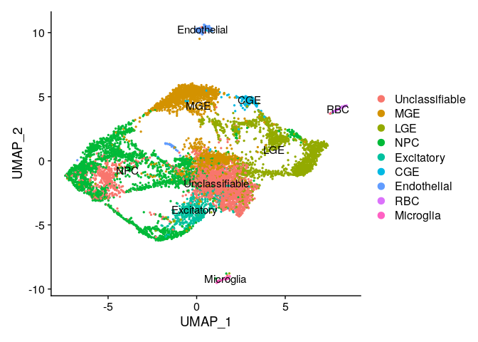

# 05-3_manual_annot

## Objectives

1.  Manual Annotation via Seurat

### load data and make seurat object

``` r
library(dplyr)
```

    ## 
    ## Attaching package: 'dplyr'

    ## The following objects are masked from 'package:stats':
    ## 
    ##     filter, lag

    ## The following objects are masked from 'package:base':
    ## 
    ##     intersect, setdiff, setequal, union

``` r
library(jsonlite)
library(Seurat)
```

    ## Attaching SeuratObject

    ## Attaching sp

``` r
library(patchwork)


source("../tools/spongy_panda/export_gdcmatrix.R")

data.id = "gw12"
data <- readRDS(paste0("../../data/gse165388_variablefeat/", data.id, "feat_seurat_pbj.rds"))

dim <- as.integer(read_json("../../out/gse165388/05_seurat_annot/dimensionality.json", simplifyVector = TRUE)[data.id])
```

### make difrectory to save outputs

``` r
dir.name <- "../../data/gse165388_annot"

if (! dir.exists(dir.name)) {
  dir.create(dir.name)
}
```

## PCA

``` r
all.genes <- rownames(data)
feat <- VariableFeatures(object = data)

data <- RunPCA(
  data,
  features = feat,
  verbose = FALSE,
  seed.use = 0,
  npcs=length(feat),
  approx=FALSE
)
```

## Clustering

``` r
data <- FindNeighbors(data, dims = 1:dim)
```

    ## Computing nearest neighbor graph

    ## Computing SNN

``` r
data <- FindClusters(data, resolution = 0.8)
```

    ## Modularity Optimizer version 1.3.0 by Ludo Waltman and Nees Jan van Eck
    ## 
    ## Number of nodes: 10112
    ## Number of edges: 1287059
    ## 
    ## Running Louvain algorithm...
    ## Maximum modularity in 10 random starts: 0.7485
    ## Number of communities: 16
    ## Elapsed time: 3 seconds

### Get cluster id

``` r
clusters_id <- data.frame(Idents(data))
```

## Embedding into Manifolds

### UMAP

``` r
data <- RunUMAP(data, dims = 1:dim)
```

    ## Warning: The default method for RunUMAP has changed from calling Python UMAP via reticulate to the R-native UWOT using the cosine metric
    ## To use Python UMAP via reticulate, set umap.method to 'umap-learn' and metric to 'correlation'
    ## This message will be shown once per session

    ## 13:14:15 UMAP embedding parameters a = 0.9922 b = 1.112

    ## 13:14:15 Read 10112 rows and found 210 numeric columns

    ## 13:14:15 Using Annoy for neighbor search, n_neighbors = 30

    ## 13:14:15 Building Annoy index with metric = cosine, n_trees = 50

    ## 0%   10   20   30   40   50   60   70   80   90   100%

    ## [----|----|----|----|----|----|----|----|----|----|

    ## **************************************************|
    ## 13:14:18 Writing NN index file to temp file /tmp/RtmpXKP02Y/file10a027fbbbf7
    ## 13:14:18 Searching Annoy index using 1 thread, search_k = 3000
    ## 13:14:27 Annoy recall = 100%
    ## 13:14:27 Commencing smooth kNN distance calibration using 1 thread with target n_neighbors = 30
    ## 13:14:28 Initializing from normalized Laplacian + noise (using irlba)
    ## 13:14:28 Commencing optimization for 200 epochs, with 487888 positive edges
    ## 13:14:35 Optimization finished

``` r
DimPlot(data, reduction = "umap", label = T)
```


## Find DEG

``` r
markers <- FindAllMarkers(data, only.pos = TRUE, min.pct = 0.25, logfc.threshold = 0.25)
```

    ## Calculating cluster 0

    ## For a more efficient implementation of the Wilcoxon Rank Sum Test,
    ## (default method for FindMarkers) please install the limma package
    ## --------------------------------------------
    ## install.packages('BiocManager')
    ## BiocManager::install('limma')
    ## --------------------------------------------
    ## After installation of limma, Seurat will automatically use the more 
    ## efficient implementation (no further action necessary).
    ## This message will be shown once per session

    ## Calculating cluster 1

    ## Calculating cluster 2

    ## Calculating cluster 3

    ## Calculating cluster 4

    ## Calculating cluster 5

    ## Calculating cluster 6

    ## Calculating cluster 7

    ## Calculating cluster 8

    ## Calculating cluster 9

    ## Calculating cluster 10

    ## Calculating cluster 11

    ## Calculating cluster 12

    ## Calculating cluster 13

    ## Calculating cluster 14

    ## Calculating cluster 15

``` r
n <- 10

degs <- markers %>%
  group_by(cluster) %>%
  slice_max(n = n, order_by = avg_log2FC) %>%
  data.frame()

write.csv(
  degs, 
  paste0(dir.name, "/", data.id, "_degs_top", n, ".csv"),
  quote = F
  )
```

### choose one key gene per cluster

``` r
deg.list <- sapply(unique(degs$cluster), function(idx) degs[degs$cluster==idx, ]$gene[1])
```

## Visualization

``` r
VlnPlot(data, features = deg.list)
```


-   scatter plot

``` r
FeaturePlot(data, features = deg.list, label=T)
```


-   heatmap

``` r
markers %>%
    group_by(cluster) %>%
    top_n(n = 3, wt = avg_log2FC) -> top
DoHeatmap(data, features = top$gene)
```


-   After these procedure, clusters are **manually** annotated

``` r
degs
```

    ##             p_val avg_log2FC pct.1 pct.2     p_val_adj cluster        gene
    ## 1    9.702579e-06  0.9720001 0.265 0.416  2.066746e-01       0        BEX2
    ## 2    9.142258e-05  0.8750860 0.207 0.308  1.000000e+00       0      EEF1A2
    ## 3    2.537254e-16  0.8362807 0.142 0.275  5.404605e-12       0       LIN7C
    ## 4    6.369896e-06  0.8084897 0.504 0.643  1.356851e-01       0       PEG10
    ## 5    1.439676e-18  0.7991719 0.154 0.304  3.066654e-14       0     PRKAR2B
    ## 6    1.360180e-08  0.7707937 0.173 0.281  2.897318e-04       0        ANK3
    ## 7    6.639850e-24  0.7554179 0.126 0.279  1.414354e-19       0        ARF3
    ## 8    2.363716e-10  0.7514326 0.276 0.473  5.034952e-06       0        PKIA
    ## 9    1.918128e-16  0.7404358 0.193 0.361  4.085805e-12       0       CNIH2
    ## 10   2.684830e-32  0.7247754 0.166 0.380  5.718957e-28       0        SCOC
    ## 11   0.000000e+00  3.4459023 0.329 0.030  0.000000e+00       1     ADAMTS5
    ## 12   0.000000e+00  3.1771018 0.553 0.067  0.000000e+00       1      PDZRN4
    ## 13   0.000000e+00  3.1699584 0.840 0.144  0.000000e+00       1        PLS3
    ## 14   0.000000e+00  3.0209080 0.420 0.050  0.000000e+00       1         MAF
    ## 15   0.000000e+00  2.6747900 0.522 0.070  0.000000e+00       1       GRIA4
    ## 16   0.000000e+00  2.4713388 0.715 0.123  0.000000e+00       1       ERBB4
    ## 17  5.236704e-252  2.4180177 0.323 0.050 1.115470e-247       1       FNDC5
    ## 18   0.000000e+00  2.4107852 0.561 0.119  0.000000e+00       1       CXCR4
    ## 19   0.000000e+00  2.3650352 0.370 0.050  0.000000e+00       1       NXPH1
    ## 20   0.000000e+00  2.2300160 0.721 0.219  0.000000e+00       1       ARL4D
    ## 21   0.000000e+00  4.4122463 0.697 0.054  0.000000e+00       2        EBF1
    ## 22   0.000000e+00  3.6906423 0.731 0.091  0.000000e+00       2      ZNF503
    ## 23  2.649094e-239  3.6690904 0.453 0.097 5.642835e-235       2      IGFBP5
    ## 24   0.000000e+00  3.5445364 0.625 0.118  0.000000e+00       2        TAC1
    ## 25   0.000000e+00  3.3353716 0.436 0.051  0.000000e+00       2       RAMP1
    ## 26   0.000000e+00  3.2925010 0.721 0.083  0.000000e+00       2        ISL1
    ## 27  7.922485e-274  2.9519127 0.637 0.189 1.687569e-269       2       FOXP1
    ## 28  1.067371e-192  2.8533486 0.338 0.060 2.273606e-188       2      POU3F1
    ## 29  8.297976e-265  2.5764191 0.477 0.093 1.767552e-260       2      ZNF521
    ## 30  5.098353e-173  2.4473681 0.563 0.202 1.086000e-168       2  AC009041.2
    ## 31  6.613676e-242  3.1125926 0.338 0.041 1.408779e-237       3  AL139246.5
    ## 32  5.442252e-105  2.9567360 0.263 0.058 1.159254e-100       3      COL1A2
    ## 33  1.628529e-185  2.7764842 0.527 0.143 3.468930e-181       3        HES5
    ## 34  1.379494e-295  2.6029724 0.456 0.064 2.938461e-291       3        GSX2
    ## 35  2.194557e-300  2.4906864 0.394 0.044 4.674625e-296       3       SOX21
    ## 36  1.311335e-187  2.3195310 0.270 0.033 2.793274e-183       3       MGST1
    ## 37  1.292754e-240  2.2543406 0.403 0.060 2.753696e-236       3        E2F1
    ## 38  9.660207e-278  2.2151323 0.451 0.066 2.057721e-273       3        MCM5
    ## 39  2.752634e-235  2.1813070 0.353 0.046 5.863385e-231       3       PLPP3
    ## 40  2.534099e-155  2.1524323 0.274 0.042 5.397884e-151       3        LIX1
    ## 41   0.000000e+00  3.6455995 0.469 0.011  0.000000e+00       4      KIF20A
    ## 42   0.000000e+00  3.5557018 0.677 0.029  0.000000e+00       4    HIST1H3F
    ## 43   0.000000e+00  3.5132875 0.817 0.048  0.000000e+00       4       GTSE1
    ## 44   0.000000e+00  3.5120553 0.822 0.070  0.000000e+00       4        ASPM
    ## 45   0.000000e+00  3.5033926 0.807 0.041  0.000000e+00       4       KIFC1
    ## 46   0.000000e+00  3.4963140 0.726 0.032  0.000000e+00       4      CKAP2L
    ## 47   0.000000e+00  3.4941027 0.438 0.015  0.000000e+00       4       CDCA2
    ## 48   0.000000e+00  3.4366537 0.964 0.103  0.000000e+00       4       MKI67
    ## 49   0.000000e+00  3.3911382 0.997 0.218  0.000000e+00       4       TOP2A
    ## 50   0.000000e+00  3.3810597 0.663 0.053  0.000000e+00       4       CENPE
    ## 51  6.767260e-138  2.5995162 0.545 0.190 1.441494e-133       5        SIX3
    ## 52   8.077922e-99  2.1500272 0.278 0.063  1.720678e-94       5       TSHZ1
    ## 53  1.931000e-124  2.1065503 0.304 0.061 4.113223e-120       5       RALYL
    ## 54   6.283418e-97  1.9336451 0.481 0.183  1.338431e-92       5       ZFHX4
    ## 55   2.518843e-83  1.6763622 0.514 0.224  5.365387e-79       5        TLE4
    ## 56   8.770561e-65  1.5770852 0.331 0.115  1.868217e-60       5        ZIC1
    ## 57  5.568855e-119  1.5660858 0.811 0.459 1.186222e-114       5        MEG3
    ## 58   9.728733e-90  1.5030975 0.743 0.476  2.072317e-85       5       MEIS2
    ## 59   1.582805e-66  1.4305972 0.309 0.100  3.371533e-62       5      ARPP21
    ## 60   2.793879e-86  1.4002527 0.418 0.143  5.951242e-82       5     SERTAD4
    ## 61   1.093458e-27  2.7563723 0.282 0.163  2.329175e-23       6        TSIX
    ## 62   6.263437e-09  1.9847260 0.287 0.251  1.334175e-04       6   LINC00599
    ## 63  2.306247e-113  1.7797434 0.774 0.605 4.912537e-109       6        XIST
    ## 64   1.117521e-03  1.7224198 0.291 0.313  1.000000e+00       6         FTX
    ## 65   1.702094e-08  1.7050061 0.143 0.276  3.625631e-04       6        ZEB1
    ## 66   7.150047e-12  1.6888275 0.272 0.202  1.523032e-07       6       ERBB4
    ## 67   2.634245e-03  1.6505794 0.309 0.347  1.000000e+00       6        AAK1
    ## 68   1.115758e-11  1.6319261 0.404 0.404  2.376676e-07       6       DCLK2
    ## 69   1.738067e-06  1.6054797 0.346 0.359  3.702256e-02       6        MIAT
    ## 70   3.276424e-10  1.5571270 0.430 0.475  6.979110e-06       6        RERE
    ## 71  2.208662e-122  3.4984101 0.305 0.065 4.704671e-118       7        SCG2
    ## 72  6.984636e-164  3.2940723 0.346 0.063 1.487797e-159       7        CALY
    ## 73   1.465575e-47  2.4248985 0.252 0.093  3.121821e-43       7        NRP2
    ## 74   2.417179e-37  2.2604174 0.323 0.169  5.148832e-33       7      PCDH17
    ## 75   1.759963e-48  2.1826840 0.385 0.201  3.748897e-44       7        SCG5
    ## 76   4.697180e-38  2.0968933 0.340 0.178  1.000546e-33       7        CHL1
    ## 77   2.061594e-40  2.0511580 0.278 0.120  4.391401e-36       7        ZIC1
    ## 78   1.173151e-22  2.0164813 0.256 0.145  2.498929e-18       7        CHGB
    ## 79   9.436551e-32  2.0061870 0.278 0.138  2.010080e-27       7        BEX5
    ## 80   3.311847e-54  1.9979562 0.413 0.210  7.054566e-50       7        PEG3
    ## 81   2.431909e-13  2.1531548 0.299 0.227  5.180210e-09       8      ADGRV1
    ## 82   1.345905e-07  1.6316421 0.353 0.329  2.866912e-03       8      PTPRZ1
    ## 83   1.918185e-12  1.5796450 0.299 0.224  4.085925e-08       8       METRN
    ## 84   5.662450e-13  1.4744206 0.302 0.215  1.206158e-08       8      NUSAP1
    ## 85   9.708629e-12  1.4371573 0.323 0.247  2.068035e-07       8       CENPF
    ## 86   2.011467e-19  1.3213135 0.284 0.167  4.284625e-15       8        HES5
    ## 87   1.960746e-10  1.2830645 0.443 0.413  4.176585e-06       8       FABP7
    ## 88   3.462840e-03  1.2168868 0.274 0.266  1.000000e+00       8        CKS2
    ## 89   5.802743e-06  1.1956064 0.280 0.239  1.236042e-01       8       TTYH1
    ## 90   1.259259e-17  1.1865237 0.380 0.268  2.682347e-13       8       TOP2A
    ## 91  1.582519e-142  3.8601732 0.270 0.032 3.370924e-138       9     PPP1R1B
    ## 92  3.920880e-179  3.5058488 0.408 0.060 8.351867e-175       9         SLA
    ## 93  1.449020e-253  3.4537478 0.563 0.086 3.086558e-249       9     NEUROD2
    ## 94  8.307389e-176  3.2881809 0.423 0.066 1.769557e-171       9        TBR1
    ## 95  6.350896e-114  3.1584441 0.318 0.056 1.352804e-109       9       PRDM8
    ## 96  9.976682e-253  3.0893795 0.652 0.118 2.125133e-248       9     NEUROD6
    ## 97   2.641601e-53  2.4529255 0.414 0.174  5.626874e-49       9         ID2
    ## 98   4.367954e-50  2.3457742 0.412 0.184  9.304179e-46       9      ZBTB18
    ## 99   1.711946e-63  2.2329789 0.558 0.285  3.646616e-59       9        LMO3
    ## 100  2.374491e-34  2.1842299 0.359 0.176  5.057903e-30       9        SOX5
    ## 101  2.375593e-47  2.4191976 0.258 0.070  5.060251e-43      10       CENPN
    ## 102 1.672919e-143  2.3592832 0.609 0.141 3.563484e-139      10    HIST1H3B
    ## 103 1.540200e-134  2.3037795 0.672 0.185 3.280779e-130      10    HIST1H1B
    ## 104  5.281247e-99  2.3032044 0.982 0.886  1.124958e-94      10    HIST1H4C
    ## 105  4.675100e-48  2.2917103 0.270 0.074  9.958430e-44      10       SPC24
    ## 106  3.600730e-78  2.2646766 0.369 0.090  7.669914e-74      10       CDKN3
    ## 107  1.476571e-70  2.2201842 0.364 0.095  3.145244e-66      10    HIST1H4D
    ## 108  6.585112e-98  2.2183180 0.500 0.133  1.402695e-93      10       BIRC5
    ## 109  7.076799e-84  2.2139601 0.482 0.143  1.507429e-79      10    HIST1H1A
    ## 110  9.467218e-98  2.2017808 0.545 0.159  2.016612e-93      10   HIST1H2AG
    ## 111  0.000000e+00  4.9552421 0.501 0.014  0.000000e+00      11       NHLH1
    ## 112  0.000000e+00  4.5800432 0.441 0.025  0.000000e+00      11       EOMES
    ## 113  0.000000e+00  4.4501166 0.561 0.028  0.000000e+00      11       SSTR2
    ## 114  0.000000e+00  4.2496845 0.687 0.027  0.000000e+00      11     NEUROG2
    ## 115  0.000000e+00  4.1961797 0.649 0.020  0.000000e+00      11     NEUROD1
    ## 116 2.669313e-284  4.0705357 0.458 0.037 5.685903e-280      11     PPP1R17
    ## 117  0.000000e+00  3.9327757 0.371 0.009  0.000000e+00      11       NXPH4
    ## 118  0.000000e+00  3.9257498 0.526 0.020  0.000000e+00      11     BHLHE22
    ## 119  0.000000e+00  3.8495345 0.896 0.115  0.000000e+00      11     NEUROD6
    ## 120  0.000000e+00  3.7918693 0.305 0.006  0.000000e+00      11       NPTX1
    ## 121  0.000000e+00  4.4713046 0.359 0.010  0.000000e+00      12        THRB
    ## 122  0.000000e+00  4.2634527 0.405 0.014  0.000000e+00      12        PNOC
    ## 123 2.655761e-290  3.9929295 0.697 0.053 5.657038e-286      12       CALB2
    ## 124 1.181640e-255  3.6185358 0.908 0.118 2.517012e-251      12       NR2F2
    ## 125 1.479688e-198  3.3224138 0.631 0.065 3.151883e-194      12      KLHL35
    ## 126 2.914148e-176  3.3072829 0.892 0.168 6.207426e-172      12       CXCR4
    ## 127 4.423726e-129  3.2839132 0.436 0.046 9.422978e-125      12         SP8
    ## 128 3.254262e-150  2.9866529 0.415 0.035 6.931904e-146      12        SCGN
    ## 129 8.402263e-124  2.9602651 0.636 0.109 1.789766e-119      12      PDZRN3
    ## 130 1.571142e-136  2.8744424 0.923 0.240 3.346689e-132      12       NR2F1
    ## 131  0.000000e+00  7.0089143 0.373 0.005  0.000000e+00      13       DPEP1
    ## 132  0.000000e+00  6.8878220 0.459 0.005  0.000000e+00      13      CAVIN3
    ## 133  0.000000e+00  6.8842473 0.341 0.003  0.000000e+00      13       FOXQ1
    ## 134  0.000000e+00  6.8014939 0.292 0.004  0.000000e+00      13 MIR4435-2HG
    ## 135  0.000000e+00  6.7932410 0.822 0.057  0.000000e+00      13       CLDN5
    ## 136  0.000000e+00  6.7512651 0.859 0.070  0.000000e+00      13      IGFBP7
    ## 137  0.000000e+00  6.6788801 0.351 0.008  0.000000e+00      13        FLT1
    ## 138  0.000000e+00  6.6205124 0.470 0.010  0.000000e+00      13       SOX18
    ## 139  0.000000e+00  6.5946318 0.519 0.014  0.000000e+00      13     SLC38A5
    ## 140  0.000000e+00  6.5333489 0.341 0.008  0.000000e+00      13        APLN
    ## 141 4.129621e-188 10.8105945 1.000 0.067 8.796507e-184      14        HBA1
    ## 142 5.552745e-110 10.7544431 1.000 0.128 1.182790e-105      14        HBG2
    ## 143  0.000000e+00 10.7238317 1.000 0.029  0.000000e+00      14         HBB
    ## 144 1.113034e-111 10.6719793 1.000 0.126 2.370874e-107      14        HBA2
    ## 145  0.000000e+00  9.3274600 0.845 0.001  0.000000e+00      14        HBG1
    ## 146  0.000000e+00  9.1330662 0.707 0.003  0.000000e+00      14         HBZ
    ## 147  0.000000e+00  8.5527635 0.552 0.002  0.000000e+00      14         HBM
    ## 148  0.000000e+00  8.4077783 0.621 0.002  0.000000e+00      14       ALAS2
    ## 149  0.000000e+00  8.0590720 0.603 0.002  0.000000e+00      14        AHSP
    ## 150  0.000000e+00  7.9649047 0.483 0.001  0.000000e+00      14       HEMGN
    ## 151  0.000000e+00  9.8673767 0.868 0.002  0.000000e+00      15        C1QC
    ## 152  0.000000e+00  9.7934182 0.585 0.007  0.000000e+00      15        CCL3
    ## 153  0.000000e+00  9.5049580 0.887 0.003  0.000000e+00      15        C1QB
    ## 154 2.665375e-249  9.4567452 0.962 0.040 5.677515e-245      15        SPP1
    ## 155  0.000000e+00  9.2529903 0.717 0.001  0.000000e+00      15       GPR34
    ## 156  0.000000e+00  9.2528291 0.717 0.001  0.000000e+00      15      CX3CR1
    ## 157  0.000000e+00  9.2180427 0.472 0.005  0.000000e+00      15      CCL3L1
    ## 158  0.000000e+00  9.1346522 0.679 0.002  0.000000e+00      15       VSIG4
    ## 159  0.000000e+00  9.0971047 0.792 0.003  0.000000e+00      15        C1QA
    ## 160  0.000000e+00  8.9928639 0.528 0.007  0.000000e+00      15      CCL4L2

### Assign Names

``` r
new.label <- c(
  "Unclassifiable", "MGE", "LGE", "NPC", "NPC", "LGE",
  "MGE", "Unclassifiable", "NPC", "Excitatory", "Unclassifiable", "NPC",
  "CGE", "Endothelial", "RBC", "Microglia"
)
```

### Visualization

``` r
names(new.label) <- levels(data)
data <- RenameIdents(data, new.label)
DimPlot(data, reduction = "umap", label = TRUE, pt.size = 0.5)
```



### Export Clusters

## Export Data

``` r
saveRDS(Embeddings(data, reduction = "pca")[, 1:dim], file = paste0(dir.name, "/", data.id, "pca.rds"))
saveRDS(Embeddings(data, reduction = "umap"), file = paste0(dir.name, "/", data.id, "umap.rds"))
```
