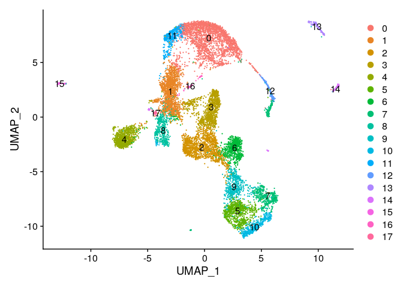
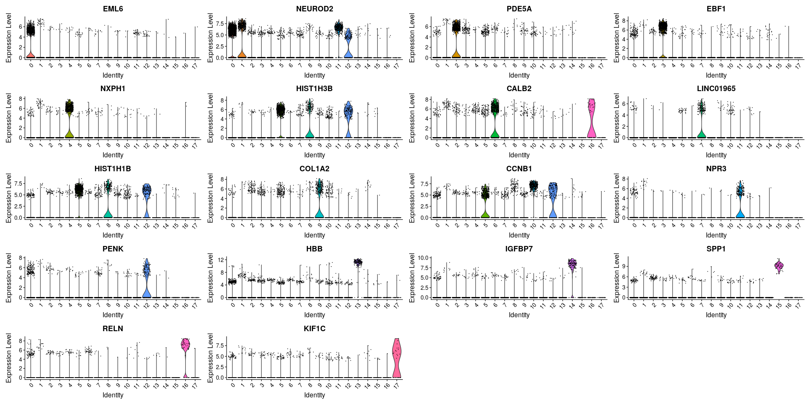
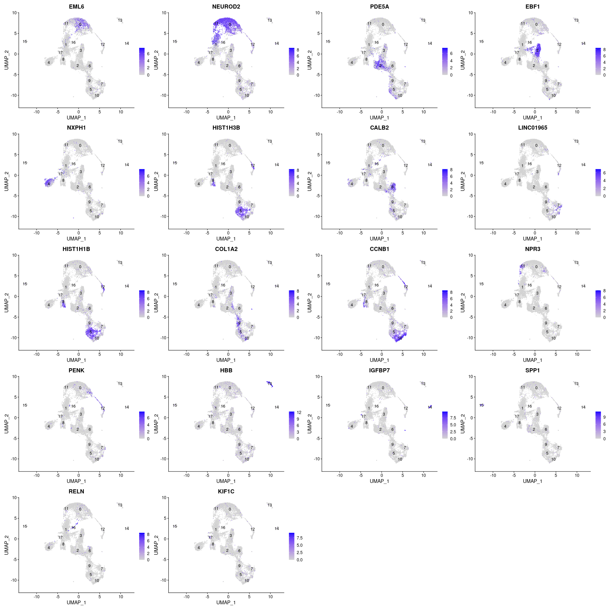
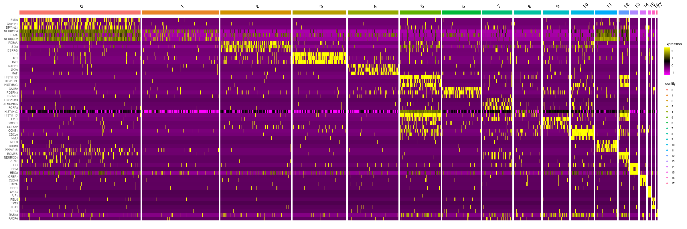
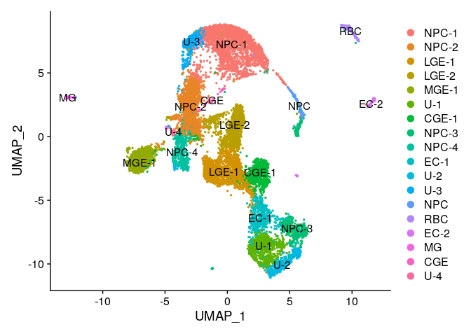

# 05-3_manual_annot

## Objectives

1.  Manual Annotation via Seurat

### load data and make seurat object

``` r
library(dplyr)
```

    ## 
    ## Attaching package: 'dplyr'

    ## The following objects are masked from 'package:stats':
    ## 
    ##     filter, lag

    ## The following objects are masked from 'package:base':
    ## 
    ##     intersect, setdiff, setequal, union

``` r
library(jsonlite)
library(Seurat)
```

    ## Attaching SeuratObject

    ## Attaching sp

``` r
library(patchwork)


source("../tools/spongy_panda/export_gdcmatrix.R")

data.id = "gw9"
data <- readRDS(paste0("../../data/gse165388_variablefeat/", data.id, "feat_seurat_pbj.rds"))

dim <- as.integer(read_json("../../out/gse165388/05_seurat_annot/dimensionality.json", simplifyVector = TRUE)[data.id])
```

### make difrectory to save outputs

``` r
dir.name <- "../../data/gse165388_annot"

if (! dir.exists(dir.name)) {
  dir.create(dir.name)
}
```

## PCA

``` r
all.genes <- rownames(data)
feat <- VariableFeatures(object = data)

data <- RunPCA(
  data,
  features = feat,
  verbose = FALSE,
  seed.use = 0,
  npcs=length(feat),
  approx=FALSE
)
```

## Clustering

``` r
data <- FindNeighbors(data, dims = 1:dim)
```

    ## Computing nearest neighbor graph

    ## Computing SNN

``` r
data <- FindClusters(data, resolution = 0.8)
```

    ## Modularity Optimizer version 1.3.0 by Ludo Waltman and Nees Jan van Eck
    ## 
    ## Number of nodes: 12176
    ## Number of edges: 1048531
    ## 
    ## Running Louvain algorithm...
    ## Maximum modularity in 10 random starts: 0.8687
    ## Number of communities: 18
    ## Elapsed time: 3 seconds

### Get cluster id

``` r
clusters_id <- data.frame(Idents(data))
```

## Embedding into Manifolds

### UMAP

``` r
data <- RunUMAP(data, dims = 1:dim)
```

    ## Warning: The default method for RunUMAP has changed from calling Python UMAP via reticulate to the R-native UWOT using the cosine metric
    ## To use Python UMAP via reticulate, set umap.method to 'umap-learn' and metric to 'correlation'
    ## This message will be shown once per session

    ## 10:54:42 UMAP embedding parameters a = 0.9922 b = 1.112

    ## 10:54:42 Read 12176 rows and found 169 numeric columns

    ## 10:54:42 Using Annoy for neighbor search, n_neighbors = 30

    ## 10:54:42 Building Annoy index with metric = cosine, n_trees = 50

    ## 0%   10   20   30   40   50   60   70   80   90   100%

    ## [----|----|----|----|----|----|----|----|----|----|

    ## **************************************************|
    ## 10:54:46 Writing NN index file to temp file /tmp/Rtmp6ylqrD/file9bcf0ed015
    ## 10:54:46 Searching Annoy index using 1 thread, search_k = 3000
    ## 10:54:54 Annoy recall = 100%
    ## 10:54:54 Commencing smooth kNN distance calibration using 1 thread with target n_neighbors = 30
    ## 10:54:55 Initializing from normalized Laplacian + noise (using irlba)
    ## 10:54:56 Commencing optimization for 200 epochs, with 576664 positive edges
    ## 10:55:04 Optimization finished

``` r
DimPlot(data, reduction = "umap", label = T)
```



## Find DEG

``` r
markers <- FindAllMarkers(data, only.pos = TRUE, min.pct = 0.25, logfc.threshold = 0.25)
```

    ## Calculating cluster 0

    ## For a more efficient implementation of the Wilcoxon Rank Sum Test,
    ## (default method for FindMarkers) please install the limma package
    ## --------------------------------------------
    ## install.packages('BiocManager')
    ## BiocManager::install('limma')
    ## --------------------------------------------
    ## After installation of limma, Seurat will automatically use the more 
    ## efficient implementation (no further action necessary).
    ## This message will be shown once per session

    ## Calculating cluster 1

    ## Calculating cluster 2

    ## Calculating cluster 3

    ## Calculating cluster 4

    ## Calculating cluster 5

    ## Calculating cluster 6

    ## Calculating cluster 7

    ## Calculating cluster 8

    ## Calculating cluster 9

    ## Calculating cluster 10

    ## Calculating cluster 11

    ## Calculating cluster 12

    ## Calculating cluster 13

    ## Calculating cluster 14

    ## Calculating cluster 15

    ## Calculating cluster 16

    ## Calculating cluster 17

``` r
n <- 10

degs <- markers %>%
  group_by(cluster) %>%
  slice_max(n = n, order_by = avg_log2FC) %>%
  data.frame()

write.csv(
  degs, 
  paste0(dir.name, "/", data.id, "_degs_top", n, ".csv"),
  quote = F
  )
```

### choose one key gene per cluster

``` r
deg.list <- sapply(unique(degs$cluster), function(idx) degs[degs$cluster==idx, ]$gene[1])
```

## Visualization

``` r
VlnPlot(data, features = deg.list)
```



-   scatter plot

``` r
FeaturePlot(data, features = deg.list, label=T)
```



-   heatmap

``` r
markers %>%
    group_by(cluster) %>%
    top_n(n = 3, wt = avg_log2FC) -> top
DoHeatmap(data, features = top$gene)
```



-   After these procedure, clusters are **manually** annotated

``` r
degs
```

    ##             p_val avg_log2FC pct.1 pct.2     p_val_adj cluster       gene
    ## 1    0.000000e+00  3.5697124 0.326 0.018  0.000000e+00       0       EML6
    ## 2    0.000000e+00  3.3547684 0.293 0.025  0.000000e+00       0   C6orf141
    ## 3    0.000000e+00  3.2808445 0.385 0.045  0.000000e+00       0    DPY19L1
    ## 4    0.000000e+00  3.2174535 0.324 0.025  0.000000e+00       0       LHX9
    ## 5    0.000000e+00  3.1991765 0.589 0.060  0.000000e+00       0    NEUROD1
    ## 6    0.000000e+00  3.1105554 0.478 0.070  0.000000e+00       0      SSTR2
    ## 7    0.000000e+00  2.9486532 0.457 0.072  0.000000e+00       0    PPP1R17
    ## 8    0.000000e+00  2.8189574 0.410 0.049  0.000000e+00       0      NHLH1
    ## 9    0.000000e+00  2.8078894 0.333 0.032  0.000000e+00       0    BHLHE22
    ## 10   0.000000e+00  2.6001606 0.360 0.037  0.000000e+00       0    SLC17A7
    ## 11   3.904455e-07  1.2976970 0.292 0.286  8.683508e-03       1    NEUROD2
    ## 12   3.416783e-28  1.2131249 0.419 0.339  7.598926e-24       1    NEUROD6
    ## 13   1.669121e-09  1.1844027 0.203 0.348  3.712124e-05       1       THRA
    ## 14   4.577939e-10  1.1637582 0.219 0.379  1.018134e-05       1      CNIH2
    ## 15   3.653692e-03  1.1524671 0.228 0.332  1.000000e+00       1     EEF1A2
    ## 16   1.082247e-08  1.1257232 0.157 0.263  2.406918e-04       1       SCG5
    ## 17   1.087227e-05  1.0637091 0.279 0.451  2.417993e-01       1       MAPT
    ## 18   9.653825e-09  1.0607734 0.201 0.338  2.147011e-04       1       LY6H
    ## 19   2.870252e-07  1.0474343 0.279 0.466  6.383441e-03       1       BEX2
    ## 20   8.377530e-20  0.9900801 0.145 0.300  1.863163e-15       1      BLCAP
    ## 21   0.000000e+00  3.8822302 0.451 0.046  0.000000e+00       2      PDE5A
    ## 22   0.000000e+00  3.7033128 0.748 0.158  0.000000e+00       2       SIX3
    ## 23  8.235468e-302  3.4217017 0.356 0.061 1.831568e-297       2      ESRRG
    ## 24   0.000000e+00  3.1154867 0.419 0.076  0.000000e+00       2      TSHZ2
    ## 25  4.139471e-228  3.0635252 0.277 0.045 9.206183e-224       2    SLITRK6
    ## 26  7.969662e-184  2.9386508 0.303 0.072 1.772453e-179       2       NRG1
    ## 27   0.000000e+00  2.7502862 0.625 0.197  0.000000e+00       2      ZFHX4
    ## 28  3.412489e-168  2.5842984 0.274 0.061 7.589375e-164       2  LINC01305
    ## 29   0.000000e+00  2.4366480 0.986 0.596  0.000000e+00       2      MEIS2
    ## 30  1.728802e-221  2.3730587 0.579 0.248 3.844856e-217       2       TLE4
    ## 31   0.000000e+00  6.0860993 0.788 0.031  0.000000e+00       3       EBF1
    ## 32   0.000000e+00  5.5793938 0.741 0.069  0.000000e+00       3       TAC1
    ## 33   0.000000e+00  4.7612933 0.802 0.054  0.000000e+00       3       ISL1
    ## 34   0.000000e+00  3.9965070 0.382 0.033  0.000000e+00       3      RAMP1
    ## 35  6.848601e-305  3.9857563 0.449 0.087 1.523129e-300       3     IGFBP5
    ## 36   0.000000e+00  3.6138758 0.459 0.066  0.000000e+00       3     ZNF521
    ## 37  1.795774e-242  3.4133555 0.464 0.120 3.993801e-238       3 AC009041.2
    ## 38   0.000000e+00  3.2384420 0.759 0.106  0.000000e+00       3     ZNF503
    ## 39  6.365910e-256  3.2319956 0.567 0.186 1.415778e-251       3      FOXP1
    ## 40  9.230132e-260  3.1320346 0.372 0.065 2.052781e-255       3     SEMA3C
    ## 41   0.000000e+00  5.1454970 0.533 0.017  0.000000e+00       4      NXPH1
    ## 42   0.000000e+00  5.1292498 0.460 0.012  0.000000e+00       4       LHX6
    ## 43   0.000000e+00  4.3121592 0.525 0.044  0.000000e+00       4        MAF
    ## 44   0.000000e+00  4.0333107 0.493 0.053  0.000000e+00       4      GRIA4
    ## 45   0.000000e+00  3.9486024 0.422 0.038  0.000000e+00       4     PDZRN4
    ## 46   0.000000e+00  3.8158691 0.637 0.086  0.000000e+00       4        SST
    ## 47   0.000000e+00  3.7711147 0.883 0.093  0.000000e+00       4      ERBB4
    ## 48  2.112248e-167  3.2844901 0.255 0.044 4.697639e-163       4    ADAMTS5
    ## 49   0.000000e+00  3.2394626 0.750 0.115  0.000000e+00       4       PLS3
    ## 50   0.000000e+00  3.1857857 0.751 0.145  0.000000e+00       4       SOX6
    ## 51   0.000000e+00  4.1304283 0.887 0.049  0.000000e+00       5   HIST1H3B
    ## 52   0.000000e+00  4.0637794 0.444 0.018  0.000000e+00       5   HIST1H3F
    ## 53   0.000000e+00  4.0354723 0.599 0.034  0.000000e+00       5   HIST1H3G
    ## 54   0.000000e+00  4.0261911 0.787 0.048  0.000000e+00       5  HIST1H2AL
    ## 55   0.000000e+00  3.9961693 0.940 0.068  0.000000e+00       5   HIST1H1B
    ## 56   0.000000e+00  3.9315983 0.359 0.014  0.000000e+00       5   HIST1H3C
    ## 57   0.000000e+00  3.8952686 0.726 0.048  0.000000e+00       5      ESCO2
    ## 58   0.000000e+00  3.8874932 0.999 0.655  0.000000e+00       5   HIST1H4C
    ## 59   0.000000e+00  3.8810885 0.502 0.023  0.000000e+00       5  HIST1H2BB
    ## 60   0.000000e+00  3.7346409 0.396 0.020  0.000000e+00       5   HIST1H4H
    ## 61   0.000000e+00  4.0055498 0.536 0.045  0.000000e+00       6      CALB2
    ## 62  1.956731e-280  3.6313328 0.320 0.032 4.351770e-276       6     BRINP1
    ## 63  1.720720e-297  3.2103414 0.499 0.086 3.826882e-293       6     PDZRN3
    ## 64  6.192800e-214  2.9318142 0.320 0.044 1.377279e-209       6      NPAS1
    ## 65   0.000000e+00  2.7149494 0.709 0.131  0.000000e+00       6       PLS3
    ## 66  1.665328e-132  2.7053440 0.266 0.049 3.703689e-128       6  NR2F2-AS1
    ## 67  2.114018e-224  2.6667413 0.528 0.124 4.701577e-220       6      CXCR4
    ## 68   0.000000e+00  2.5957512 0.946 0.302  0.000000e+00       6      NR2F2
    ## 69  2.672778e-171  2.5168768 0.435 0.105 5.944258e-167       6        SP8
    ## 70   0.000000e+00  2.3126131 0.651 0.125  0.000000e+00       6      ERBB4
    ## 71   0.000000e+00  4.2774133 0.255 0.011  0.000000e+00       7  LINC01965
    ## 72   0.000000e+00  4.2597121 0.376 0.024  0.000000e+00       7 AL139246.5
    ## 73   0.000000e+00  4.0119998 0.439 0.032  0.000000e+00       7      FGFR3
    ## 74  7.733111e-292  4.0047856 0.253 0.014 1.719844e-287       7      VCAM1
    ## 75   0.000000e+00  3.9035924 0.621 0.070  0.000000e+00       7       HES5
    ## 76   0.000000e+00  3.7841806 0.574 0.044  0.000000e+00       7       LIX1
    ## 77   0.000000e+00  3.7702430 0.376 0.024  0.000000e+00       7      PLPP3
    ## 78   0.000000e+00  3.7457462 0.276 0.014  0.000000e+00       7       CRB2
    ## 79   0.000000e+00  3.7065744 0.594 0.063  0.000000e+00       7     SLC1A3
    ## 80   0.000000e+00  3.6190062 0.369 0.022  0.000000e+00       7    FAM107A
    ## 81   1.922081e-42  2.5130193 0.295 0.118  4.274708e-38       8   HIST1H1B
    ## 82   2.304967e-36  2.5127165 0.253 0.098  5.126246e-32       8   HIST1H3B
    ## 83   2.824741e-61  2.2527084 0.727 0.675  6.282223e-57       8   HIST1H4C
    ## 84   1.270098e-48  2.1988165 0.410 0.198  2.824699e-44       8       TYMS
    ## 85   1.167233e-19  2.1752978 0.302 0.184  2.595927e-15       8   HIST1H1A
    ## 86   4.768162e-37  2.1640789 0.355 0.176  1.060439e-32       8      PCLAF
    ## 87   2.121830e-40  2.1622636 0.377 0.180  4.718950e-36       8      UBE2C
    ## 88   9.561193e-21  2.1168766 0.284 0.161  2.126409e-16       8   HIST1H1D
    ## 89   1.008803e-14  2.0566699 0.436 0.369  2.243577e-10       8      FABP7
    ## 90   3.129569e-25  2.0099024 0.377 0.237  6.960162e-21       8      CKS1B
    ## 91  3.606277e-208  3.6375570 0.381 0.050 8.020360e-204       9     COL1A2
    ## 92  2.199271e-278  3.3597696 0.402 0.040 4.891179e-274       9      SMOC1
    ## 93  2.618687e-300  3.1250687 0.545 0.075 5.823960e-296       9       E2F1
    ## 94  1.067086e-228  2.9592815 0.619 0.132 2.373200e-224       9       CDK6
    ## 95  4.226087e-179  2.8548993 0.449 0.082 9.398819e-175       9      RGS16
    ## 96  1.167595e-218  2.8037027 0.470 0.073 2.596732e-214       9       GSX2
    ## 97  1.966686e-131  2.7714447 0.307 0.050 4.373910e-127       9       VAX1
    ## 98  1.092294e-248  2.7149742 0.587 0.105 2.429261e-244       9       MCM5
    ## 99  4.821917e-193  2.6724188 0.470 0.084 1.072394e-188       9       MCM6
    ## 100  4.026618e-99  2.6717481 0.252 0.045  8.955197e-95       9        DTL
    ## 101  0.000000e+00  5.0798860 0.987 0.090  0.000000e+00      10      CCNB1
    ## 102  0.000000e+00  4.9030770 0.978 0.069  0.000000e+00      10      CDC20
    ## 103  0.000000e+00  4.8638015 0.570 0.018  0.000000e+00      10        NMU
    ## 104  0.000000e+00  4.8369537 0.816 0.042  0.000000e+00      10       PLK1
    ## 105  0.000000e+00  4.7387113 0.696 0.020  0.000000e+00      10      CCNA1
    ## 106  0.000000e+00  4.7308110 0.936 0.106  0.000000e+00      10       ASPM
    ## 107  0.000000e+00  4.6804827 0.787 0.041  0.000000e+00      10       NEK2
    ## 108  0.000000e+00  4.6518105 0.621 0.031  0.000000e+00      10       PIF1
    ## 109  0.000000e+00  4.6098226 0.796 0.039  0.000000e+00      10      CENPA
    ## 110  0.000000e+00  4.5501562 0.798 0.045  0.000000e+00      10       BUB1
    ## 111  0.000000e+00  4.7951819 0.373 0.010  0.000000e+00      11       NPR3
    ## 112  0.000000e+00  4.7575393 0.627 0.020  0.000000e+00      11      CDH13
    ## 113  0.000000e+00  3.9262696 0.767 0.054  0.000000e+00      11    PPP1R1B
    ## 114  0.000000e+00  3.8236653 0.482 0.023  0.000000e+00      11       MGLL
    ## 115  0.000000e+00  3.6376647 0.592 0.055  0.000000e+00      11       CDH7
    ## 116 2.576346e-302  3.6040358 0.380 0.027 5.729793e-298      11     PLXDC2
    ## 117  0.000000e+00  3.6019806 0.565 0.031  0.000000e+00      11      OPCML
    ## 118  0.000000e+00  3.6019231 0.472 0.041  0.000000e+00      11       LMO7
    ## 119  0.000000e+00  3.5513084 0.643 0.056  0.000000e+00      11   SERPINI1
    ## 120  0.000000e+00  3.4961650 0.601 0.048  0.000000e+00      11     VSTM2L
    ## 121 3.632307e-254  4.3122955 0.458 0.026 8.078250e-250      12       PENK
    ## 122  0.000000e+00  4.0994693 0.951 0.059  0.000000e+00      12      EOMES
    ## 123  0.000000e+00  3.9423664 0.675 0.022  0.000000e+00      12    NEUROD4
    ## 124 9.686999e-209  3.4952106 0.296 0.012 2.154389e-204      12 AC004852.2
    ## 125 4.807779e-270  3.4931155 0.709 0.063 1.069250e-265      12       ECT2
    ## 126 5.471293e-174  3.3611679 0.271 0.013 1.216816e-169      12       EBF2
    ## 127 3.181428e-230  3.2529734 0.458 0.029 7.075496e-226      12    NEUROG1
    ## 128 5.738068e-187  3.1427964 0.374 0.023 1.276146e-182      12     PLPPR4
    ## 129 2.680823e-252  3.1248475 0.857 0.101 5.962151e-248      12       RRM2
    ## 130 1.138261e-176  3.1134310 0.256 0.011 2.531493e-172      12     PHLDB2
    ## 131  0.000000e+00 10.4894680 0.975 0.066  0.000000e+00      13        HBB
    ## 132 2.620183e-179 10.2942648 0.994 0.236 5.827287e-175      13       HBG2
    ## 133  0.000000e+00 10.1965707 0.850 0.004  0.000000e+00      13        HBM
    ## 134  0.000000e+00 10.1721459 0.875 0.004  0.000000e+00      13       AHSP
    ## 135 3.977687e-249  9.9282312 1.000 0.153 8.846375e-245      13       HBA1
    ## 136  0.000000e+00  9.9092489 0.931 0.003  0.000000e+00      13      ALAS2
    ## 137 8.591020e-169  9.8548446 1.000 0.263 1.910643e-164      13       HBA2
    ## 138  0.000000e+00  9.8395122 0.963 0.003  0.000000e+00      13       HBG1
    ## 139  0.000000e+00  9.2326485 0.381 0.002  0.000000e+00      13        HBZ
    ## 140  0.000000e+00  9.1570205 0.812 0.002  0.000000e+00      13       GYPA
    ## 141  0.000000e+00  9.5041500 0.914 0.018  0.000000e+00      14     IGFBP7
    ## 142  0.000000e+00  9.1139842 0.805 0.021  0.000000e+00      14      CLDN5
    ## 143  0.000000e+00  8.9327083 0.758 0.018  0.000000e+00      14      ITM2A
    ## 144  0.000000e+00  8.3903704 0.609 0.004  0.000000e+00      14     CAVIN3
    ## 145  0.000000e+00  8.3747506 0.492 0.001  0.000000e+00      14      ECSCR
    ## 146  0.000000e+00  8.3523121 0.578 0.003  0.000000e+00      14       ESAM
    ## 147  0.000000e+00  8.3404190 0.383 0.002  0.000000e+00      14       FLT1
    ## 148 7.444458e-289  8.2553824 0.562 0.024 1.655648e-284      14        FN1
    ## 149  0.000000e+00  8.1419587 0.625 0.012  0.000000e+00      14    SLC38A5
    ## 150  0.000000e+00  8.0638044 0.336 0.001  0.000000e+00      14      DPEP1
    ## 151  0.000000e+00 10.3784752 1.000 0.024  0.000000e+00      15       SPP1
    ## 152  0.000000e+00 10.2641452 0.887 0.001  0.000000e+00      15       C1QC
    ## 153  0.000000e+00 10.2254139 1.000 0.002  0.000000e+00      15       AIF1
    ## 154  0.000000e+00  9.8904713 0.943 0.001  0.000000e+00      15       C1QB
    ## 155  0.000000e+00  9.8505094 0.887 0.001  0.000000e+00      15     TYROBP
    ## 156  0.000000e+00  9.7155704 0.868 0.001  0.000000e+00      15      VSIG4
    ## 157  0.000000e+00  9.4850021 0.906 0.001  0.000000e+00      15       C1QA
    ## 158  0.000000e+00  9.3955740 0.830 0.001  0.000000e+00      15     CX3CR1
    ## 159  0.000000e+00  9.2966961 0.604 0.006  0.000000e+00      15       APOE
    ## 160  0.000000e+00  9.2898066 0.679 0.000  0.000000e+00      15         C3
    ## 161  0.000000e+00  7.5577408 0.840 0.020  0.000000e+00      16       RELN
    ## 162  0.000000e+00  7.2490651 0.440 0.001  0.000000e+00      16       TP73
    ## 163 6.064807e-266  7.2276702 0.620 0.013 1.348813e-261      16       LHX1
    ## 164  0.000000e+00  7.1519708 0.320 0.002  0.000000e+00      16    LHX1-DT
    ## 165  0.000000e+00  7.1272852 0.580 0.007  0.000000e+00      16    MAB21L1
    ## 166 1.763203e-176  7.0174265 0.600 0.020 3.921363e-172      16       PCP4
    ## 167  0.000000e+00  6.9375686 0.440 0.001  0.000000e+00      16   LHX5-AS1
    ## 168 8.351339e-301  6.6404907 0.380 0.004 1.857338e-296      16       LHX5
    ## 169 5.977318e-228  6.1466150 0.560 0.013 1.329355e-223      16      WNT7B
    ## 170 3.825215e-226  5.9898170 0.440 0.007 8.507278e-222      16       EBF3
    ## 171  1.708880e-76  7.2010746 0.577 0.023  3.800550e-72      17      KIF1C
    ## 172  4.290461e-34  6.7433749 0.423 0.028  9.541986e-30      17      PAQR6
    ## 173  5.247170e-38  6.4555610 0.962 0.166  1.166971e-33      17      RAB13
    ## 174  1.184554e-46  6.4066770 0.692 0.059  2.634448e-42      17     GXYLT1
    ## 175  8.172234e-19  6.3374703 0.269 0.021  1.817505e-14      17     SAMD4A
    ## 176  4.783691e-19  5.7053298 0.462 0.061  1.063893e-14      17     ZSWIM9
    ## 177  1.338678e-20  5.6304780 1.000 0.502  2.977219e-16      17     ANP32B
    ## 178  5.263746e-10  5.5102038 0.346 0.063  1.170657e-05      17       NET1
    ## 179  3.486237e-12  5.3637635 0.269 0.033  7.753390e-08      17       UACA
    ## 180  6.970599e-30  5.2804953 0.769 0.115  1.550261e-25      17  ARHGAP11A

### Assign Names

``` r
new.label <- c(
  "NPC-1", "NPC-2", "LGE-1", "LGE-2", "MGE-1", "U-1",
  "CGE-1", "NPC-3", "NPC-4", "EC-1", "U-2", "U-3",
  "NPC", "RBC", "EC-2", "MG", "CGE", "U-4"
)
```

### Visualization

``` r
names(new.label) <- levels(data)
data <- RenameIdents(data, new.label)
DimPlot(data, reduction = "umap", label = TRUE, pt.size = 0.5)
```



### Export Clusters

## Export Data

``` r
saveRDS(Embeddings(data, reduction = "pca")[, 1:dim], file = paste0(dir.name, "/", data.id, "pca.rds"))
saveRDS(Embeddings(data, reduction = "umap"), file = paste0(dir.name, "/", data.id, "umap.rds"))
```
