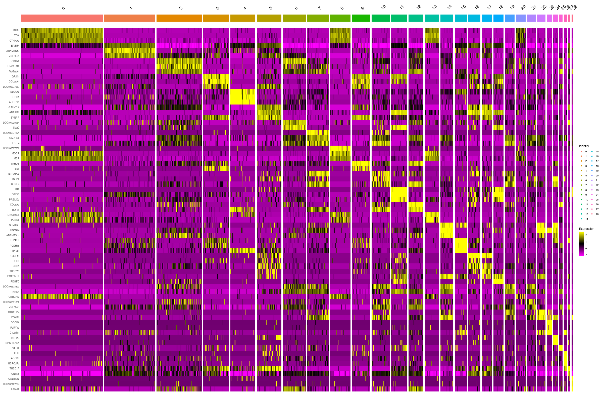

# 05-3_manual_annot

## Objectives

1.  Manual Annotation via Seurat

### load data and make seurat object

``` r
library(dplyr)
```

    ## 
    ## Attaching package: 'dplyr'

    ## The following objects are masked from 'package:stats':
    ## 
    ##     filter, lag

    ## The following objects are masked from 'package:base':
    ## 
    ##     intersect, setdiff, setequal, union

``` r
library(jsonlite)
library(Seurat)
```

    ## Attaching SeuratObject

    ## Attaching sp

``` r
library(patchwork)


source("../tools/spongy_panda/export_gdcmatrix.R")

data.id <- "m1_10x"
data <- readRDS(paste0("../../data/m1_10x_variablefeat/", data.id, "feat_seurat_pbj.rds"))

dim <- as.integer(read_json("../../out/m1_10x/05_seurat_annot/dimensionality.json", simplifyVector = TRUE)[data.id])
```

### make difrectory to save outputs

``` r
dir.name <- "../../data/m1_10x_annot"

if (! dir.exists(dir.name)) {
  dir.create(dir.name)
}
```

## PCA

``` r
all.genes <- rownames(data)
feat <- VariableFeatures(object = data)

data <- RunPCA(
  data,
  features = feat,
  verbose = FALSE,
  seed.use = 0,
  npcs=length(feat),
  approx=FALSE
)
```

## Clustering

``` r
data <- FindNeighbors(data, dims = 1:dim)
```

    ## Computing nearest neighbor graph

    ## Computing SNN

``` r
data <- FindClusters(data, resolution = 0.8)
```

    ## Modularity Optimizer version 1.3.0 by Ludo Waltman and Nees Jan van Eck
    ## 
    ## Number of nodes: 12015
    ## Number of edges: 501313
    ## 
    ## Running Louvain algorithm...
    ## Maximum modularity in 10 random starts: 0.9292
    ## Number of communities: 29
    ## Elapsed time: 1 seconds

### Get cluster id

``` r
clusters_id <- data.frame(Idents(data))
```

## Embedding into Manifolds

### UMAP

``` r
data <- RunUMAP(data, dims = 1:dim)
```

    ## Warning: The default method for RunUMAP has changed from calling Python UMAP via reticulate to the R-native UWOT using the cosine metric
    ## To use Python UMAP via reticulate, set umap.method to 'umap-learn' and metric to 'correlation'
    ## This message will be shown once per session

    ## 06:16:37 UMAP embedding parameters a = 0.9922 b = 1.112

    ## 06:16:37 Read 12015 rows and found 51 numeric columns

    ## 06:16:37 Using Annoy for neighbor search, n_neighbors = 30

    ## 06:16:37 Building Annoy index with metric = cosine, n_trees = 50

    ## 0%   10   20   30   40   50   60   70   80   90   100%

    ## [----|----|----|----|----|----|----|----|----|----|

    ## **************************************************|
    ## 06:16:39 Writing NN index file to temp file /tmp/RtmpW8RhE1/file1f47175f064
    ## 06:16:39 Searching Annoy index using 1 thread, search_k = 3000
    ## 06:16:44 Annoy recall = 100%
    ## 06:16:44 Commencing smooth kNN distance calibration using 1 thread with target n_neighbors = 30
    ## 06:16:45 Found 2 connected components, falling back to 'spca' initialization with init_sdev = 1
    ## 06:16:45 Using 'irlba' for PCA
    ## 06:16:45 PCA: 2 components explained 45.31% variance
    ## 06:16:45 Scaling init to sdev = 1
    ## 06:16:45 Commencing optimization for 200 epochs, with 507436 positive edges
    ## 06:16:53 Optimization finished

``` r
DimPlot(data, reduction = "umap", label = T)
```


## Find DEG

``` r
markers <- FindAllMarkers(data, only.pos = TRUE, min.pct = 0.25, logfc.threshold = 0.25)
```

    ## Calculating cluster 0

    ## For a more efficient implementation of the Wilcoxon Rank Sum Test,
    ## (default method for FindMarkers) please install the limma package
    ## --------------------------------------------
    ## install.packages('BiocManager')
    ## BiocManager::install('limma')
    ## --------------------------------------------
    ## After installation of limma, Seurat will automatically use the more 
    ## efficient implementation (no further action necessary).
    ## This message will be shown once per session

    ## Calculating cluster 1

    ## Calculating cluster 2

    ## Calculating cluster 3

    ## Calculating cluster 4

    ## Calculating cluster 5

    ## Calculating cluster 6

    ## Calculating cluster 7

    ## Calculating cluster 8

    ## Calculating cluster 9

    ## Calculating cluster 10

    ## Calculating cluster 11

    ## Calculating cluster 12

    ## Calculating cluster 13

    ## Calculating cluster 14

    ## Calculating cluster 15

    ## Calculating cluster 16

    ## Calculating cluster 17

    ## Calculating cluster 18

    ## Calculating cluster 19

    ## Calculating cluster 20

    ## Calculating cluster 21

    ## Calculating cluster 22

    ## Calculating cluster 23

    ## Calculating cluster 24

    ## Calculating cluster 25

    ## Calculating cluster 26

    ## Calculating cluster 27

    ## Calculating cluster 28

``` r
n <- 10

degs <- markers %>%
  group_by(cluster) %>%
  slice_max(n = n, order_by = avg_log2FC) %>%
  data.frame()

write.csv(
  degs, 
  paste0(dir.name, "/", data.id, "_degs_top", n, ".csv"),
  quote = F
  )
```

### choose one key gene per cluster

``` r
deg.list <- sapply(unique(degs$cluster), function(idx) degs[degs$cluster==idx, ]$gene[1])
```

## Visualization

``` r
VlnPlot(data, features = deg.list)
```


-   scatter plot

``` r
FeaturePlot(data, features = deg.list, label=T)
```


-   heatmap

``` r
markers %>%
    group_by(cluster) %>%
    top_n(n = 3, wt = avg_log2FC) -> top
DoHeatmap(data, features = top$gene)
```



-   After these procedure, clusters are **manually** annotated

``` r
degs
```

    ##             p_val avg_log2FC pct.1 pct.2     p_val_adj cluster         gene
    ## 1    0.000000e+00   3.682147 0.998 0.227  0.000000e+00       0         PLP1
    ## 2    0.000000e+00   2.988543 0.999 0.137  0.000000e+00       0         ST18
    ## 3    0.000000e+00   2.979453 0.999 0.559  0.000000e+00       0       CTNNA3
    ## 4    0.000000e+00   2.889492 0.845 0.062  0.000000e+00       0 LOC101927459
    ## 5    0.000000e+00   2.837201 0.978 0.182  0.000000e+00       0        KCNH8
    ## 6    0.000000e+00   2.747175 0.875 0.157  0.000000e+00       0 LOC101927967
    ## 7    0.000000e+00   2.706144 0.999 0.488  0.000000e+00       0          MBP
    ## 8    0.000000e+00   2.687177 0.995 0.316  0.000000e+00       0       RNF220
    ## 9    0.000000e+00   2.680949 0.975 0.142  0.000000e+00       0        ENPP2
    ## 10   0.000000e+00   2.563043 0.921 0.219  0.000000e+00       0          CNP
    ## 11   0.000000e+00   2.682931 1.000 0.682  0.000000e+00       1        ERBB4
    ## 12   0.000000e+00   2.579236 0.986 0.206  0.000000e+00       1     ADAMTS17
    ## 13   0.000000e+00   2.411447 0.993 0.469  0.000000e+00       1      ZNF804A
    ## 14   0.000000e+00   2.408873 0.992 0.216  0.000000e+00       1       BTBD11
    ## 15   0.000000e+00   2.307248 0.948 0.669  0.000000e+00       1        DPP10
    ## 16   0.000000e+00   2.296404 1.000 0.692  0.000000e+00       1     PPARGC1A
    ## 17   0.000000e+00   2.001752 0.983 0.166  0.000000e+00       1        SAMD5
    ## 18   0.000000e+00   1.996976 0.976 0.295  0.000000e+00       1     CNTNAP3B
    ## 19   0.000000e+00   1.990776 1.000 0.622  0.000000e+00       1        KCNC2
    ## 20   0.000000e+00   1.989550 0.997 0.485  0.000000e+00       1        SLIT2
    ## 21   0.000000e+00   2.158034 0.992 0.302  0.000000e+00       2        CBLN2
    ## 22   0.000000e+00   2.151108 0.965 0.217  0.000000e+00       2    LINC01378
    ## 23   0.000000e+00   1.949205 0.992 0.313  0.000000e+00       2      FAM19A1
    ## 24   0.000000e+00   1.911190 1.000 0.702  0.000000e+00       2       KCNIP4
    ## 25   0.000000e+00   1.850626 0.992 0.383  0.000000e+00       2         ENC1
    ## 26   0.000000e+00   1.821129 1.000 0.573  0.000000e+00       2       HS6ST3
    ## 27   0.000000e+00   1.778994 0.985 0.273  0.000000e+00       2         MLIP
    ## 28   0.000000e+00   1.775580 0.859 0.231  0.000000e+00       2 LOC105378334
    ## 29   0.000000e+00   1.724358 0.999 0.631  0.000000e+00       2         DGKB
    ## 30   0.000000e+00   1.722099 1.000 0.742  0.000000e+00       2       LRRTM4
    ## 31   0.000000e+00   3.677148 0.997 0.341  0.000000e+00       3        GRIK1
    ## 32   0.000000e+00   2.641602 0.877 0.230  0.000000e+00       3      COL25A1
    ## 33  6.558862e-273   2.369849 0.896 0.330 1.995468e-268       3 LOC105377567
    ## 34   0.000000e+00   2.334944 0.826 0.092  0.000000e+00       3          SST
    ## 35   0.000000e+00   2.277402 0.998 0.277  0.000000e+00       3        NXPH1
    ## 36   4.252944e-75   2.253808 0.738 0.529  1.293916e-70       3         SGCZ
    ## 37   0.000000e+00   2.173504 0.997 0.259  0.000000e+00       3         SOX6
    ## 38   0.000000e+00   2.141282 1.000 0.701  0.000000e+00       3        ROBO2
    ## 39   0.000000e+00   2.118372 0.995 0.365  0.000000e+00       3        SYNPR
    ## 40   0.000000e+00   2.116439 0.985 0.406  0.000000e+00       3       KIF26B
    ## 41   0.000000e+00   5.211908 0.979 0.508  0.000000e+00       4       SLC1A2
    ## 42   0.000000e+00   4.799267 0.991 0.280  0.000000e+00       4         GPC5
    ## 43   0.000000e+00   4.719649 0.979 0.294  0.000000e+00       4       ADGRV1
    ## 44   0.000000e+00   4.272149 0.916 0.040  0.000000e+00       4   RNF219-AS1
    ## 45   0.000000e+00   3.876810 0.962 0.202  0.000000e+00       4       SLC1A3
    ## 46   0.000000e+00   3.692391 0.892 0.116  0.000000e+00       4         CST3
    ## 47   0.000000e+00   3.690036 0.841 0.168  0.000000e+00       4     ARHGAP24
    ## 48   0.000000e+00   3.407349 0.783 0.152  0.000000e+00       4        HPSE2
    ## 49   0.000000e+00   3.254719 0.952 0.285  0.000000e+00       4       NKAIN3
    ## 50   0.000000e+00   3.211115 0.846 0.075  0.000000e+00       4 LOC101927437
    ## 51   0.000000e+00   2.535386 1.000 0.499  0.000000e+00       5      GALNTL6
    ## 52   0.000000e+00   2.526866 1.000 0.349  0.000000e+00       5       ADARB2
    ## 53   0.000000e+00   2.508455 1.000 0.366  0.000000e+00       5        SYNPR
    ## 54   0.000000e+00   2.503806 0.972 0.417  0.000000e+00       5       THSD7A
    ## 55   0.000000e+00   2.471866 0.837 0.039  0.000000e+00       5          VIP
    ## 56   0.000000e+00   2.254003 0.981 0.350  0.000000e+00       5        RGS12
    ## 57  1.374542e-306   2.149146 0.974 0.447 4.181908e-302       5        KCNT2
    ## 58   0.000000e+00   2.046854 0.800 0.057  0.000000e+00       5 LOC105373642
    ## 59  6.573759e-267   2.016258 0.849 0.304 2.000000e-262       5         CNR1
    ## 60   0.000000e+00   1.972283 0.963 0.293  0.000000e+00       5      SLC24A3
    ## 61   0.000000e+00   2.349058 0.998 0.332  0.000000e+00       6        CBLN2
    ## 62   0.000000e+00   2.344958 0.998 0.366  0.000000e+00       6 LOC101928964
    ## 63   0.000000e+00   1.895586 0.978 0.165  0.000000e+00       6         SV2C
    ## 64   0.000000e+00   1.862039 0.991 0.251  0.000000e+00       6      COL24A1
    ## 65  6.062457e-254   1.779363 1.000 0.716 1.844442e-249       6       KCNIP4
    ## 66   0.000000e+00   1.728723 0.987 0.318  0.000000e+00       6        LAMA2
    ## 67  1.005618e-264   1.717368 1.000 0.550 3.059492e-260       6         LDB2
    ## 68  1.170892e-212   1.678453 0.983 0.431 3.562322e-208       6         NRG1
    ## 69  8.913064e-260   1.658015 1.000 0.641 2.711711e-255       6       ADGRL2
    ## 70   0.000000e+00   1.642762 0.996 0.263  0.000000e+00       6       TESPA1
    ## 71   0.000000e+00   2.519359 0.908 0.056  0.000000e+00       7 LOC105374971
    ## 72   0.000000e+00   2.106976 1.000 0.391  0.000000e+00       7       CADPS2
    ## 73  6.386108e-286   2.035252 0.998 0.436 1.942909e-281       7        FSTL4
    ## 74   0.000000e+00   2.017939 0.978 0.205  0.000000e+00       7     IL1RAPL2
    ## 75   0.000000e+00   1.899943 0.946 0.103  0.000000e+00       7 LOC105377703
    ## 76   0.000000e+00   1.888384 0.990 0.323  0.000000e+00       7        CPNE4
    ## 77  1.122152e-225   1.793328 0.998 0.433 3.414036e-221       7         NRG1
    ## 78  4.907234e-249   1.749164 1.000 0.500 1.492977e-244       7       CLSTN2
    ## 79  3.882403e-251   1.676360 0.996 0.446 1.181182e-246       7      CCDC85A
    ## 80   0.000000e+00   1.665727 0.912 0.101  0.000000e+00       7 LOC102546299
    ## 81   0.000000e+00   3.331595 0.936 0.046  0.000000e+00       8 LOC100507336
    ## 82   0.000000e+00   2.460229 0.989 0.271  0.000000e+00       8         MOBP
    ## 83  4.421800e-239   2.331132 1.000 0.552 1.345288e-234       8          MBP
    ## 84   0.000000e+00   2.245463 0.862 0.187  0.000000e+00       8    LINC01170
    ## 85  2.189968e-276   2.211223 0.977 0.334 6.662759e-272       8      TMEM144
    ## 86   0.000000e+00   2.204030 1.000 0.245  0.000000e+00       8         ST18
    ## 87  2.231359e-251   2.183302 1.000 0.401 6.788687e-247       8       RNF220
    ## 88  1.602169e-205   2.154451 1.000 0.614 4.874439e-201       8       CTNNA3
    ## 89   0.000000e+00   2.124465 0.996 0.272  0.000000e+00       8        DOCK5
    ## 90  2.484585e-239   2.079403 1.000 0.427 7.559101e-235       8       NCKAP5
    ## 91   0.000000e+00   3.274353 0.998 0.378  0.000000e+00       9        TRHDE
    ## 92  1.741604e-278   2.630638 0.998 0.350 5.298655e-274       9        GRIK1
    ## 93   0.000000e+00   2.463213 0.889 0.100  0.000000e+00       9          SST
    ## 94  1.552284e-273   2.352394 0.998 0.374 4.722669e-269       9        SYNPR
    ## 95  2.601907e-234   2.241369 0.968 0.336 7.916043e-230       9 LOC105377567
    ## 96  2.538497e-186   2.196842 0.968 0.498 7.723122e-182       9         CDH9
    ## 97   0.000000e+00   2.190804 0.970 0.220  0.000000e+00       9        SAMD5
    ## 98  2.094522e-238   2.181063 1.000 0.532 6.372373e-234       9       KCNMB2
    ## 99  2.880588e-243   2.162099 0.949 0.342 8.763902e-239       9      PCDH11X
    ## 100 3.093751e-236   2.085085 0.993 0.512 9.412428e-232       9   ST6GALNAC5
    ## 101 4.100012e-276   2.433843 0.819 0.187 1.247388e-271      10        TSHZ2
    ## 102  0.000000e+00   2.313462 0.908 0.212  0.000000e+00      10     IL1RAPL2
    ## 103 4.265005e-258   2.186456 0.979 0.327 1.297585e-253      10        CPNE4
    ## 104 2.609566e-262   1.982373 0.998 0.365 7.939345e-258      10       POU6F2
    ## 105 1.131946e-240   1.969166 0.995 0.440 3.443832e-236      10        FSTL4
    ## 106 5.312019e-207   1.860741 0.984 0.455 1.616129e-202      10          DCC
    ## 107  0.000000e+00   1.859593 0.981 0.208  0.000000e+00      10         RORB
    ## 108 5.865052e-177   1.847074 0.626 0.149 1.784383e-172      10         RMST
    ## 109 4.895464e-284   1.815937 0.993 0.262 1.489396e-279      10 LOC105373893
    ## 110  0.000000e+00   1.795728 0.965 0.201  0.000000e+00      10        RXFP1
    ## 111 1.843698e-272   3.578608 0.995 0.417 5.609267e-268      11        FGF13
    ## 112 1.239433e-265   3.549230 0.976 0.354 3.770851e-261      11      PRELID2
    ## 113  0.000000e+00   3.173379 0.995 0.079  0.000000e+00      11          KIT
    ## 114 4.826216e-256   3.062697 0.997 0.489 1.468328e-251      11       PTCHD4
    ## 115  0.000000e+00   3.036879 0.970 0.133  0.000000e+00      11        TRPC3
    ## 116 1.451571e-268   3.017488 1.000 0.361 4.416261e-264      11       ADARB2
    ## 117 1.753347e-273   2.850491 1.000 0.426 5.334384e-269      11       UNC13C
    ## 118  0.000000e+00   2.728829 0.987 0.223  0.000000e+00      11    LINC00299
    ## 119  0.000000e+00   2.661174 0.997 0.185  0.000000e+00      11        NXPH2
    ## 120  0.000000e+00   2.629615 0.995 0.219  0.000000e+00      11        FREM1
    ## 121  0.000000e+00   2.543153 1.000 0.206  0.000000e+00      12       COL5A2
    ## 122  0.000000e+00   2.299201 1.000 0.212  0.000000e+00      12         RORB
    ## 123 9.127877e-246   2.177170 1.000 0.331 2.777065e-241      12        CPNE4
    ## 124 1.596105e-222   2.084747 0.994 0.382 4.855989e-218      12        TRHDE
    ## 125 1.216865e-228   2.072141 1.000 0.369 3.702191e-224      12       POU6F2
    ## 126 1.979871e-307   2.043117 1.000 0.224 6.023560e-303      12        NTNG1
    ## 127 3.802260e-256   1.915237 0.991 0.277 1.156800e-251      12        PLCH1
    ## 128 1.656127e-223   1.895683 0.997 0.329 5.038599e-219      12        LAMA2
    ## 129 4.241657e-206   1.880642 1.000 0.354 1.290482e-201      12      FAM19A1
    ## 130 7.655994e-181   1.809506 1.000 0.452 2.329260e-176      12      ZNF804B
    ## 131 1.816923e-256   2.508557 0.997 0.290 5.527808e-252      13    LINC00609
    ## 132 7.217537e-256   2.438785 1.000 0.254 2.195863e-251      13         ST18
    ## 133 1.876294e-214   2.374437 0.976 0.358 5.708438e-210      13        PCSK6
    ## 134 2.670433e-307   2.353798 0.937 0.182 8.124524e-303      13        S100B
    ## 135 8.740266e-243   2.272959 0.973 0.288 2.659138e-238      13        CDK18
    ## 136 2.135965e-223   2.256972 0.994 0.279 6.498461e-219      13         MOBP
    ## 137 9.666618e-167   2.221831 0.997 0.797 2.940972e-162      13       MAN2A1
    ## 138 4.060916e-169   2.182743 0.997 0.564 1.235493e-164      13           TF
    ## 139 8.942834e-213   2.118728 0.955 0.252 2.720768e-208      13 LOC101927967
    ## 140 4.267773e-146   2.117006 1.000 0.619 1.298427e-141      13       CTNNA3
    ## 141 1.753580e-275   3.338051 1.000 0.288 5.335090e-271      14       HS3ST4
    ## 142 2.453968e-257   2.595174 0.983 0.268 7.465953e-253      14     ADAMTSL1
    ## 143  0.000000e+00   2.478068 0.993 0.130  0.000000e+00      14       SEMA3E
    ## 144 1.510991e-216   2.416281 1.000 0.347 4.597039e-212      14       PDZRN4
    ## 145 4.955378e-308   2.412546 0.997 0.196 1.507624e-303      14      EGFEM1P
    ## 146 2.358016e-175   2.372650 1.000 0.624 7.174027e-171      14        ASIC2
    ## 147 2.427903e-182   2.166586 0.997 0.454 7.386651e-178      14        TRPM3
    ## 148 3.412395e-179   2.077003 0.997 0.485 1.038187e-174      14        OLFM3
    ## 149 3.610188e-272   2.074091 0.987 0.221 1.098364e-267      14        FOXP2
    ## 150 1.411309e-177   1.851843 0.987 0.405 4.293768e-173      14         RYR3
    ## 151 2.512236e-283   4.956841 1.000 0.277 7.643227e-279      15       LHFPL3
    ## 152 7.475549e-275   4.304082 1.000 0.288 2.274361e-270      15       PCDH15
    ## 153 1.625994e-255   4.287588 1.000 0.329 4.946923e-251      15       PTPRZ1
    ## 154  0.000000e+00   4.220419 0.993 0.079  0.000000e+00      15         VCAN
    ## 155 9.710545e-195   3.578547 0.997 0.596 2.954336e-190      15          TNR
    ## 156 1.896122e-236   3.228659 0.993 0.335 5.768762e-232      15         CA10
    ## 157 1.301955e-256   3.145241 0.979 0.274 3.961068e-252      15       SEMA5A
    ## 158 3.534398e-219   3.086477 0.990 0.365 1.075305e-214      15        LUZP2
    ## 159 6.607647e-184   3.031347 0.997 0.645 2.010311e-179      15        MMP16
    ## 160 9.632814e-185   2.961237 0.983 0.555 2.930687e-180      15        XYLT1
    ## 161 2.323090e-252   4.715910 0.754 0.123 7.067768e-248      16         RELN
    ## 162  0.000000e+00   3.375246 0.989 0.098  0.000000e+00      16       CXCL14
    ## 163 2.137058e-206   3.270668 0.964 0.315 6.501784e-202      16         CNR1
    ## 164 3.547937e-157   3.167741 0.996 0.598 1.079424e-152      16       INPP4B
    ## 165 1.403501e-204   3.014892 1.000 0.366 4.270012e-200      16       ADARB2
    ## 166 1.228116e-174   2.721617 0.972 0.405 3.736422e-170      16        FSTL5
    ## 167 2.813637e-152   2.400157 1.000 0.621 8.560210e-148      16        CNTN5
    ## 168 2.533519e-148   2.369692 1.000 0.511 7.707978e-144      16      GALNTL6
    ## 169 1.906691e-163   2.317100 1.000 0.732 5.800917e-159      16        GRIK2
    ## 170  7.083385e-44   2.292606 0.747 0.486  2.155049e-39      16          CCK
    ## 171 5.607257e-232   3.122542 0.795 0.124 1.705952e-227      17       THSD7B
    ## 172 1.268202e-147   2.858695 1.000 0.513 3.858378e-143      17      GALNTL6
    ## 173 4.634494e-165   2.647419 0.849 0.203 1.409998e-160      17      EGFEM1P
    ## 174  0.000000e+00   2.581378 0.946 0.102  0.000000e+00      17       CXCL14
    ## 175 8.138492e-153   2.556834 1.000 0.368 2.476055e-148      17       ADARB2
    ## 176  0.000000e+00   2.495770 0.845 0.062  0.000000e+00      17          VIP
    ## 177 1.525948e-182   2.442018 1.000 0.311 4.642545e-178      17      SLC24A3
    ## 178 9.193873e-139   2.197406 0.996 0.511 2.797144e-134      17         SDK1
    ## 179 1.014833e-113   2.180747 0.941 0.443 3.087529e-109      17      C8orf34
    ## 180  1.680813e-94   2.068557 0.891 0.348  5.113704e-90      17 LOC105377567
    ## 181  0.000000e+00   3.288286 0.992 0.101  0.000000e+00      18        PDGFD
    ## 182 1.823990e-172   3.237984 1.000 0.423 5.549307e-168      18        FGF13
    ## 183 6.563441e-142   3.148324 0.949 0.362 1.996861e-137      18      PRELID2
    ## 184 2.123640e-245   3.121115 0.992 0.232 6.460963e-241      18        NTNG1
    ## 185 4.249708e-159   2.859331 1.000 0.600 1.292931e-154      18        UNC5D
    ## 186 9.434620e-146   2.750362 1.000 0.530 2.870389e-141      18         SGCZ
    ## 187 2.191585e-156   2.735496 1.000 0.546 6.667678e-152      18       SEMA6D
    ## 188  0.000000e+00   2.722898 0.996 0.151  0.000000e+00      18         EYA4
    ## 189 2.527774e-186   2.687296 0.996 0.336 7.690500e-182      18          TOX
    ## 190 4.277623e-192   2.685327 1.000 0.341 1.301424e-187      18        MYO16
    ## 191 5.754714e-145   2.339061 1.000 0.446 1.750814e-140      19         NRG1
    ## 192 2.092083e-139   1.917688 1.000 0.449 6.364952e-135      19        FSTL4
    ## 193 1.007463e-164   1.897949 0.991 0.275 3.065106e-160      19 LOC105373893
    ## 194 2.001271e-128   1.887797 1.000 0.512 6.088668e-124      19       CLSTN2
    ## 195 1.194844e-144   1.833718 1.000 0.338 3.635192e-140      19        CPNE4
    ## 196 4.183417e-134   1.717269 0.672 0.131 1.272763e-129      19 LOC105371308
    ## 197 3.502563e-204   1.711095 0.996 0.247 1.065620e-199      19       HS3ST2
    ## 198 4.677857e-119   1.685114 1.000 0.475 1.423191e-114      19       SORCS1
    ## 199 2.453740e-123   1.683852 1.000 0.405 7.465259e-119      19       CADPS2
    ## 200 4.964987e-117   1.642682 1.000 0.833 1.510548e-112      19      PHACTR1
    ## 201  1.925890e-68   1.586857 0.782 0.257  5.859329e-64      20       CERCAM
    ## 202  2.411164e-64   1.403462 0.969 0.562  7.335724e-60      20          MBP
    ## 203  1.019671e-62   1.272375 0.987 0.623  3.102246e-58      20       CTNNA3
    ## 204  4.942671e-28   1.235842 0.498 0.203  1.503758e-23      20         LDB3
    ## 205  2.870763e-62   1.216799 0.938 0.414  8.734010e-58      20       RNF220
    ## 206  2.330044e-94   1.203977 0.987 0.261  7.088925e-90      20         ST18
    ## 207  1.494127e-45   1.188014 0.636 0.217  4.545731e-41      20      SLC5A11
    ## 208  1.189781e-46   1.182017 0.942 0.786  3.619789e-42      20        ELMO1
    ## 209  5.548576e-48   1.178922 0.942 0.852  1.688099e-43      20      SLC44A1
    ## 210  9.488098e-40   1.177512 0.920 0.773  2.886659e-35      20       PHLPP1
    ## 211 1.384833e-136   2.049481 0.859 0.211 4.213217e-132      21 LOC105371832
    ## 212 2.127042e-137   1.897522 0.966 0.276 6.471314e-133      21 LOC105373893
    ## 213  5.902478e-95   1.838841 0.990 0.459  1.795770e-90      21      ZNF804B
    ## 214  0.000000e+00   1.634522 0.913 0.100  0.000000e+00      21       THEMIS
    ## 215  6.898633e-90   1.614762 0.990 0.513  2.098840e-85      21       CLSTN2
    ## 216  1.065672e-91   1.589599 0.990 0.574  3.242201e-87      21        CDH12
    ## 217  1.591774e-89   1.587005 0.990 0.584  4.842813e-85      21        RALYL
    ## 218 7.955992e-100   1.535813 0.981 0.353  2.420531e-95      21       PDZRN4
    ## 219  1.627808e-87   1.439088 0.990 0.633  4.952443e-83      21        MCTP1
    ## 220  1.291076e-64   1.418718 0.529 0.134  3.927969e-60      21 LOC105371308
    ## 221 5.297725e-175   3.159062 1.000 0.294 1.611780e-170      22       HS3ST4
    ## 222  0.000000e+00   2.523074 1.000 0.095  0.000000e+00      22    LOC401134
    ## 223 2.138139e-197   2.429920 0.990 0.228 6.505074e-193      22        FOXP2
    ## 224 1.858930e-121   2.146879 1.000 0.572 5.655608e-117      22     KIAA1217
    ## 225 6.131661e-127   2.085101 1.000 0.543 1.865497e-122      22        EPHA5
    ## 226 5.135385e-272   2.043219 0.990 0.138 1.562390e-267      22       SEMA3E
    ## 227 7.796158e-117   2.028523 0.995 0.622 2.371903e-112      22    LOC729732
    ## 228  0.000000e+00   2.019304 0.959 0.101  0.000000e+00      22        MDFIC
    ## 229 1.484522e-114   1.987539 1.000 0.643 4.516510e-110      22       SORBS2
    ## 230 6.718932e-192   1.963947 0.995 0.215 2.044168e-187      22        RXFP1
    ## 231 5.297357e-132   4.795904 0.966 0.218 1.611668e-127      23     C10orf11
    ## 232  0.000000e+00   4.531869 0.941 0.028  0.000000e+00      23        DOCK8
    ## 233  0.000000e+00   4.217726 0.882 0.034  0.000000e+00      23       P2RY12
    ## 234  0.000000e+00   4.082673 0.866 0.025  0.000000e+00      23      APBB1IP
    ## 235 5.226965e-134   4.023741 0.958 0.193 1.590252e-129      23     ARHGAP24
    ## 236  1.897960e-76   4.010848 0.975 0.569  5.774354e-72      23       PLXDC2
    ## 237  3.987080e-84   3.953954 0.916 0.334  1.213029e-79      23      ST6GAL1
    ## 238  1.362856e-61   3.747273 0.664 0.182  4.146352e-57      23 LOC105370359
    ## 239  3.326931e-65   3.511200 0.924 0.533  1.012186e-60      23       SFMBT2
    ## 240  0.000000e+00   3.425035 0.824 0.018  0.000000e+00      23          FYB
    ## 241 2.513878e-137   3.611890 1.000 0.202 7.648221e-133      24        TSHZ2
    ## 242  0.000000e+00   3.238340 0.936 0.056  0.000000e+00      24        HTR2C
    ## 243  0.000000e+00   3.209262 1.000 0.050  0.000000e+00      24    NPSR1-AS1
    ## 244  2.377533e-75   2.694477 1.000 0.625  7.233406e-71      24    LOC729732
    ## 245  2.411892e-73   2.691926 1.000 0.630  7.337941e-69      24        ASIC2
    ## 246 7.730533e-120   2.536429 1.000 0.234 2.351937e-115      24        ITGA8
    ## 247  1.898214e-89   2.506875 1.000 0.299  5.775125e-85      24       HS3ST4
    ## 248  1.672466e-67   2.402232 1.000 0.584  5.088312e-63      24      ZNF385D
    ## 249  1.573097e-73   2.271228 1.000 0.493  4.785989e-69      24        OLFM3
    ## 250 3.084975e-114   2.073323 1.000 0.202 9.385729e-110      24        NXPH2
    ## 251  3.372925e-82   2.570983 0.987 0.225  1.026179e-77      25       COL5A2
    ## 252  2.510031e-59   2.350448 1.000 0.368  7.636519e-55      25      FAM19A1
    ## 253  4.101546e-99   2.283608 1.000 0.201  1.247854e-94      25        VAT1L
    ## 254  0.000000e+00   2.227088 0.948 0.043  0.000000e+00      25 LOC105378657
    ## 255  1.404280e-72   2.206743 1.000 0.280  4.272381e-68      25      COL24A1
    ## 256  8.387171e-62   2.181350 0.792 0.160  2.551713e-57      25 LOC101928923
    ## 257  2.722074e-74   2.170110 1.000 0.282  8.281639e-70      25         NRP1
    ## 258  1.100416e-45   2.096285 1.000 0.453  3.347907e-41      25         NRG1
    ## 259  9.111132e-98   2.077295 0.935 0.146  2.771971e-93      25 LOC101927745
    ## 260 6.661919e-274   1.950575 0.948 0.051 2.026822e-269      25 LOC105369860
    ## 261  8.463100e-88   5.199973 0.955 0.175  2.574814e-83      26        ABCB1
    ## 262  9.665448e-74   5.121886 0.909 0.189  2.940616e-69      26      HERC2P3
    ## 263 6.025984e-237   4.910634 0.939 0.051 1.833345e-232      26         FLT1
    ## 264  1.618633e-87   4.599364 0.894 0.146  4.924528e-83      26        MECOM
    ## 265 3.640201e-109   4.097189 0.955 0.132 1.107495e-104      26       COBLL1
    ## 266 1.995285e-287   4.041814 0.879 0.035 6.070456e-283      26       ATP10A
    ## 267 6.818191e-282   3.983824 0.848 0.033 2.074366e-277      26        PRKCH
    ## 268  4.466685e-75   3.871606 0.803 0.130  1.358944e-70      26        THSD4
    ## 269  0.000000e+00   3.839192 0.894 0.011  0.000000e+00      26         EBF1
    ## 270  7.779257e-27   3.798734 0.727 0.319  2.366761e-22      26       GPCPD1
    ## 271  5.507385e-43   3.273470 1.000 0.392  1.675567e-38      27 LOC101928964
    ## 272  9.466304e-36   3.126102 1.000 0.628  2.880028e-31      27        CNTN5
    ## 273  2.375377e-39   2.943460 1.000 0.441  7.226846e-35      27       THSD7A
    ## 274  3.169217e-36   2.918941 1.000 0.586  9.642024e-32      27      ZNF385D
    ## 275 2.067524e-111   2.831026 1.000 0.105 6.290235e-107      27          CA8
    ## 276  4.107220e-43   2.825580 1.000 0.355  1.249581e-38      27          ALK
    ## 277  2.792513e-38   2.497645 1.000 0.416  8.495941e-34      27        FSTL5
    ## 278  1.362066e-31   2.487038 1.000 0.695  4.143949e-27      27        DPP10
    ## 279  3.851101e-19   2.477386 0.882 0.521  1.171659e-14      27      GALNTL6
    ## 280  6.955368e-33   2.345351 1.000 0.818  2.116101e-28      27         RORA
    ## 281  6.380860e-37   4.778666 1.000 0.346  1.941313e-32      28        LAMA2
    ## 282 8.551917e-307   4.766345 0.974 0.024 2.601835e-302      28      COLEC12
    ## 283 5.928476e-144   4.490697 0.769 0.033 1.803680e-139      28 LOC102467224
    ## 284  1.191019e-31   4.219331 1.000 0.464  3.623555e-27      28        RBMS3
    ## 285  2.068491e-22   4.084134 0.872 0.433  6.293178e-18      28        ABCA9
    ## 286  4.524495e-71   4.014913 0.846 0.090  1.376532e-66      28    LINC01088
    ## 287  2.024387e-19   3.915288 0.692 0.213  6.158994e-15      28         APOD
    ## 288  6.897446e-50   3.755825 0.923 0.171  2.098479e-45      28     ARHGAP29
    ## 289  1.164299e-90   3.753759 0.923 0.082  3.542263e-86      28         UACA
    ## 290  0.000000e+00   3.709242 0.821 0.014  0.000000e+00      28        ITIH5

### Assign Names

``` r
new.label <- c(
  "Oligodendrocyte", "MGE", "Unclassifiable", "MGE", "Astrocyte", "CGE",
  "Unclassifiable", "Unclassifiable", "Unclassifiable", "MGE", "Unclassifiable", "Unclassifiable",
  "Unclassifiable", "Astrocyte", "Unclassifiable", "Unclassifiable", "CGE", "CGE",
  "Unclassifiable", "Unclassifiable", "Unclassifiable", "Unclassifiable", "Unclassifiable", "Unclassifiable",
  "Unclassifiable", "Unclassifiable", "Unclassifiable", "Unclassifiable", "Unclassifiable"
)
```

### Visualization

``` r
names(new.label) <- levels(data)
data <- RenameIdents(data, new.label)
DimPlot(data, reduction = "umap", label = TRUE, pt.size = 0.5)
```


### Export Clusters

## Export Data

``` r
saveRDS(Embeddings(data, reduction = "pca")[, 1:dim], file = paste0(dir.name, "/", data.id, "pca.rds"))
saveRDS(Embeddings(data, reduction = "umap"), file = paste0(dir.name, "/", data.id, "umap.rds"))
```
